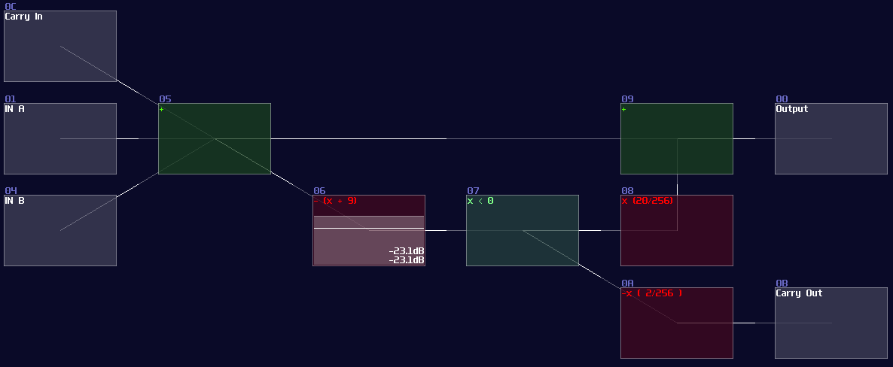
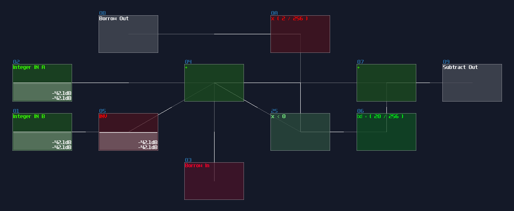
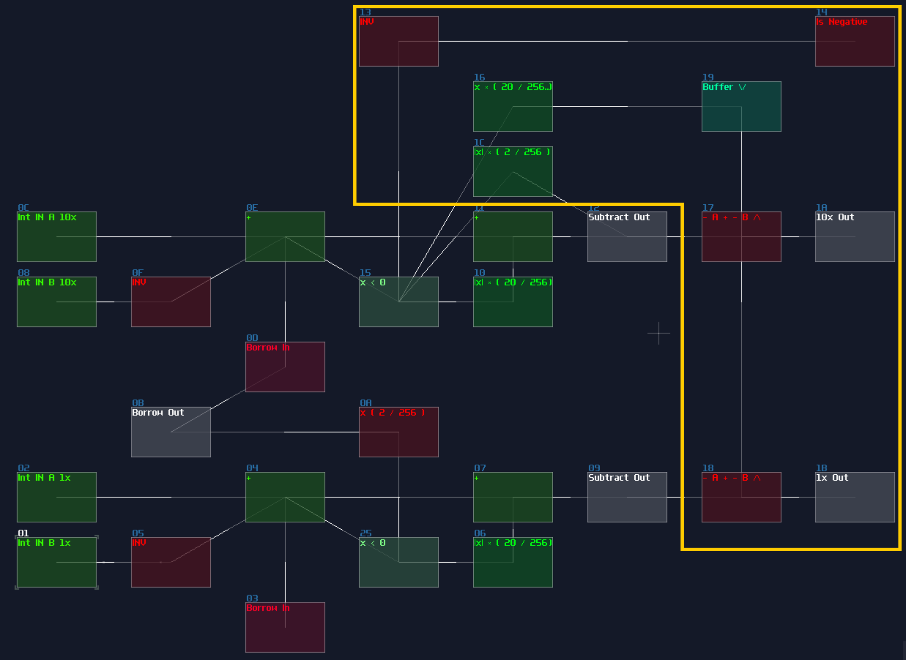

# Adder and Subtractor

## Overview

Although we have learnt how to do addition, some other features - such as carrying and borrowing - are missing; these features are important since we can use them for limitating a range of numbers or spliting the number into serval digits for display. Thus, I am going to show you how to achieve other feature for additions.

## Adder

In digital logic, we must build a full adder to compute any given two number; full adder works with two **XOR Gate** which one of them handles the two inputs and another **XOR** handles the carry bit with the calculated result. There are **AND Gates** too for handling carry bit for the next bit. Here is the single bit of full adder:

<object data="../apps/circuitjs/circuitjs.html?ctz=CQAgjCAMB0l3BWc0FwCwCY0HYEA4cEMElURTJyBTAWjDACgwE1w1WNsMRPveoeAhExYgAzGIBsPBNLSSOsgd0rCA7jy6buYyBy2QGG3fp1TtUI+PNhJlfrcqHj5rPa1vLG-p59YvFhj+YOw8-s4WjoHhVhh4eOBxIPKsYEkR9HzxbBzZGaGZIHiUhRHF4GlF9kpl1dIhitL5qQWVDQGF7YVxCREpiQn97RES9QCcOnrgEwEm05OmAf3E0ggzK5bMJQVJPQPKQiKUo+DYcgqnTYKqItxDduQzUfaHADI5YanSQaxOIABmAEMADYAZyo5Es73KG1sMiulCBYIhSEM7262Thez+SPBkMMtm4a24UUkWii3AAJlQgQBXYEAFxowKolPAAicsEYhMefCUZL53xA1LpjOZrPZfxgkEYAHMQALwA9JJiHk4GPLFRsVQkNuqgA
" width="100%" height="500vh"></object> 

Single bit of full adder is useless because it can only calculate number between 0 - 3 (including the carry bit), so we always cascade multiple of them to perform larger numbers like shown which is a 4 bit adder:

<object data="../apps/circuitjs/circuitjs.html?ctz=CQAgjCAMB0l3BWcMBMcUHYMGZIA4UA2ATmIxAUgoqoQFMBaMMAKAEIQATOgMwEMArgBsALlBABBADQAhKQGEQAZSkAdAM6KAxgPUiA9gFsNQ-QHMAllvDNVAR1sA7ZpHuQwqx+4933nsH6+Hs5w9gGe7q4Orl6B4bFRoY4saHggKAiEIHhUACxgWTni3PzCYlSQLADuINgIKDYNuXCNUNUgzVTMTS1gGFmVNZ3g-en4IwPtqRNjaZgNg7PpGA0ZWfNtQy0ozR0tuLmbe1TYhGnDudgLU+OXq+P1aYvTB0vDi8OvL5CHi3UNp3O+zOR3+6V2wx2FXaFyubzhz1u20yxyO00e6RRGL+9WyeVyaSKOPu5wJS2JtVOHTJ2CpFNyhEOuTJDN+7TBuWIWWZ5y5bQAMpjCl0UISKuJ+EJ1HRqJVBWtWmBRa1xZLpbKWPKUdMlXNxqq+FKZUg5ULwSK5rsDUaNVqsrSsrrKQMJYb1SbNWbAeBld7re6BWbWT7zozxFQ1cbAwrOY7lbHwyBIxqCk0yUUEEq8ekuLxBKIGEI6JxwImYO4WKnqXq0pmSTmSvmRIXi6XxeXWFWec6KFmHQ282UWyWIO3YJ3CGnQ4c6x0ww1G0OiyOy+PK5Pqx0+bOEwvBwXl23w2uzL2GhnmdnoafZ+jL9Nr2eewhL-3Hzuwy+mWH31mE1+txdSppgVaZ8nWfVc1KURwxScYFX7cCeyoRcYOhECUWDJDgxQ-dyjaIA
" width="100%" height="650vh"></object> 

Clearly, this is not a good solution for SunVox because we will end up using a lot of logic gates for such a simple operation; thanks to the amplifer, we can do addition in an analog manner by adding two incoming signal, while you can also apply a negative detector to check if the sum of two numbers are larger then the base (based 10 for the upcoming example) so that to perform carry logic by removing the sum to the sum output and sending 1 to the carry output:

This adder works in any bases, so you can change Module 06 to trigger the carry logic in other amount, which can be octal, hexadecimal and beyond. MOdule 08 also required to change as well, to ensure the carry logic completely cancelling the sum output; the equation for cancelling is shown:

\\[ (base \times 2) / 256 \\]

If you work on decimal system, set the volume to 20, likewise setting the volume to 32 for hexadecimal, or 24 for base-12.

## Subtractor

> It is currently unavailable because the borrowing logic is a bit faulty; I will rework the structure, or thie section will be removed at worst.

<!--
Instead of carrying, borrowing is required for subtraction, which doesn't exist for digital logic due to a clever trick. 

In SunVox, subtraction is done by summing two signals while one of them is inverted. Once the sum of two signal is negative, the signal trigger the negative detector for borrowing. The borrower takes 10 from the right digit, and decrease the value by one for the next subtractor. With the borrowed value, it sums with the subtraction result to return the finalized result.

However, there is a tricky part for the most significant digit; since we can't indefinitely borrow the digits, we must end the result with the correct answer; thus we must do the following:

- Result of the correct negative numebr in positive
- Switch on a Negative indicator

It is easy to switch on the negative indicator, as we can just take the reading at the last borrow out; as long as it is true, the number must be in negative. The number offset is a bit tricky though, as for the most significant digit, you need to add the amount of base - 1, while add the amount of base for other digits, for reveting the borrowing logic: 

The reason for the weird magic number is cased by the borrower. for example, if you subtract 0 with 11, you don't get -11, but 89. The ones is explainable, as it is borrowed from the left digit, with an extra of 10; because the most significant digit has loan a one to the following digit, it is reduced by 1, but because it has 

## Conclusion
You have learnt how to carry and borrow number in addition and subtraction, which is convient for display and calculate very large number wihout worrying the floating point error. For the next chapter, you will learn how to covert analog signal into digital.
-->

