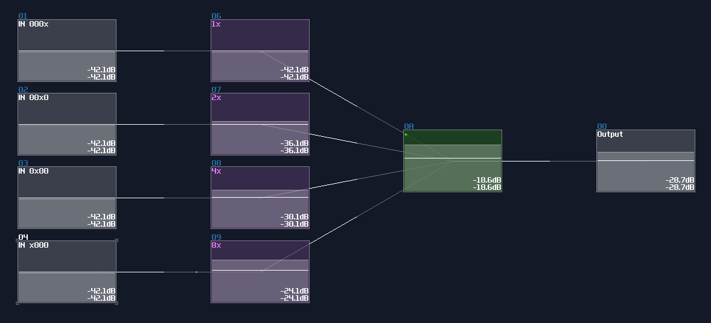
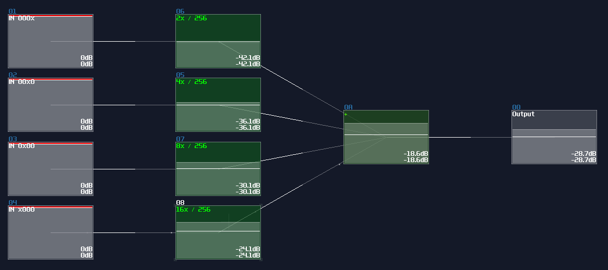
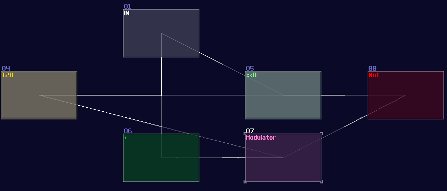
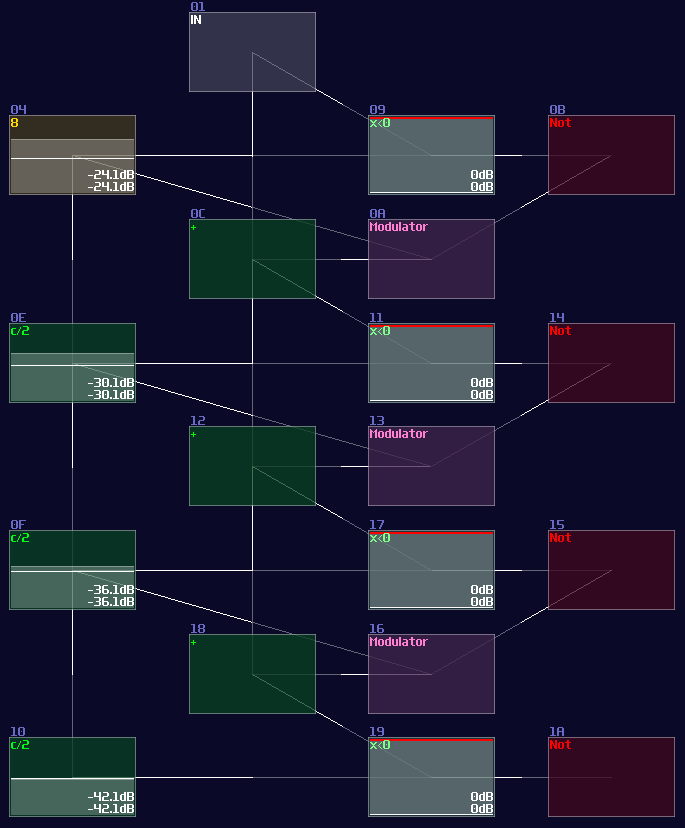
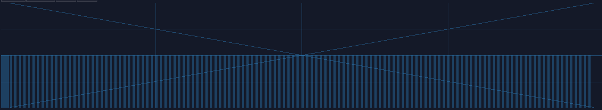
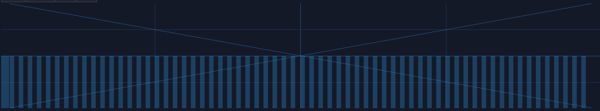
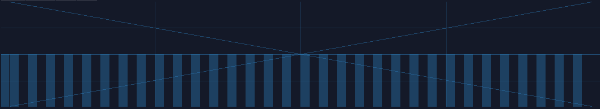
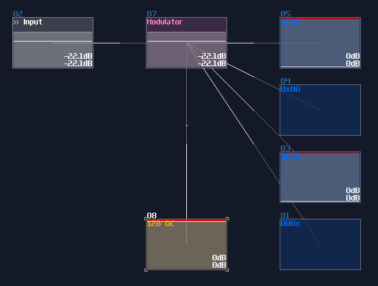
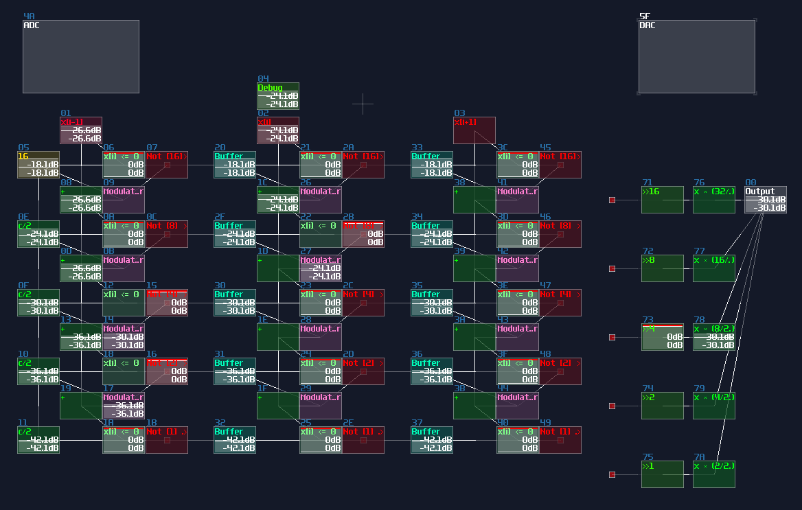
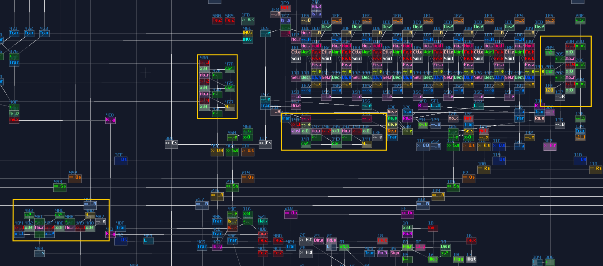

# ADC and DAC

## Overview
In some situations, it is more connivent to process data either in integer or binary form, while the input is not always the one you prefer; therefore, we need to know how to convert the data type to each others.

## DAC (Digital to Analog Conversion)
If you want to compact your binary signal into DC offset, you can use a DAC. To convert the signal, it is better to normalize your binary signal either 1DC unit or 128DC unit, to make conversion easier.

If your input use 1DC unit, you may use the gain control to regulate the binary signal, which the gain value is \\(n^2\\) for nth bits:

For 128DC input, you may tune down the volume to \\(n^2\\) as shown:

Both of the configurations also aligns to the DC offset of an amplifier, so consider the configuration above, both of the DAC will generate a signal with magnitude of 15DC unit.

## ADC (Analog to Digital Conversion)
There are two ways to do ADC:

### traditional method

The traditional method uses a negative detector and a negative constant for a threshold checking; because of the negativity, the detector is always on, unless the value of the input is large enough for a cancellation; once cancelled, the negative detector disabled, flipping the NOT gate to the ON state as a output.

Meanwhile, if the NOT gate (output) is true, it triggers the Modulator, passing the negative constant into the addition block, for finding the remainder after satisfies the output of the current bit; otherwise, the constant won't be added for the reminder, passing the original input into the next stage.

The configuration above is used for detecting the MSB of an 8bit integer, due to the magnitude of -128DC unit. To build the complete ADC, you must know:

- The upper bound of your integer
- The initial constant of the MSB

In the example, I decided to build ADC with the operation range between 0 - 10. Since I know the maximum is 10, I must pick a bit size that covers the maximum, using this equation:
\\[\text{Maximum} \le 2^x - 1 \text{ , where x = bit depth}\\]

1, 2, and 3 bit don't work because the maximum values are 1, 3 and 7 respectively. Anything no less than 4 bit works, but we should pick the minimal bit size to prevent wasting resource on CPU usage. Thus we should settle down with 4 bit.

Once we know the bit depth of the signal, we can now find out the initial constant by using the following equation:

\\[ \text{Initial constant} = 2^n \text{ , where n = index of MSB, start from 0 from LSB}\\]

Since we have 4 bits, counting from 0, the index of MSB is 3; hence, the initial constant is 8. After that, we can cascade multiple detector stages, connecting the sum block of the current stage to the sum block and negative detector of the next stage; meanwhile, it is not necessary to define every constant for each detector stage, as binary number digit always have half a value relative to their left digit; thus, we can squarely and recursively divide the initial constant by 2 for each stage, ending with the configuration below:

### Waveshaper Method

Rediscovery of wavershaper properties is a boon for logic processing, as it has simplified a lot of circuits and has achieved some modules that is thought to be impossible. If you work on a ADC with the range less than 256, waveshaper is a quick and (slightly more) efficient way to build such structure.

Like previous design, I use a 4 bit adc as an example; all you need is 4 waveshapers and the following configuration:

| Controller | Values                                   |
|------------|------------------------------------------|
| Input vol  | 256                                      |
| Mix        | 256                                      |
| Output vol | 256                                      |
| Symmetric  | off                                      |
| Mode       | LQmono                                   |
| DC blocker | off                                      |

For the waveshaper curves, you need an alternating pattern for each bits, which the off state is at 0, while the on state is either -1 or 1, depending on your application. Each digits have its own independent frequency for parsing binary numbers, which the next left digit always half the frequency to the current digit: 

At bit 000x (LSB):

At bit 00x0:

At bit 0x00:

And so on. Generate these curves requires curve generators, which is included in SunVox. Pixilang is required to run the program. 

Once your curves are ready, simply connecting the input to the waveshaper to complete the ADC; however, due to the performance concern, waveshaper disables its output after a certain time when the input is 0. The work around of this issue is to attach a modulator in between the input and the waveshapers, with applying a constant +128DC input for the modulator to prevent the timeout. Thus, we will have a ADC like shown:

### Examples

ADCs are common in my contraptions. In Game of Life module, if you open the life detector module, you will immediately see a group of ADCs, used for breaking down the input into individual cell state, and DAC if you switch the project to layer 3 to summarize the result:

VOXCOM 1610 is even wilder, as you can see ADCs everywhere, for splitting the operands due to different indexing or operation modes:

## Conclusion
Now you know how to build ADC and DAC for you projects, and you have seen that they have many applications. For the upcoming chapters, will start to learn memory circuits, but before that, let's take a break with a checkpoint, and practice the things you have learnt.

## Examples Projects:
[ADC and DAC](../example_projects/fundamental/1.14-ADC_and_DAC.sunvox)
