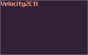

# Commonly Used Modules For Processing Logic

Unlike composing a track or designing sounds, you don't need any fancy modules like FMX, Accipiter or CaRaCaRa to make logic circuits, but the following rather basic modules:

## Amplifier

Normally, you use amplifier in SunVox projects mostly because you want to change the loudness of a signal, or to change the panning of the sound, so you can make the track sounds wider. In logic processing, amplifiers play a crucial role, due to its simplicity and its features. Here is a list of useful features in amplifiers:

1. DC offset: Generates a perfect 8 bit DC signal.
2. Inverse: Invert an in coming signal
3. Absolute: Change negative signal into positive.
4. Balance, stereo width and gain: Extract regulated version of the left or right signal

These controls are useful because you can build logic gates like “or” and “not”, by combining the three controller mentioned above. You can use it for simple calculation like adding two incoming signal or to multiple/divide the input with a constant. You can combine two signal into one by storing them in left and right channel separately, while you can also split the channels by selecting the channel; setting the width to none; and doubling the gain, so you can create a more compact design.

## Distortion

Distortion is an other commonly used module in the realm of logic processing. You only need to use two of the controllers from the module:

1. Type: Set the type of distortions
2. Bit depth: Quantize the input to the nearest bit

Distortion actually only has few uses, but it executes the job fantastically. The first common uses for distortion is used for negative detection, with the bit depth set to 1. Another application is to check the odd parity of a signal, by setting the type to overflow. The last thing you would use distortion is to prevent the signal getting out of bound, by using different types, that may handy for generate graphics.

## Modulator

At first glance, it doesn’t seem to have many controls. All you can change are the modulation type, the volume and the channels. However, its amplitude modulation mode is versatile, which you can use it for building some and gates, controlling the route of the signal, or even doing multiplication.

## Delay

Obviously, delay module is used for… well, delaying signals. It offers quite a few useful controllers, making it more than just a delay:

1. Delay L/R: To set the delay time
2. Channels: Set the signal to stereo or mono
3. Delay unit: Change the unit of the delay time. (Like Hz, ms, sample)
4. Inverse: Invert the wet signal of delay.
5. Feedback: Set the amount of the output signal loops back to input.

Thanks to the inverse function, delay can also be a mono-stable circuit to send pulses to other components. In addition, the newly introduced feedback makes delay also acting as a memory storage which is handy for storing temporary data.

These 6 modules are already able to make SunVox turing complete. You can use these modules only to build your computer. Obviously, there are many more modules in my computer project, I will introduces them in the later section when they are needed, to simplify the designs. Let’s only focus on these 6 modules alone in the first few chapters.

## Feedback

If you are a [mindustry](https://mindustrygame.github.io/) player, you know there is a component called the [Router](https://youtu.be/6zoRd5ACaBc?si=E_YH5bNjN30RNEx1&t=194). The routers play in a crucial role where the items need to be distributed in multiple conveyor belts; however, if you chain the routers, they pass the item back to the previous router, clogging the whole system resulting in a lower efficiency. 

The reason why I point out mindustry because Feedback modules is similar to Routers, which is a necessary evil; you have to use it when you want to form a feedback loop in your system for building a stateful system, but the module itself has a 20ms delay, so you can't chain too many of them; otherwise, your logic circult will be high in latency. You have to use at least one pair of them at best, so normally your contraption will never soar beyond 50Hz. **Use it wisely**

## Soundtctl

This module converts your incoming audio signal into control signal. Although it doesn't offer audio rate performance, it is a great module if you want more than two inputs for your specific modules (e.g. 16 Ram with indexing and enables), so you can reserve the audio input for time critical parameters like clock signal or data bus.

## Multisynth

Multisynth duplicates midi signal to the adjcient output modules, but it is not useful on its own if we talk about logic processing, unless you pair it with the following:

## Velocity2ctl

This is an underrated module which its original purpose is to detect incoming velocity of a midi note and converts it into controller value, which is rarely used for making music unless you want to design a module with velocity sensitivity for some parameters other than the volume. In logic processing of SunVox, this is a handy module for building memory block with loosely instantaneous response, and you will know how to make one for the upcoming tutorials.

## Ctl2note

The two modules above will be useless if you can't use Ctl2note because this is the only module that can convert your controller signal into midi signal by manipulating the pitch, velocity and the state of the module, to trigger any midi based flip flops.

## Metamodule

The [Inception](https://www.youtube.com/watch?v=c0Gvwo6yyyA) of SunVox. This over-powered module can loads another SunVox instance. Besides user defined controllers, you may also need the following controls:

1. Input Module: Change which module will receive an input.
2. Play patterns: Have an option to do project playback.
3. BPM and TPL: Change the speed of the project playback.

There are lot of applications for metamodules. At first, you can use it to simplify the structure of your logic machine, making it more readable. You can reuse the metamodule by copy and paste, so you can scale a project easily with the commonly used logic. Another use for metamodule is to build a source block, that you can enable project play back to simulate input switch and clock. If this module didn't exist in the first place, VOXCOM 1610 and pong would not exist.

## Conclusion
The rule of the modules above makes SunVox turing complete. In theroy, you can compute anything only with these module, if you give it enough time and memory. Obviously, there are many more modules in my computer project; I will introduces them in the later section when they are needed.