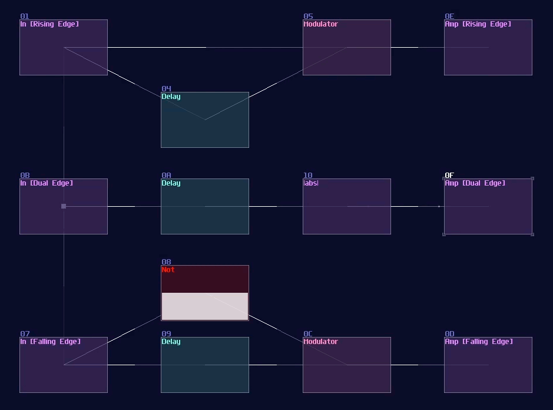
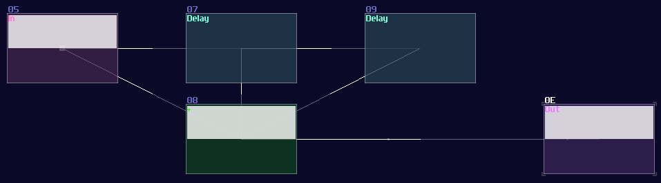

# Delay Based Component

## Overview

Besides logic gates and mathematical operations, there are delay based operations as well. Delay is another powerful module to let you not only delaying signal, but also limiting or expanding a pulse in a specific length.

## Mono Stable Circuit

You might heard this term in some of the Minecraft Redstone videos. We also have them in SunVox too! Monostable circuits are used for converting a sustain signal into a pulse in constant time. It is useful for triggering Flip Flops and Latches (Introducing in the later chapters).

The simplest monostable circuits only contains a single delay module with the following settings:

| Controller | Values                                   |
|------------|------------------------------------------|
| Dry        | 256                                      |
| Wet        | 256                                      |
| Delay L/R  | Timing in both channel must be same      |
| Inverse    | On                                       |

 

At this point, if you feed constant DC input, you can see that the output stay lit for only the given delay time, and it switches if off itself afterwards, likewise if you release the DC input. This behavior is known as **dual edge** monostable because it only give of pulses with a limit of time at every switching point rather then the state. You may use a modulator to use the timing difference to eliminate pulses either at switch off or on, forming a **Rising Edge** or **Falling Edge** monostable circuit as shown:

## Pulse Extender

Another well-known contraption in Minecraft; instead of shortening the pulse, we can extend it as well. To do this, we need a pulse extender. It is similar to making a monostable circuit, except to remove the dry signal and set inverse to off because no signal cancellation is required for this circuit.

| Controller | Values                                   |
|------------|------------------------------------------|
| Dry        | 0                                        |
| Wet        | 256                                      |
| Delay L/R  | Timing in both channel must be same      |
| Inverse    | Off                                      |

 

You must align the delay time with the period of your pulse. If the input pulse last 1ms, you must set your delay to 1ms. If you unsure about the time of your pulses, you may also make it shorter and more unified using a monostable to calibrate the length of your pulse before extend it. Once you have set the delay module, simply chaining a few delays in a row and sum all of the delayed signal and the input signal. With this configuration, you can extend the pulse n time by chaining n number of delay as shown:

> Side Note: Due to 2.1.1 update, Modulator can also delay a signal with a maximum of 4 seconds, meaning that you can create structure above with dynamic delay time without using sound2ctl which is suitable for more precise and complex timing applications. 

## Conclusion

Here we go, now you know the two common uses for delay modules, besides simply delaying signal. You we see this module in the following chapters for more advance usages. For now, let we move on to the more complex stuff, some common combinational structures.