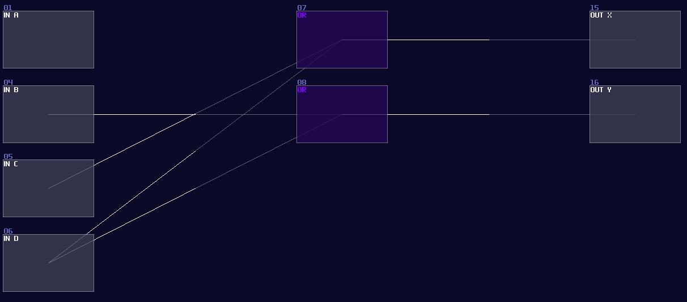
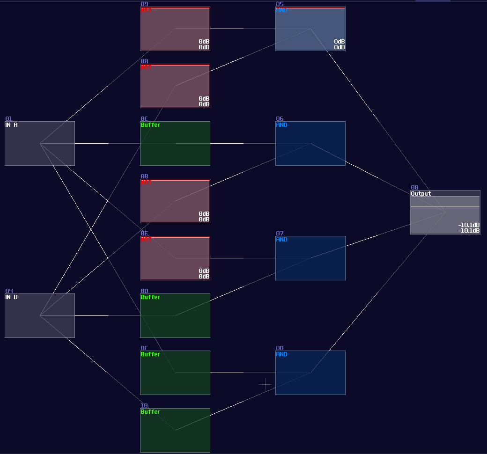
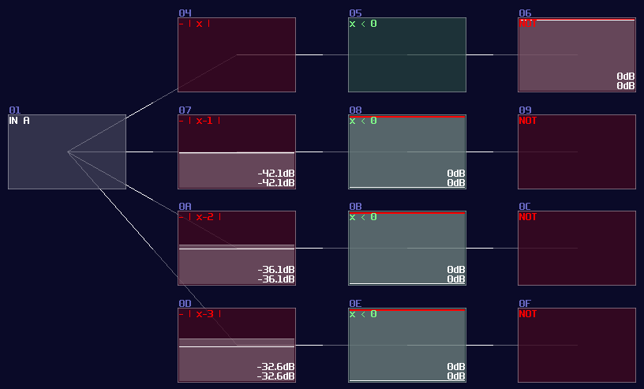
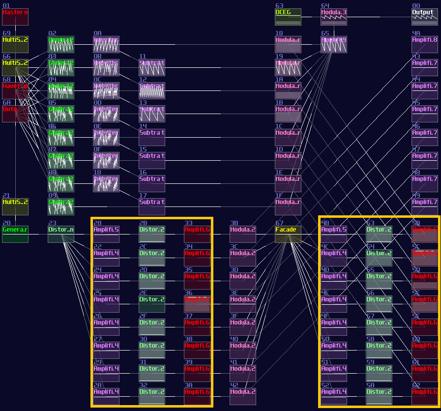

# Encoder and Decoder

## Overview
After you have warmed up a little by messing around the simple logic modules, let we move on to something more complex. Combinational Logic is a type of digital logic that only rely on the current input state, so this kind of structure don't remember any previous state, and calculate the result only using what the inputs have given. There are a few common combinational circuits, including:

- Encoder
- Decoder
- Multiplexer
- Demultiplexer
- Adder
- ADC and DAC (Analog to digital convertor; and vise versa)

I will go through circuit with pairs, so let me tell you about Encoder and Decoder first.

## Encoder
This is used for mapping N number input into its binary representation. For example, if there are 8 inputs, each input will have its own unique binary output as shown:

| Input | Output |
|-------|--------|
| 0     | 000    |
| 1     | 001    |
| 2     | 010    |
| 3     | 011    |
| 4     | 100    |
| 5     | 101    |
| 6     | 110    |
| 7     | 111    |

To achieve that logically, we can use OR gates to do the job, while the mapping between input and the OR gate are based on the binary sequence just like the table above. Hence, you will have a structure like the following:

<object data="../apps/circuitjs/circuitjs.html?ctz=CQAgjCAMB0l3BWcMBMcUHYMGZIA4UA2ATmIxAUgoqoQFMBaMMAKDARRBQUJABY4IbHj79BVUbTYcuPfsV7DRfBVH5qE0zt14JinJRX1rJFNoQMixE7JwFVOAEzoAzAIYBXADYAXBl7pHcDUqGEhWMAshKxVePlt5XidXT19-QODQqFgIqMM9OwSCrhBnd28-AKCILLDWAHN+BPt+QmVxKBZG+LtVPjbEkK6mzmL+0WLQlgAZcBQ8IUIF1WwlkJB3LwBnOmpIGbmFlr6Oqk2dvYOweZGQPoSs892kfdnro4G+gce3befOt43DjLXQ3H5-S6AhY8KiqGHrJ6Qw5GThw4zgi4vK43CyiVS4hG-TGdADuyJaOkWC32ZPet0p41J5IGlMMNOZogZeCmtKBN0p8PZdPhDMiTOFhAccgQGF4QqBxgF13FCu0ckl1JYvIWBIZDy1yN10rBBrpRt4BP2QA" width="100%" height="500vh"></object> 

Since we already have known OR gate in SunVox, we can convert the circuit directly. Here is the simplified version in SunVox, only using 4 inputs.

## Decoder 
Working in an opposite mannar, decoder converts all the binary representation into individual n number of outputs. While it only select only on output at the time, this is useful for selecting a specific signal path for a specific data or a operation.

| Input | Output |
|-------|--------|
| 000   |  0     |
| 001   |  1     |
| 010   |  2     |
| 011   |  3     |
| 100   |  4     |
| 101   |  5     |
| 110   |  6     |
| 111   |  7     |

For a two input decoder, the logic circuit is shown:

<object data="../apps/circuitjs/circuitjs.html?ctz=CQAgjCAMB0l3BWcMBMcUHYMGZIA4UA2ATmIxAUgoqoQFMBaMMAKABkRjCRttvsUPPlBEAzAIYAbAM51qkFmEKDsCFWpAAWPFVWDBAEzoSArpIAuDSXQPgRVGJFYBzLTp4aEYdYIftO-IR4PCpB9iASMnJICmCUICgomh4+KSKCSAiK8YnJmkpp+dxUvhTZJUluuhraDgkiWXEVyQiayXoUbekNLK61WgVegkX2isqFBf0jhsbiZpbWthB1jqxKqa157pv1RqYWVjZ2K7AuVZ0t3hejfe79Q+d+64V3ryUge3MHi8f2pywASXAhF0wlyQmKUGgmUBwN0YXBfGCDmhZSBSiomjgCUqWJOMPRIK0XBxeRJKJhAHdwChgrxuN5gnioCxqYytNiMRy-GzadyaUzCMkFLzBclwZohSzRVopey1MjWQKKHzwQrpQEeGEuUiNSTdSTNAI9dwjfpccaRZqzdbyUrDSSuZo7dSHdwSQgiVaPUS1V77fxhOz6Rrg0GiSGFEA" width="100%" height="500vh"></object> 

Owing to the logic gate configuation, you may directly covert the circuit into SunVox modules:

 

However, it is not an efficient way to build a decoder, since the number of logic gate will be increased exponentially when you add a new input. Normally, I use integer as my input signal for decoder instead, so you can reduce the complexity of modules from \\(O(n^3)\\) to just \\(O(n^2)\\) (I have borrowed a concept from computer science, called Big O notation, to describe how well the design can be scaled.)

To build integer based decoder, you need a negative detector, an inverted NOT gate, and a specific function for an amplifer:

\\[ y = |x - n|\text{ , where n is the nth of output} \\]

 

To create such function, you may set the amplifier as the following:

| Controller | Values                                   |
|------------|------------------------------------------|
| Absolute   | On                                       |
| DC offset  | -n (for each nth output)                 |

 

Once you have completed the configuration, you need to connect the module into the following order:

Input -> Customized function -> Negative dector -> Inverted NOT gate

After you have completed the chain and duplicated the chain parallelly, you will complete yourself of an interger based decoder. Feeding a positive DC signal at the input, generated from an amplifier, will change the selection of the output:

You may find it familar, and you may have seen it before. You are absolutely correct becuase this is the exact same decoder I have used in my old arppeggiator, used for counting the voices and selecting a specific pitch. Now you have finally understand how one of the vital components work in my arpeggiator!

## Conclusion
That's about it, you have learnt how to build your own decoder and encoder for your modules, and I will tell you how to based on the similar concept to build multiplexers and de-multiplexers.

## Example Project:
[Encoder and Decoder](../example_projects/fundamental/1.11-Encoder_and_Decoder.sunvox)