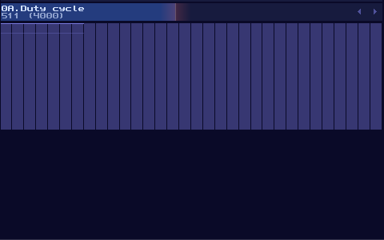
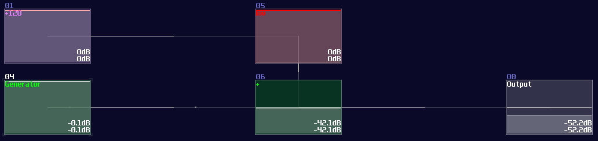
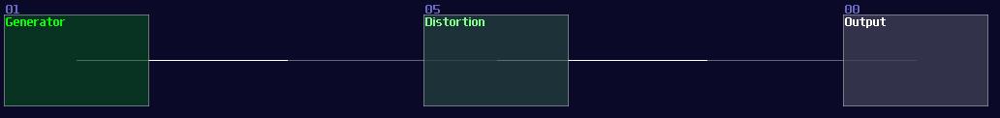
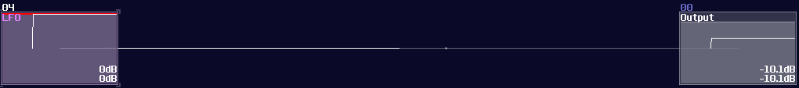
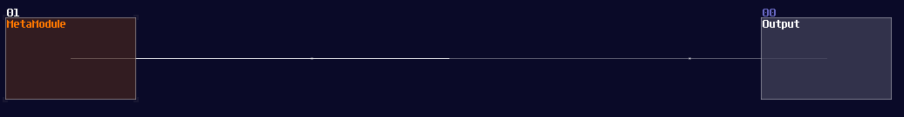
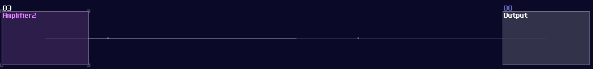

# Input and clock

## Overview

Before talking about any components and logic, let me tell you about how to make some inputs in order to test your logic stuff.

There are two type of source modules that you often use:
## 1. Pulse

The most basic type of input source, all you need to do is to use a generator with drawing a waveform in a constant DC:
Generator Drawn Mode:

However, this is not the best solution, since this is not a perfect DC signal, which it has a slight offset to the ideal +128 DC offset in the amplifier. To prove the issue, we can perform a **null test**, using an ideal signal source as an control. Inverted that signal, and add the signal with our own signal. If the signal are perfect, they will be cancelled to each other.

In this case, we can subtract our DC signal with the amplifier signal:

As expected, you can see a thin line after combining two signal, suggested that both of the signal are different in magnitude. To Fix the issue, we need to use a distortion, setting the bit depth to 2, while doubling the volume, to make a perfect +128 DC offset signal:

## 2. Clocks

In come cases, you need to send a periodic signal for your circuits, all you need to is to firing your generator in a precise timing. You need a clock to do such a job for you.

To build a basic clock, you only need a LFO module, with these particular settings:

| Controller         | Values |
|--------------------|--------| 
| Waveform           | square |
| Generator          | on     |
| Smooth transitions | off    |

That’s it, now you can change the frequency to make it go faster or slower, based you your needs to your logic structure.

## The advance way to build sources

Logickin, You lied, you didn’t use these input source in your VOXCOM 1610! Well, that is why I am now showing you a more advance way to build pulse or clock generators. The following implementation is a bit more complicated, but it offers a cleaner signal for projects that require higher timing precision.

At first, create a metamodule:

Click the edit button of the metamodule, and add an amplifier inside the metamodule like shown

Once you have that amplifier, create a pattern with a length of two. Then set the automation as the following:

Exit the metamodule, and set the playback of your metamodule to **on (repeat)** for clock signal, or **on (no repeat)** for pulse signal.

Here we go, there are the commonly use input source for testing and powering your project, now we can move on to build your first set logic gates.
