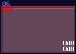

# Logic gates

## Overview

Fundamentally, every computers are made with some kind of logic gates, which is the simplest component to calculates things. In the real world, logic gates are made with a bunch of transistors. In layman terms, transistor is like a switch (there are more than that, but let's keeping it simple). When you press the switch, the light is on, and vice versa. Instead of flicking the switch manually, electronics switch on transistors using voltages.

## Binary and Truth Table

Without mentioning what is a Binary and Truth Table, it is meaningless to teach the following since they are the vital concept and figures to show how logic gates work. 

Computers don't calculates math like us, using the decimal number system; under the hood, they are just all low state or high state; some call it 0s or 1s; some call it true or false, and they all describe the same thing, the binary signal. For now, let we use 0 for no DC signal, while 1 for DC signal with +128 DC offset in amplifiers.

In Digital Logic, we also have an useful diagram, called the truth table, to show how a logical component behavies under certain inputs. For example:

<left>

| IN A | IN B | OUT  |
|------|------|------|
| 0    | 0    | 0    |
| 0    | 1    | 0    |
| 1    | 0    | 0    |
| 1    | 1    | 1    |

</left>

This table shows how **AND gate** works by flicking the input one by one, with all of the combinations, so this clearly tells the **AND gate** only switches on when both input is on.

That's about the truth table, let's talk the logic gates.

## AND Gate

The first one is an **AND gate**. You must switch on both of the input to set the output on, the following is the truth table and the simulation of the AND gate.  

Truth table:

| IN A | IN B | OUT  |
|------|------|------|
| 0    | 0    | 0    |
| 0    | 1    | 0    |
| 1    | 0    | 0    |
| 1    | 1    | 1    |

Simulation:

<object data="../apps/circuitjs/circuitjs.html?ctz=CQAgjCAMB0l3BWcMBMcUHYMGZIA4UA2ATmIxAUgoqoQFMBaMMAKABlxiUQAWMQ8Cjy9+UMQDMAhgBsAznWqR2nbjx7CwQ3urFUpchUiVhKK3tm4WqPC2O60W-S2nOqdN7twAmdKQFdpABcGaTovcF0oWFYAc21hD148a1sqJSA" width="100%" height="500vh"></object>

To build an AND gate in SunVox, all you needed is a modulator and... that's it, since you can consider AND operation is like a multiplication. If either one of your input has a Zero, the product must be resulted in Zero; otherwise, you will get an one if both of your input are one. 


Despite being a single module, I tend to change the color to blue and name it AND/Transistor to reflect the purpose of the module. There is a difference between two, AND is when both of the input are binary (0/+128), while Transistor can have one of the input in any magnitude just like how real life amplifier increase the gain of a incoming analog signal by changing the gate voltage.


## OR Gate

The second commonly used logic gate is OR gate. The output is on as long as you have switched on at least one input. It seems that OR gate is quite useless at first glance, since you can set the output to 1 if any one of them are 1, but it is useful for making multiplexer or grouping control signal. Here is the table and the simulation:

Truth table:

| IN A | IN B | OUT  |
|------|------|------|
| 0    | 0    | 0    |
| 0    | 1    | 1    |
| 1    | 0    | 1    |
| 1    | 1    | 1    |

Simulation:

<object data="../apps/circuitjs/circuitjs.html?ctz=CQAgjCAMB0l3BWcMBMcUHYMGZIA4UA2ATmIxAUgoqoQFMBaMMAKABlxiUQAWMQ8Cjy9+UMQDMAhgBsAznWqR2nbjx7CwQ3urFUpchUiX9u2NLzPbhPS9wAmdKQFdpAFwbS6d8LqixWAOZWFqp4VDbcVMYI3GBcISBm4ZZUkRQsQA" width="100%" height="500vh"></object>

Building an OR gate is as simple as an AND gate, but you need a distortion instead, and setting the distortion as shown:


| Controller    | Values |
|---------------|--------| 
| Volume        | 256    |
| Bit depth     | 2      |

Once you have done right, the distortion will always regulate the signal into constant +128 DC, if you switch on at least one of the input. Normally, I prefer to change the color of the OR gate into purple:


## NOT Gate

The third of the trine is a **NOT gate**, also known as an inverter. Unlike AND or OR gate, it only has one input. It is useful to create common structure like decoders, conditional checking, or simply to invert the output signal. 

Truth table:

| IN A | OUT  |
|------|------|
| 0    | 1    |
| 1    | 0    |

Simulation:

<object data="../apps/circuitjs/circuitjs.html?ctz=CQAgjCAMB0l3BWcMBMcUHYMGZIA4UA2ATmIxAUgoqoQFMBaMMAKABlxiUQAWbbsCjy9+UMQDMAhgBsAznWqQWYQt35U+3Hj2GaQ3ACZ0pAV2kAXBtLoHwYqjEisA5rx0iteDaIcsAkpxaouoe9tBICCxAA" width="100%" height="500vh"></object>

Building an inverter is also easy, you only need a single amplifier.


Despite having such a simple structure, there are two variants in NOT gates; depends on the type of application, you may set your amplifier into one of the configurations:

The first type is a non-inverted NOT gate, where the input signal is a +128 DC offset: 

| Controller    | Values |
|---------------|--------| 
| DC Offset     | -128   |
| Absolute      | ON     |


Another type of inverted NOT gate, where it takes negative 128 DC offset as input, which is commonly used in zero detection.

| Controller    | Values |
|---------------|--------| 
| DC Offset     | +128   |
| Absolute      | ON     |


I generally prefer NOT gates in red color.



## NAND and NOR Gate

Despite not common in SunVox, **Nand and Nor gate** are worth a mention. They are known as universal gates, meaning that their properties can emulate all other logic gates. Universal gates are common in real world digital circuits, due to its properties able to simplify the design. To make such gate, all you need is to attach a not gate after the output of the **AND/OR Gate**. Nonetheless, they required one more module to implement, so they are not frequently used in SunVox.

Truth table and simulation of a NOR gate:

| IN A | IN B | OUT  |
|------|------|------|
| 0    | 0    | 1    |
| 0    | 1    | 0    |
| 1    | 0    | 0    |
| 1    | 1    | 0    |

<object data="../apps/circuitjs/circuitjs.html?ctz=CQAgjCAMB0l3BWcMBMcUHYMGZIA4UA2ATmIxAUgoqoQFMBaMMAKABlxiUQAWMQ8Cjy9+UMQDMAhgBsAznWqR2nbjx7CwQ3urFUpchUiX9u2NLzPbhPS9wAmdKQFdpAFwbS6d8LqixWAOZWFqp4VDbcVMYI2CohIGbhllSq0KTpGZnEFCxAA" width="100%" height="500vh"></object>


And a NAND gate:

| IN A | IN B | OUT  |
|------|------|------|
| 0    | 0    | 1    |
| 0    | 1    | 1    |
| 1    | 0    | 1    |
| 1    | 1    | 0    |

<object data="../apps/circuitjs/circuitjs.html?ctz=CQAgjCAMB0l3BWcMBMcUHYMGZIA4UA2ATmIxAUgoqoQFMBaMMAKABlxiUQAWMQ8Cjy9+UMQDMAhgBsAznWqR2nbjx7CwQ3urFUpchUiX9u2NLzPbhPS9wAmdKQFdpAFwbS6d8LqixWAOZWFqp4VDbcVMYIEGBcISBm4ZZUqtCkGZlZxBQsQA" width="100%" height="500vh"></object>

As you can see, you can emulate any logic gate using NOR Gate only, due to its property of being a universal gate:

<object data="../apps/circuitjs/circuitjs.html?ctz=CQAgjCAMB0l3BWcMBMcUHYMGZIA4UA2ATmIxAUgoqoQFMBaMMAKABkQmU8QAWQ3pzDEUfAVAkAzAIYAbAM51qkdkO4V1TERp5UqMhUqQqwhUc1EIw5jIQrWQogCZ0ZAV1kAXBrLpPwEnqwrADm4Lb2omg8VqJ6LGAI2Go8vHhUTHZpeo7UCAlJErHgDsVUcRQFyVwxvIKZFHUSlpUA7kJZ6RK8xHYq7Q0ITbTq-Sli9dapvVAsA1M64wiE8YnJVNh4ghYgm4LlRVXjex27W815LGFgESfRZ-uzpuYOJzd2dyAu7l4+fgE5GCQVgcGp8OBCbS8CE5AyKZSqMHYQg8LSiZG6KRyeHGOanE4bFGzeYfc5UaHxeYObioma4fZ4pjUvC0uyYOKInY0yFRFmBEBwoxPMx8Hjc96OPnOVzSDzeXz+CCA4JXcJsqX4SWYkyFBgzblpLUXXjQUhm80W4iVAAe4AQURIjkgyXZfEcggAcgB5AAqLFtiStyKQwkEGLdKEEXoASv67RA0la0MkeqJBJGQABBD0AERYQA" width="100%" height="500vh"></object><br><br>

## NAND and NOR Gate

I used to planned to build a XOR gate as my first question as my SunVox Logic Riddle, because it is a bit complicated compared to all other gates. How XOR gates works is similar to OR gates which the output stay on if one of the input is on; however, when both of the output is on, the output is off:

Truth Table:

| IN A | IN B | OUT  |
|------|------|------|
| 0    | 0    | 0    |
| 0    | 1    | 1    |
| 1    | 0    | 1    |
| 1    | 1    | 0    |

Simulation:

<object data="../apps/circuitjs/circuitjs.html?ctz=CQAgjCAMB0l3BWcMBMcUHYMGZIA4UA2ATmIxAUgoqoQFMBaMMAKABlxiUQAWMQ8Cjy9+UMQDMAhgBsAznWqR2nbjx7CwQ3urFUpchUiX9u2NLzPbhPS9wAmdKQFdpAFwbS6d8LqixWAOZWFqp4VDbcVMYIPCohIGbhllSRFCxAA" width="100%" height="500vh"></object><br>

Likewise, there is an Inverted version as well, which is a XNOR gate. The output is the opposite to the XOR gate.

I thought XOR gate was difficult to achieve because you may need multiple modules to make one, and I was planning for using this as the first question for my riddle; however, there is a much simpler solution which is based on a non-inverted **NOT gate**. Based on the NOT gate setting, we can find that the equation of that gate is the following:

```rust,noplayground
y = |x - 128|
```

Since the signal strength of a true signal has been defined as +128, we can cancel out the offset by a single input, causing the NOT gate to switch off. If we feed 2 true signal into a NOT gate, the calculation will be 128*2 - 128. The offset of +128 will set the gate as true state again, making it behaving like a two input XNOR gate. To convert it into an XOR gate, only an extra NOT gate is required, appended at the "NOT" gate that acts like an XNOR gate.

## Conclusion

That's it, this is all of the common logic gate and its implementation in SunVox. I will attach a SunVox project to demonstrate how these gates works and what is the setting of these gates: