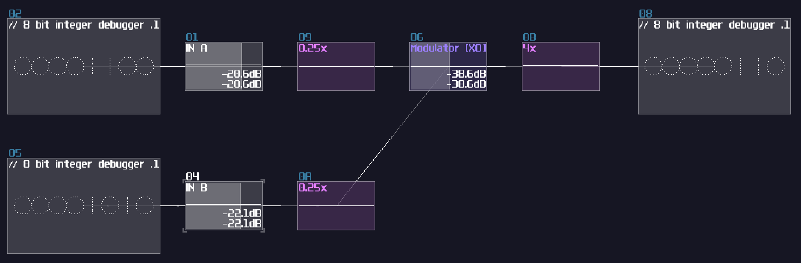

# Logic Gates Extended - Bitwise Operation

> This is the extension of the previous chapter and they might contains advance concepts; if you feel overwhelmed, please move on to other chapters first and goes back to this chapter once you are ready.

## Overview
Thanks to the 2.1.2 update, bitwise operations are now possible which it opens up a whole new dimension of possibilities. Let we explore about the latest features, to build logic gates that can process information in parallel.

## There Are N Binaries Among Us
Before know how to stack logic gates within a single module, we need to understand what is a binary (or base 2) number: 

Binary only have one and zero for every digits, so instead of the traditional base 10 which it has 10 times more value than their previous digit, binary only doubles its values. Because each digit now has either on or off state, we can perform basic logic with each digit separately, thus a bitwise operation.

## Bitwise AND
Thanks to the "bitwise and" mode in the modulator, we can squarely feed two source into the modulator for such operation:

As you can see, the bottom input masks out the input above, only showing the digits when they both true. This is useful when computer memory is limited because you could use that to store 8 separate indicators within a byte, and parse them using the AND operation. In SunVox, you could reduce the number of modules by 87.5% \*\* using this method compared to process the bit one by one. (if you build a bitwise operation processing a byte)

There is a catch though: Since the modulator in bitwise mode only works up to ±127 DC unit, we must ensure the input never goes beyond the limit; nevertheless, you can't simply extend the bit width by subtracting input and normalize the output by 128 DC unit because there is an edge case when both of the input is +128 and +127 DC unit respectively, ending with a wrong result:

To solve this issue, we need to do a simple trick. The reason I have chosen DC unit to represents bits purely because DC offset controller in amplifiers are easy to work with, while it is easier to have a consistent result; in fact, the bitwise mode in modulators can go finer than that, and you can declare your own bit step size by dividing and multiple by N before and after the modulator respectively:

With this design, because I have divided and multiplied the gain by 4, forcing the modulator perform bitwise operation in a finer resolution, I have extended the operation by 4 bits, without crossing 0 that trigger the edge case.

\*\* theoretical assumption and assume 1 bit is defined by 1 DC unit

## Bitwise XOR
With the same principle, we can swap the modulator mode to bitwise xor:

## Bitwise OR
Beyond AND and XOR, it is possible to construct other bitwise operations, but we need to find the logical expression. Since we know that OR operation means at least one of the input is true; meanwhile, AND is true if both of the input is true, while XOR is true only if one of the input is true. Because of that, we can combine both of the signal to form a bitwise OR operation:

## Bitwise NOT
XOR gate is a versatile logic gate in SunVox; instead of feeding two individual input, all we need is to feed one of the inputs with a constant that represents all true (usually \\(2^x - 1\\) ):

## Conclusion
With all these new features delivered in 2.1.2, we can now perform bitwise operations to manipulate individual bits of a number; in addition, we are one step closer to build the quake 3 inverse square root!

## Example Project:
[Bitwise Operations](../example_projects/fundamental/1.5-Logic_Gates_bitwise.sunvox)