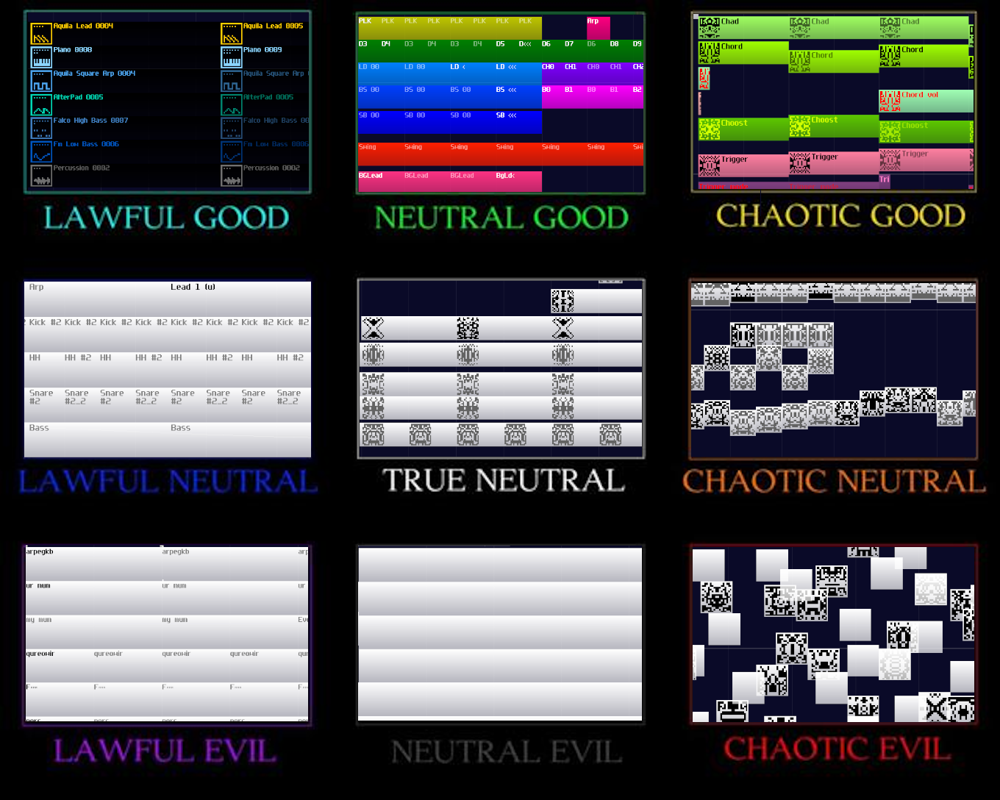
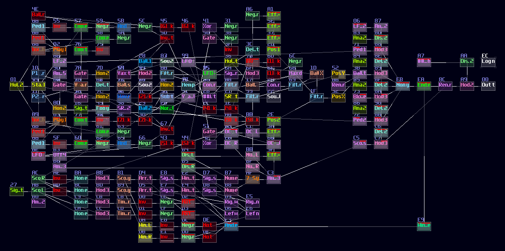
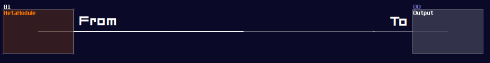
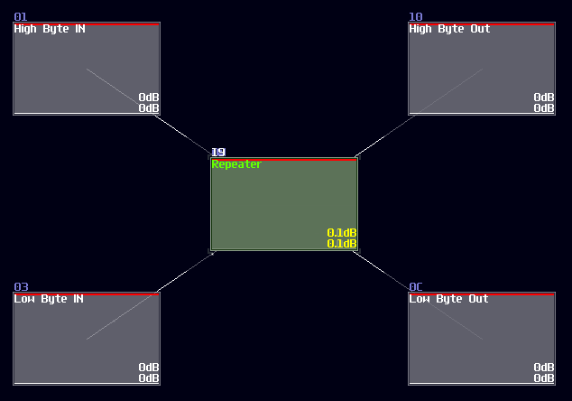
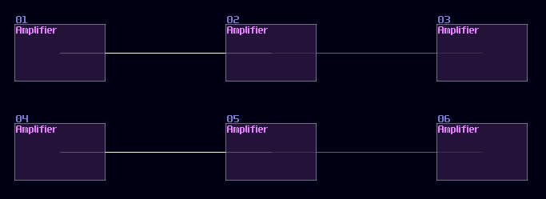
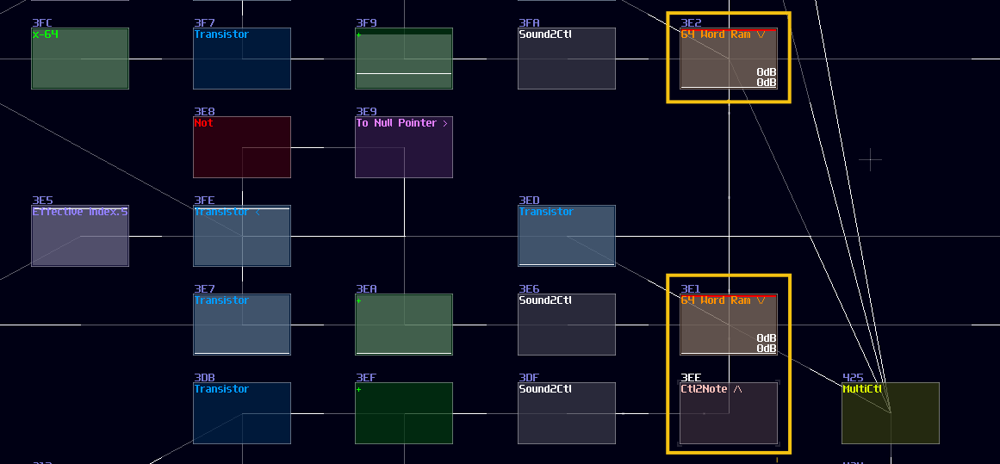

# Module Conventions and Practices
## Overview
SunVox can be quite chaotic based on your practice, and no one can prevent you from being the chaotic evil:

Of course, you can build your logic thingies without ~~noties~~ organizing or planning, and in fact, I did this once with my pong module. 

This module is really messy, and overlapped modules and connections are everywhere; as a result, I couldn't able make any update with this module. Hence, like writing your normal python or c program, "Coding Practice" is also existed in SunVox if you consider it is a visual programming language just like Reaktor or Pure Data.

## Module Flow Direction
Unlike Rick and Morty, you don't need a [high IQ](https://knowyourmeme.com/memes/to-be-fair-you-have-to-have-a-very-high-iq-to-understand-rick-and-morty) to understand the module direction in SunVox although it looks subtle. You can see the brightness of the line, which the brighter side is the sender, while the darker side is the receiver. 

It is important to remember this little detail because it is really tedious and boring to point out every single routing details of circuits while you don't need to implement most of them (all you need to do is to use my pre-made logic processing modules). I have tried that once, but drawing arrows doesn't seems to work if the contraptions are complex and tightly packed.

## Special Symbols in Modules
Besides coloring which I will talk about for the later chapters, labels are also important to tell the functionality of modules. This is not only used in logic processing, but also in module design so that assigning controllers would become easier.

Here are some of the most frequently used prepended labels for my module design:

| Symbol  | Meaning                                           |
|---------|---------------------------------------------------|
| >>      | Midi and Audio Input                              |
| ##      | Controller Input                                  |
| --      | Wire                                              |
| ==      | Bus                                               |
| [id]'   | Sender (from)                                     |
| '[id]   | Receiver (to)                                     |
| ]       | Modules are not connected to the left until [     |

And some appended lables:

| Symbol  | Meaning                                           |
|---------|---------------------------------------------------|
| [       | Modules are not connected to the right until ]    |
| /\      | Modules are not connected to the top until \\/    |
| \\/      | Modules are not connected to the bottom until /\ |

Some of the labels are function specific, and I will tell you about those in the following chapters.

## Overlapping
This is the root of evil of an unreadable project, overlapping makes the flow of module hard if not impossible to trace. There are two types of overlapping; this first one is module overlapping which must be avoid since this not only hides all the connections, but also it is no way to tell what it does! Can you tell what is the output to this "module"?

No one will get this correct because it was the 2's complement implementation while every module were squeezed into a singularity. 

Another type of overlapping is rather common, the link overlapping; let's look at the following image, and let's see if you can tell the difference:

The answer is... Module 01 connects to module 02 and 03, while Module 04 only connects to module 06, and the module 05 doesn't connected with anything! This leads to a great confusion because there is no way to tell if there are any hidden links under the original link; nevertheless, you might be forced to stack your links to achieve a more readable, compact design in term of the module organization, and you may use some of the prepend or append label to specify the connectivity of modules like shown:

This is not desirable, but at least there is some hint to tell how the module are connected.