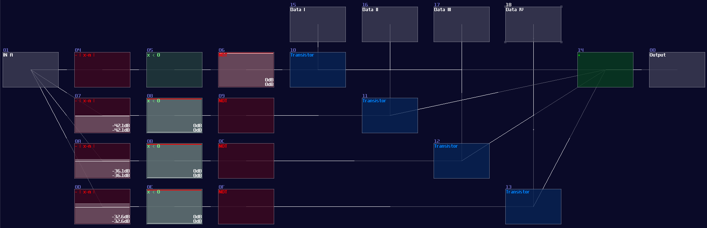

# Multiplexer and Demultiplexer

## Overview
Building a Multiplexer or De-multiplexer is not that difficult because you can build upon a decoder, so in this tutorial, I will teach you how to build such circuits.

## Multiplexer

Multiplexer can let you choose a input signal path for the output, just like a HDMI switch which you can select a specific HDMI input for your screen.

Here is the truth table for a 4 channel multiplexer, since there are quite a few combinations, I only show the most important state for this circuit. I will put an X in the table, which means “don’t care”, meaning that the input will have no change neither 0 nor 1:

 

| In A | In B | In Ch0 | In Ch1 | In Ch2 | In Ch3 | Out | 
|------|------|--------|--------|--------|--------|-----|
| 0    | 0    | 0      | x      | x      | x      | 0   |
| 0    | 0    | 1      | x      | x      | x      | 1   |
| 0    | 1    | x      | 0      | x      | x      | 0   |
| 0    | 1    | x      | 1      | x      | x      | 1   |
| 1    | 0    | x      | x      | 0      | x      | 0   |
| 1    | 0    | x      | x      | 1      | x      | 1   |
| 1    | 1    | x      | x      | x      | 0      | 0   |
| 1    | 1    | x      | x      | x      | 1      | 1   |

Let me build a simulation to see the circuit in action:

<object data="../apps/circuitjs/circuitjs.html?ctz=CQAgjCAMB0l3BWcMBMcUHYMGZIA4UA2ATmIxAUgoqoQFMBaMMAKABlwAWTi7rnhMRRQRAMwCGAGwDOdapHbgUeXjzDKKQkVQky5SBWEogUKHtgTDsaEBeFVsIhCyNVTPTmEK2bn7w6cXY3cQTjwHX3CRR1ogtzNVH1o+ANivYW4VTIoNbOEAEzoJAFdJABcGSTp88G0oWFYAcxyssIpCKmyqBQBJcA7bbG8Q7CHtaCRnPq8HSxMEu3HJlmmBzjh5jw3uiYoV-s6okLDu+uWAd35B7zA+de6WS9utqhnQ7cer+6-CHgUnu6-TahIH-H5qPiWFRg54tYFQqCfdQqRZvRYwjSo3JeRFPbHDBJ+XFKLI45GhKIYrJRN4nYnkunkhApJEaZk8ELs+l8UY3Aa8xFGKxjbKitqdQKXazJcwiymfaUUhwi0EKmyLAVEsGKoma6zcgR8WEIhQcEaEFTEbxDaFiKSyeSKY76q2hfWnXQOgxOwmu12cV0e+36RFmhIIAauiOnHTBx1AA" width="100%" height="500vh"></object> 

"Wait a minute, is that just a decoder with an extra input?" Yes! All you need is an extra AND gate for your data stream of each channels, and an OR gate to return the selected stream, and... You are done, a multiplexer!

It is even clearer to see the decoder in SunVox, as you only need to attach a modulator after the output of the decoder, while the modulators act as transistors, controlling the flow of the data stream channels:

## Demultiplexer
Instead of grouping multiple channels into one, de-multiplexer assign a single data source into one of the multiple destinations. 

 

| In A | In B | In D | Out Ch1 | Out Ch1 | Out Ch2 | Out Ch3 |
|------|------|------|---------|---------|---------|---------|
| x    | x    | 0    | 0       | 0       | 0       | 0       |
| 0    | 0    | 1    | 1       | 0       | 0       | 0       |
| 0    | 1    | 1    | 0       | 1       | 0       | 0       |
| 1    | 0    | 1    | 0       | 0       | 1       | 0       |
| 1    | 1    | 1    | 0       | 0       | 0       | 1       |

 

Unsuprisingly, you can also see a decoder here for select the destination channels, meaning that if we reverse the I/O from the multiplexer, we can get a de-multiplexer like shown:

<object data="../apps/circuitjs/circuitjs.html?ctz=CQAgjCAMB0l3BWcMBMcUHYMGZIA4UA2ATmIxAUgoqoQFMBaMMAKABlxiUKNDPvCKACxRRAMwCGAGwDOdapHbhePPmBWCRVKpNnykisJRCZu2PCOyE8Ic1tuiELI1VMghQm1ZsebVbI7Oxm4IYGbWFGGiAbRBrhjcCCreqtGBYIK2EXbunrYWJiAAJnSSAK5SAC4MUnRF4KLasKwA5rleBZ7+BdosAJIm+Fk2bilNSE4DaB0ioz1Q0BP9gz7Y3G5Ca42LFMvTkesJB9tLAO78wxeb3IrnYFzuW-vXUCx3Dy-33ELEfLdXvxMRx+fzeALUDwQhF670S0KBcJhyj4OX2OX+6hRBUx7VedxUvgRuIxBLyONCNzB5Ki+wpeORx3JKhJfCSfBCzKpDxSaIiGMhKi+FHhig4GVoDzCNgQD20IF0cgUzkyKUJary3BK5SqNTqDTlMEgrAy4WlUUJdM1pQkFWqtXqEANzWVptSFpUVu1dr1ju2RpYbXVPjwVEJvUDeTpXWO4dxbPcIdSSPFFAeIVlVPhMu4KYQKD8mdo+fA8KEhC0hfc5ZLobg9JTQjrGzrGNL1Y21dbRZGRzzBaAA" width="100%" height="500vh"></object> 

SunVox implementation:

## Conclusion

Decoder is vital for digital logic since you can create other combinational circuits from expending the decoders. In the chapter, you have learn how to build multiplexer and de-multiplexer for dynamically routing the signal. After that, we will move on to other type of circuit, the fully featured adder.

## Example Project:
[Monostable and Pulse Extender](../example_projects/fundamental/1.12-Mux_and_Demux.sunvox)