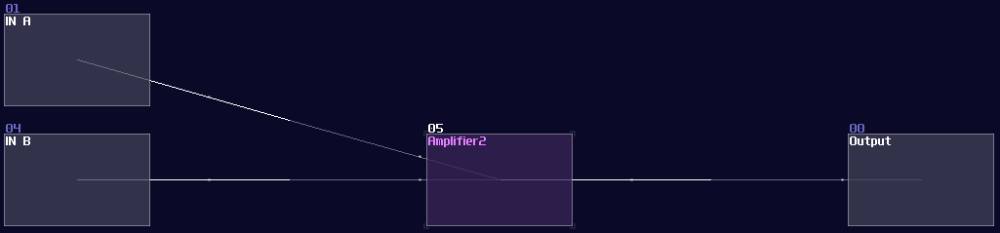
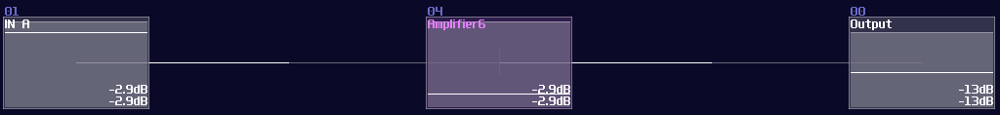
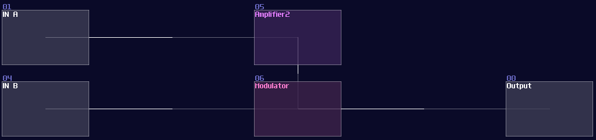
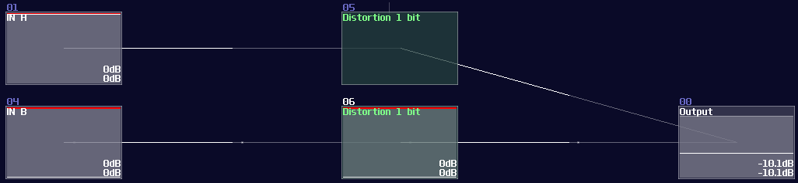
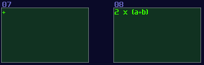
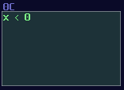

# Numerical Operations – Basics

## Overview

Since computers are worked in binary, it make sense to build a computer with such mindset. Normally, If I ask people how to add two 8bit numbers logically, people may said to build a full adder; however, since SunVox is a highly consistent and noise free environment, you can represent a data more than just binaries.

Let’s take a look in Amplifier, you know that you can find a DC offset option. If you move around the control, you can get a constant DC signal. That is the key of this chapter, since DC offset in amplifier has 257 steps, which is enough for representing a 8 bit integer. Hence, We can make use of this feature, to simplify some commonly used structure like adders and decoders.

Here are some of the the most basic mathematics and checking operation you would use in SunVox logic processing. They might sound like a joke at first, but you will find that most of the magic are just the following logic. There are more advance tricks as well, but this chapter will only go through the basics first.

## Addition

In computer, we must build a full adder to compute any given two number; full adder works with two **XOR Gate** which one of them handles the two inputs and another **XOR** handles the carry bit with the calculated result. There are **AND Gate** too for handling carry bit for the next bit. Here is the single bit of full adder:

<object data="../apps/circuitjs/circuitjs.html?ctz=CQAgjCAMB0l3BWc0FwCwCY0HYEA4cEMElURTJyBTAWjDACgwE1w1WNsMRPveoeAhExYgAzGIBsPBNLSSOsgd0rCA7jy6buYyBy2QGG3fp1TtUI+PNhJlfrcqHj5rPa1vLG-p59YvFhj+YOw8-s4WjoHhVhh4eOBxIPKsYEkR9HzxbBzZGaGZIHiUhRHF4GlF9kpl1dIhitL5qQWVDQGF7YVxCREpiQn97RES9QCcOnrgEwEm05OmAf3E0ggzK5bMJQVJPQPKQiKUo+DYcgqnTYKqItxDduQzUfaHADI5YanSQaxOIABmAEMADYAZyo5Es73KG1sMiulCBYIhSEM7262Thez+SPBkMMtm4a24UUkWii3AAJlQgQBXYEAFxowKolPAAicsEYhMefCUZL53xA1LpjOZrPZfxgkEYAHMQALwA9JJiHk4GPLFRsVQkNuqgA
" width="100%" height="500vh"></object> 

Single bit of full adder is really useless because it can only calculate number between 0 - 3 (including the carry bit), so we always cascade multiple of them to perform larger number like shown which is a 4 bit adder:

<object data="../apps/circuitjs/circuitjs.html?ctz=CQAgjCAMB0l3BWcMBMcUHYMGZIA4UA2ATmIxAUgoqoQFMBaMMAKAEIQATOgMwEMArgBsALlBABBADQAhKQGEQAZSkAdAM6KAxgPUiA9gFsNQ-QHMAllvDNVAR1sA7ZpHuQwqx+4933nsH6+Hs5w9gGe7q4Orl6B4bFRoY4saHggKAiEIHhUACxgWTni3PzCYlSQLADuINgIKDYNuXCNUNUgzVTMTS1gGFmVNZ3g-en4IwPtqRNjaZgNg7PpGA0ZWfNtQy0ozR0tuLmbe1TYhGnDudgLU+OXq+P1aYvTB0vDi8OvL5CHi3UNp3O+zOR3+6V2wx2FXaFyubzhz1u20yxyO00e6RRGL+9WyeVyaSKOPu5wJS2JtVOHTJ2CpFNyhEOuTJDN+7TBuWIWWZ5y5bQAMpjCl0UISKuJ+EJ1HRqJVBWtWmBRa1xZLpbKWPKUdMlXNxqq+FKZUg5ULwSK5rsDUaNVqsrSsrrKQMJYb1SbNWbAeBld7re6BWbWT7zozxFQ1cbAwrOY7lbHwyBIxqCk0yUUEEq8ekuLxBKIGEI6JxwImYO4WKnqXq0pmSTmSvmRIXi6XxeXWFWec6KFmHQ282UWyWIO3YJ3CGnQ4c6x0ww1G0OiyOy+PK5Pqx0+bOEwvBwXl23w2uzL2GhnmdnoafZ+jL9Nr2eewhL-3Hzuwy+mWH31mE1+txdSppgVaZ8nWfVc1KURwxScYFX7cCeyoRcYOhECUWDJDgxQ-dyjaIA
" width="100%" height="650vh"></object> 

We can build a full adder in SunVox too, but this is actually not a wise idea because we have a much simplier solution than a full adder; introducing the single amplifier, if you understand how to use amplifer to do mixing between two audio signal, you already know how to additional in SunVox because mixing audio signal is basically summing two number:

You may argue it doesn't have any carry logic, but we will learn this for the later chapters.

## Subtraction

"How about subtraction?" People may ask. For the beginner level, we fcan simply using an amplifier to invert the signal by seting the **Inverse** controller to on. Since you have negated the original signal, you can minus any number by combining the negated number as shown:

## Multiplication

There are two type of multiplications, the first one is static multiplication which you only need to change the gain of an amplifier to do the trick, which is not special, so I am not going to show any image about that.

Nevertheless, most of the equations not just multiply over a constant only, so that is the reason why we need dynamic multiplication. To multiply any number, you need to multiply one of the input with a gain of 128, and this normalize the signal for the following modulator which is used for multiplication; thus, you will something like shown:

## Negative Detection

Distortion has an interesting property when you set the bit depth to 1: If the value is less then 0, distortion generates a constant negative 128 DC signal; otherwise, distortion will not give any signal. This property is exceptionally useful, and this gives SunVox an efficient way to do conditions.

## Naming and Coloring Standard:

Unlike logic gates, coloring in numerical operations are not defined by the module type, but the equation type, and there are a few catergories:

If the function is Amplifier based while it only process positive number, I normally set them to green: 

When there is an inversion, I would set it to red, since it has similar function as NOT gate, which inveres the signal

If the module only process absolute, the color will be retained as the original color of amplifier:

So do multiplication and negative detection:

## Conclusion

Here we go, here are the basic numerical logic in SunVox, but you may wondering: how about division; how about geometries; how about squareroots? No worries, I will tell you about that later since they are more complicated.