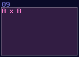

# Numerical Operations – Basics

## Overview

Since computers are worked in binary, it make sense to build a computer with such mindset. Normally, If I ask people how to add two 8bit numbers logically, people may said to build a full adder; however, since SunVox is a highly consistent and noise free environment, you can represent a data more than just binaries.

Let’s take a look in Amplifier, you know that you can find a DC offset option. If you move around the control, you can get a constant DC signal. That is the key of this chapter, since DC offset in amplifier has 257 steps, which is enough for representing a 8 bit integer. Hence, We can make use of this feature, to simplify some commonly used structure like adders and decoders.

Here are some of the the most basic mathematics and checking operation you would use in SunVox logic processing. They might sound like a joke at first, but you will find that most of the magic are just the following logic. There are more advance tricks as well, but this chapter will only go through the basics first.

## Addition

Addition is common in SunVox because mixing two audio signal is already an addition; thus, we may use an amplifier (or modulator in add mode, or EQ) with default settings to combine two values.

There might be other features for additions as well, and will talk about that in the later sections.

## Subtraction

"How about subtraction?" People may ask. For the beginner level, we can simply using an amplifier to invert the signal by seting the **Inverse** controller to on. Since you have negated the original signal, you can minus any number by combining the negated number as shown:

Alternatively, since the 2.1.2 update, we can also use the subtraction mode in modulators:

## Multiplication

There are two type of multiplications, the first one is static multiplication which you only need to change the gain of an amplifier to do the trick, which is not special, so I am not going to show any image about that.

Moreover, most of the equations don't just multiply over a constant only, so that is the reason why we need dynamic multiplication. To multiply any number, you need to multiply one of the input with a gain of 128, normalizing the signal ; thus, you will something like shown:

## Negative Detection

Distortion has an interesting property when you set the bit depth to 1: If the value is less then 0, distortion generates a constant negative 128 DC signal; otherwise, distortion will not give any signal. This property is useful, as this gives SunVox an efficient way to do conditions.

## Min / Max

If you want to find out the highest and lowest values given the input signal paths, modulators can accomplish the task with using "min", "max", "min abs" and "max abs". They pick up the highest/weakest signal out of all signal paths, while the abs mode only consider the magnitude of the signal.

## Naming and Coloring Conventions:

Unlike logic gates, coloring in numerical operations are not defined by the module type, but the equation type, and there are a few catergories:

If the function is Amplifier based while it only process positive number, I normally set them to green: 

When there is an inversion or subtraction, I would set it to red, since they all have the idea of opposing and negation from the inputs:

If the module only process absolute, the color will be retained as the original color of amplifier:

So do multiplication and negative detection:

These are not strict rules; as long as your coloring is consistent, it is not necessarily to follow the coloring.

## Conclusion

Here we go, here are the basic numerical logic in SunVox, but you may wondering: how about division; how about geometries; how about squareroots? No worries, I will tell you about that later since they are more complicated.