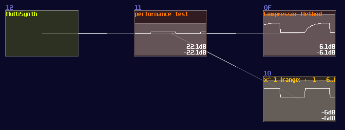

# Numerical Operations – Dynamic Division

> This is the extension of the previous chapter and they might contains advance concepts; if you feel overwhelmed, please move on to other chapters first and goes back to this chapter once you are ready.

## Overview

Due to the re-discovery of the properties in [waveshaper lookup tables](https://logickin.net/logicprocessing/waveshaper-in-lq-mode-redifines-sunvox-programming/), quite a few mathematical operations, considered as impossible, have been brought into the reality. Let we show you the first problem:

Division has been my headache since I was messing around logic stuff in SunVox, as most of the division methods require a dynamic number of iterations. This is not really an issue in computers because they have ultra high clock speed and low feedback latency, making the process time being unnoticeable; nevertheless, this is not applied in SunVox owing to its rather long 20ms feedback delay and its limited sample frequencies (44100, 48000 or 96000 in most cases). As a result, division will take ages to complete.

Take 8455 / 2 as an example; if we loop for every iterations, we ended up increasing an accumulator by 4228 times, which it takes (4228 * 20) / 1000 = 84.56s. Roughly a minute to complete a single division is horrific because not only we ended up with wasting all the time to do a simple task, but also making the machine hard to predict the run time. Thus, we must find something better.

## Multiplied Divisor

Let’s look at the first non-iterative method. Considering that we only need to divide a single bit, we only need to know a few things:

1. Is dividend (Numerator) large enough for cancelling the divisor (denominator)?
2. If so, how to represent the answer?
3. How to handle for the remaining values?

As you can see, since we need to compare number between dividend and divisor, negative detector is needed, and because negative detectors only switch on when dividend is smaller than the divisor, we must apply an NOT gate for the answer. We must sort out the remainder as well, so we must return the subtracted result during comparing the the two inputs; hence, we have the following:

But... why is this have a x2 for the divisor side? This is the middle stage of the division logic, which the divisor is multiplied by two for each stage, except for the first stage. Thus, the divisor is grown exponentially by passing every stage, to minimize the number of subtraction by representing the answer in binary form. If we apply this rule, by chaining 8 of them, we can get a 8 bit division circuit:

It works because it is basically a binary long division; if you insert 67 / 5 into the structure, it triggers stage of 8x and 4x and 1x which is 13, while the remainder 2 is shown in the remainder module. (Module 2E in the image of 8 bit division structure). It works on decimal number too since there is no quantization, so you can easily fill a equation of 10.6 / 5.3 and you can still get a two.

However, this circuit has two flaws. The first problem is quite obvious that the result does not support answers with decimal point, so you cannot compute anything precise; another problem is the range of operation is narrow. Even though you can extend the number of stages to handles larger number or finer fractions, it is unrealistic that the division circuit is so huge which might consumes too much CPU power, so this implementation is not ideal yet.

## Newton’s Method With Waveshaper

You might already know in the “Waveshaper In LQ Mode Redifines SunVox Programming” post. Let me tell about about the Newton’s method which includes a division algorithm which provides a great result with a small, fixed number of iteration. All you need to know is the following equation:

 

\\[ x_{n+1} = x_n ( 2 – a x ) \\]

 

a is the number you want to invert while x is the initial estimation. 

To find the best initial estimation, the initial estimation must not exceed 1.5 times of the actual result. With a great estimation, you can get a great result of 1/x. In this example, we find the result of 1/16.56 with the estimation 1/16, which provides a result that is accurate after 15 decimal points:

 

\\( x_{n+1} = 0.0625 ( 2 – 16.56 \times 0.0625 ) = 0.0603125 \\)
\\( x_{n+2} = 0.0603125 ( 2 – 16.56 \times 0.0603125 ) = 0.0603863828125 \\)
\\( x_{n+3} = 0.0603863828125 ( 2 – 16.56 \times 0.0603863828125 ) = 0.0603864734298157 \\)
\\( x_{n+4} = 0.0603864734298157 ( 2 – 16.56 \times 0.0603864734298157 ) = 0.0603864734299517 \\)

 

On the other hand, you can’t estimate a number from 0.5, if the number you want to invert is 5 which is resulting in a 0.2 because 0.5 is 2.5 times greater than 0.2. In consequence, you will go to infinity and soar beyond the ideal range:

 

\\( x_{n+1} = 0.5 ( 2 – 5 \times 0.5 ) = -0.25 \\)
\\( x_{n+1} = 0.25 ( 2 – 5 \times 0.25 ) = -0.8125 \\)
\\( x_{n+1} = 0.8125 ( 2 – 5 \times 0.8125 ) = -4.92578 \\)
\\( x_{n+1} = -4.92578 ( 2 – 5 \times -4.92578 ) = -131.168 \\)

 

That is the reason why we need a lookup table from waveshapers. To get the optimal lookup, we may follow the following equation:

 

\\[ f(n) =
\begin{cases}
0.75,  & \text{if x = 1} \\\\
1/x, & \text{otherwise}
\end{cases}
\\]

 

The reason for the 0.75 when x = 1 is to avoid the >1.5 problem when x is between 1.5 and 2. Because we already have a lookup table of 1/x, we can not only have a relatively good initial estimation, but we also can do 8bit integer division out of the box as shown. 

Now we can apply the Newton’s method as shown:

You may see there are four stages of duplication, and they are exactly the equation of \\(x ( 2 – ax )\\), which the upper modulator represents \\(ax\\) while the lower one represents \\(x (…)\\), and the red modules represents the result from \\(2 – ax\\). 

After \\(x_1\\) has been calculated, it is passed to the modulators of the second level, to do the second iteration, and so on, and we extract the result at the last stage.

This design has a limited range, but its audio rate performance is perfect for sound design like physical modeling and filter design, you may conditionally prepend and append a module for multiplying input and output over a constant to get a wider range.

## Newton’s Method With Compressor

Right after I have posted the [division module](https://warmplace.ru/forum/viewtopic.php?f=11&t=6254), [fuzion_mixer](https://soundcloud.com/fuzion-mixer) asked a question:

>I don’t know if you have thought about trying to do division like this:
>Controlling the Fine Volume in 04 alters the value in the compressor
>in which a curve that looks like 1/n.
>The only problem is that it has a lower threshold of 128 before it starts curving.

Along With the old post about a [compressor design issue](https://warmplace.ru/forum/viewtopic.php?p=8342#p8342), which NightRadio had posted the fixed version of the compressor algorithm; the algorithm basically only has a single division with a bit of other variables:

 

\\[ Gain = Threshold / ( Threshold + ( Envelope – Threshold ) \times Slope ) \\]

 

That is an interesting question because if we can use compressor instead, we can further simplify the design of the division module.

Thus, we did a test by using a compressor only; here is the original SunVox Project from fuzion_mixer, related to the compressor divider prototype, with a little re-coloring for explanation:

To test the accuracy, we made another project and performed a simple calculation, \\( x / x \\) . Since \\( x / x \\) must equals to 1, we can subtract another one after the division and multiply the subtracted result to see how large the error with both of the methods. Meanwhile, we also did a performance test by firing a fast pulse to see the respond time, considering the release time of the compressor might slow down the throughput:

With this approach, we have found a few properties with the compressor method:

For smaller values, where x < 65535, compressor has a slight worse precision than waveshaper, considering the little error after attempting to nullify the result with -1.

Eventually, due to running out of lookup and pre-multiplication, the waveshaper method losses accuracy, while compressor maintains the same level of error, making it great for application with larger range.

Nevertheless, because the release can not be zero, the compressor introduces a little latency, so that is not ideal for realtime application:

This is a great discovery since we have more than one way to divide a number with less CPU usage, so we decided to replace the waveshaper with a compressor for initial estimation in order to provide a higher precision.

Although it has more modules than the purely compressor method, it still has lower CPU usage because of the lack of pre-multiplication (and fewer stage in the latest version), which this design is suitable for controlling signals in the Metamodule controllers.

## Newton’s Method Inverter – How to

Instead of re-inventing the module, you may use my division module in my tool kit, including waveshaper and compressor inverter. As you can see from the example above, these modules only calculate the \\( 1/x \\) for the divisor instead of divisions. To divide a number, we need to do another multiplication:

To achieve number that is out of range for waveshaper inverter, we must multiply a value at the input and output. Take 4 / 0.25 as an example; this is out of range with the Inverter, so we must multiply the value before and after the inverter by a constant (256 for this example):

To make range extension more practical, you may also perform a range check when numbers have reach certain threshold by using subtraction and negative detection.