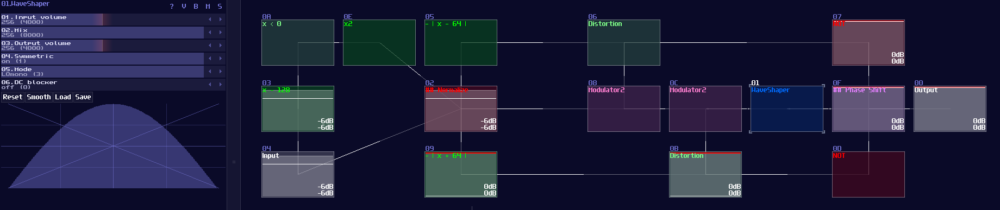

# Numerical Operations – Trigonometry

> This is the extension of the previous chapter and they might contains advance concepts; if you feel overwhelmed, please move on to other chapters first and goes back to this chapter once you are ready.

## Overview

Trigonometry functions are commonly used for splitting a vector into x and y directions, finding the length of a certain side of a triangle given an angle, or calculating or modeling any equations that have a oscillation. Similar to division, it also requires waveshaper to do the tricks.

## Sine

Since Waveshaper can be used as a lookup table, we can build a trigonometric function easily. In fact, there is already a sine curve for waveshaper, ws sin2 curve in the curve folder. Thanks to the Symmetric Function in waveshaper; we can expend it to a full sine curve loaded in the waveshaper with DC blocker disabled (LQ mode is optional, depends on how accurate your application is.):

How this function work is when DC equals to 0 or 128, it corresponds to 0 degrees (0π), so the output is 0; when the input is 64, the degree and radian is corresponded to 90° and 0.5π respectively, so the output is 1, and so on.

However, this is not a good solution because the peak of the sine function is not a perfect 1. To fix the problem, we must hard code the value one when the input is either 64 or -64 (±90° or ±0.5π), so to give out a perfect DC unit for these two specific case. Thus, with two extra number detectors to override the original imprecise reading; as a result, we have the following structure to find out a good approximation of a sine function:

## Cosine

We can make cosine from sine by introducing a bit of offset, because you may consider that cosine is a phase shifted version sine. Hence, we can apply +64 DC offset which is same as adding 90°, to get the cosine waveform; nevertheless, the lookup table cannot wrap around if the input approaches to the limit, so we must add another set of detector, to check if the input value has goes beyond 64 so that to enable a signal to reset the lookup table.

## Tangent
"So how about tangent?" people might ask. Tangent is a bit more complicated because it introduces infinity for every π/2, so it is impossible to get the perfect result when we close to the limit, but for the general case, it is possible for getting a reasonable approximation and we don't need to build another structure for that, thanks to the following equation:

 

\\[ tan θ = sin θ / cos θ \\]

 

Thus, we can use the divider to find out the value of tan like shown:

 
Since the division module have a limitation on representing infinity, the closer the input towards to π/2, the less accurate it becomes; hence, it method is only good for less precise applications like graphics.

## Conclusion
That's about it, here are the commonly used Trigonometry function, and we have gone through the basic sin(), cos() and ten() using waveshapers. For now, let we pause the numerical operation for awhile and introduce some other basic components.