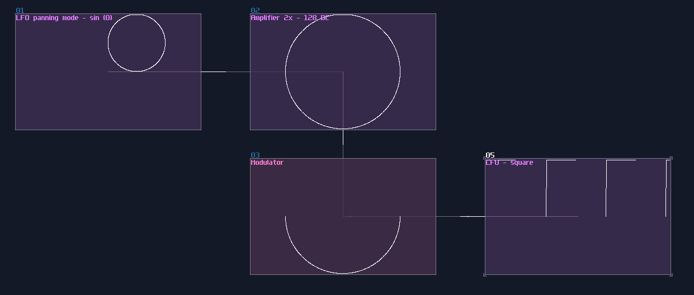

# Arcs, Spirals and Curves

## Overview
In this tutorial, I will tell you how to build arcs and spirals based on the knowledge from the previous chapter.

## Arc
Sometimes, we only want to have part of an arc of a circle, to form curves, semi-circles or fans. To do that, you need two LFOs, synced with the same frequency, and set the waveform into square and circle respectively. The smoothing function for the square LFO should be off to get a clean cut for the arc. Once the LFOs have been set, multiply both signals using a modulator, and you will get an arc of a semi-circle:

If you change the duty cycle of the square signal, you can get different arc proportions; more the controller goes toward to the minimum, more complete it becomes, and vise versa towards to the maximum. You can change the phase of the square to change the starting point of the arc too, but make sure you have clicked the stop button or using midi signal to reset both of the LFO to have a consistent orientation:

## Spiral
There is only one step ahead to convert an arc into a spiral; all you need is to change the square wave LFO into a saw wave:

We can get a denser spiral by halving the frequency of the sawtooth by the following equation:

\\[ \text{frequency of sin LFO } \div  \frac {\text{frequency of sin LFO} }{2^n} \\]

In this example, the frequency of saw is 4 times lower than the sine, so the spiral is 4 times more dense than the previous setup:

By contrast, if you set the rate of the sawtooth wave by \\( x \times n \\), despite being less dense, it draws a rotation symmetrical pattern by duplicating the original segment by n times; here is an example for turbine like shape, multiplying the saw frequency by 5:

The direction of the spiral is depends on the type of sawtooth; if you want your spiral spinning in counter clockwise, you need to use saw down instead of saw up:

## Waveshaper

Waveshaper also comes in handly if you want to draw a wild looking curve, by simply draw a curve in the waveshaper without DC blocker. You may use symmetry setting optionally depending how you want to draw a curves:

## Conclusion
That's about it; as you can see, there are a lot ways to play with curves and to make complex pattens only using LFOs, Amplifiers, Modulators and Waveshapers, go ahead to messing around with different modules, to see if you can get something wilder. For the upcoming chapter, I will add another level of complexity by introduce the terms: Multiplexing
