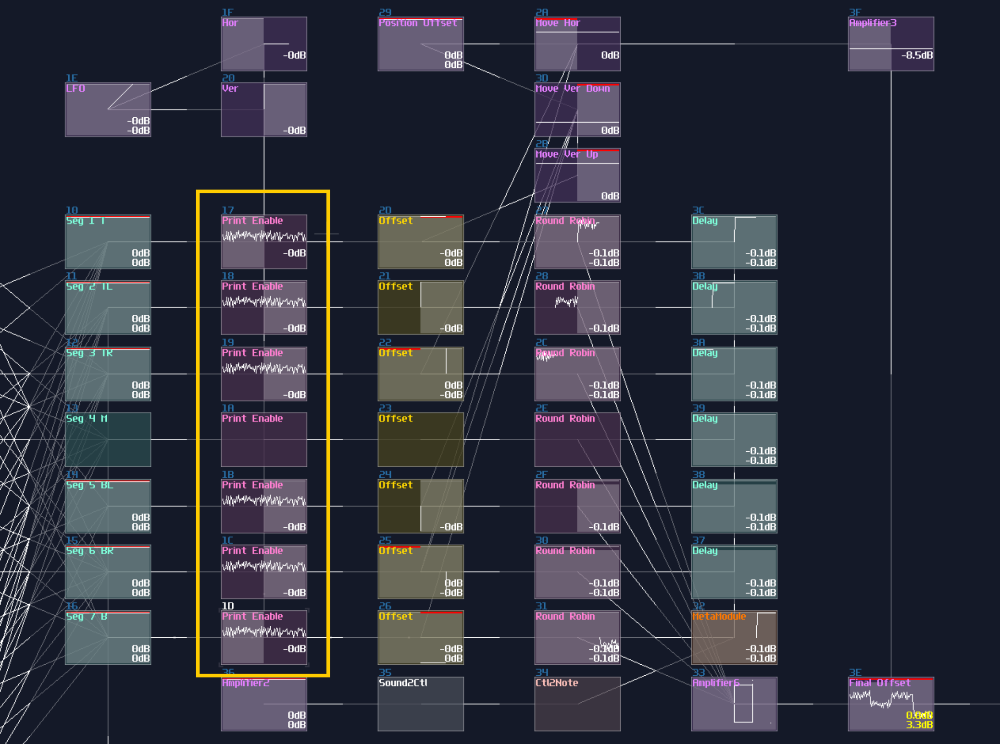
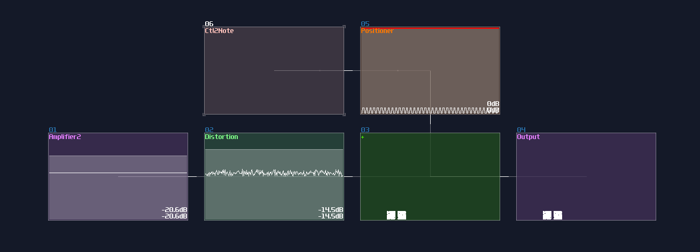

# Complex Shapes With Multiplexing

## Overview
> If you can play it slowly, you can play it quickly.
> 
> [*- The Sacrilegious Violin Guy (2018)*](https://www.youtube.com/watch?v=BvsvaCU6i1M)

"If there are only points, line and circles, why are those seven segment displays existed in the pong game and the VOXCOM 1610?"

As you are wondering, there is no way to make display using the techniques I have mentioned before because there is no way to conditionally control the individual segments other than redraw everything. To achieve such behavior, you must do Multiplexing.

## Concept
Let we put SunVox away for awhile for introducing the concept. In the real world, displays don't have an one to one pin for every pixels because this approach is expensive and space inefficient. Take a standard standard definition 16:9 television as an example [^tv_resolution]; if the aforementioned way for controlling pixels was used, you would needed 640 x 480 number of control pins! (307200 in total) There is no way to have that many pins for a processor to control, not to mention how we can suppose to route all the connections with all three colors.

Therefore, to make it more space efficient and easier for processors to control, one of the solutions is to connecting the input pin of LEDs into specific rows, likewise to the output pins into a specific column, forming an matrix like shown[^dot_matrix]:

Great, we have now reduced the complexity of connections from \\(O(n^2)\\) to \\(O(2n)\\) which is far easier to manage, especially for larger displays. With this approach, we can light up individual LED by switching on the a specific row and column. I have prepared a little simulation so that you can try out the LED matrix:

<object data="../apps/circuitjs/circuitjs.html?ctz=CQAgjCAMB0l3BWEA2M0wE4EYBwBYDMcMAmEpBSECqhAUwFowwAoPSJDMEkAZkjzhuVfoNrUWAJxBceokDmSD5VMHCkzufXsgVLtu1eumy+yHHuXmo4Y5p7sqiwY5trIG03l49nIbzxGHgDOlnwCCnDhYuAgAGYAhgA2wXQsoX68OpEi2arxyanpYToWOFGlbgUpaRn6ruVUrvmJNcV+ATn+PlWtRaEYBP76g4IIJBYthbUyAOy6eCPz1BO908XuFouCmyuTsX0zauzDOwK0q1NtoWqzDvq3POP7EIcsAOYyQ89fY0NUHk+GGWP2BugQ-ygH1skAsP12EJigNsJ3h52okORjz2tjuGKRLAASl15PMLCobKibADoAgWAB3EkRRoGKGMllZXQc6wedkVaws5oMroNKKdDxAA" width="100%" height="500vh"></object> 

Nevertheless, there is a problem: the matrix works for individual light, how about a more complex shape, like a letter "A"? No matter how hard you have tried, you can either able to switch on or off for the whole row or column of the matrix, and you can't switch off the middle LEDs. 

This is where Multiplexing comes in. Multiplexing doesn't generate the whole image, but one line at a time like shown:

<object data="../apps/circuitjs/circuitjs.html?ctz=CQAgjCAMB0l3BWK0BMC4E4AscwGYA2AlMFDEdCiyCgUwFowwAoHJbLEPSTphFLjyhUEzAE4gOgzgA4MBacLBxxkrJzyEQchZoU1lkVVMIzt8rgTMGVEqTho6QDpbbWcseAU88CbRgCUQAHZ+EBRggVCBFBxwcPB4cOgkFBThGFEwAjwQlBpuTmCZDSEEUgEkJBoaqGYgyJpfECszZtq46oyU5gBCEAATWgAzAEMAVwAbABclABoUObw5rDmkAEE5gCE5gGE5gBE5gFFBsQBLADdaMQAdAGchgGMAeyGJQzhbgEdcL4A7SCfH5A0G3QGgyAgpjKcHwWG-ZSwiG4aFg-7MfJmUhwZy40gEDy4nAWIZjKazWpdIwAd202UUTkKdTpMgZem0Xi4Wlp9N0Vm0WDMphZfLxjkJ4tFbIUzRkMiaXN5Mi5HKZPOYrKFljMTIFyslLh8uOVCucXJ8Ss12jNcrNET81vlNAd4EILsiovwBA9Am9BX1TsNuJkkrQ+iDnHDbpQZmjvPwsfCCAUieFga16d12tiNSdObipAsua9ZAUJaL-OsTtVWhVMVi0q5KEbBKjjYTKDDra7GgzYuZMvCkGrrIZWPAKGbI9L0+xU4EIqMsyYWiwFiYQnX+nijGgwWICH4GBIJ6LwXIYGgobQx9PFTwWAYykSNDJExmqiYJRare9v84fwvzAH8EBPcB-zAvxX2A0CfQgrQU1qQxYM4fhsUgpMgI+ECPA3f9t1cBNlA8SVNw8M0E3dZwyOowiqPgwjvzwiM6TTGjeC8Mx0K9LiKCTZj+NHScLCwMiywoeDOwsJCILgvM2N7DjJ0lKDS1U8DBLUzsuTE3gFwA2cBGIXhcMM5cILKATIE9HiDBAPcD1vMhTxIMgL3Aa9DzvMAMAfJ9GH8QYRg-aZrXIihSESWz1C9TCMKs4TlBi3geBoBADzqFcbMqeCSPSqT4hgAgT0gPA5CFEgZFjEDkGCEDlEIPB0AwC8IiQQxgvJT82LSihMsMMwfWrbLOk0uBuPA+zHO8lzfLc1rLy85yzz8ltH2fIL3wpcKJpaGdWoUQk82ymcTMkTLzumq8nKPOaz3cpabzu1b-M218utC8LILynLJIUhCFDU-KKCm76tHOwbzOtQ7lNh4avT2vTX24zKEz65GQYQWL0c9TG-vKR0AHMLqOuInGOjJmCAA" width="100%" height="500vh"></object> 

If it can do it slowly, it can do it quickly. Once you have increased the simulation speed, you can start to see the letter "A" on the dot matrix display because it is fast enough to fool our eyes to see it as a single still image rather than a bunch of scan lines although it is slightly dimmer than a constantly on LED.

This is the priciple of multiplexing, so let me show you how to do that in SunVox.

## Implementation
Let me start from a simple example, making an interlocking twin circles. Here is an image made by overlapping two modules:

Clearly, we can't do that inside a metamodule because we only have one output channel, so we must combine the two elements into one before returning the result. We can't just sum two images using amplifiers because it will only sum the total magnitude of two circle into one, resulting in a larger circle:

For that problem, we must show them one at the time; this can be done using a square LFO and a NOT gate, alternating the first and the second circle using modulators. Keep in mind that the frequency of the square LFO must not be the multiple of the LFO which generates shapes, or you will get a incomplete shape:

For more segments, I will show you the solution by building a 5 segments diamond:

Since there is more than 2 components, you can't just use a single LFO to separate all the elements, and you will always have overlapped shapes. For this situation, you need additional delay modules and a modification to Duty Cycle of the LFO. To generate a pulse with the correct weighting, you may loosely base on the following equation:

\\[ \text{Dyty Cycle } = 256 - \frac {256} {n} \text{ , where n is the number of segments}\\]

For the diamond, it is true that you can split the pulse into 5 parts, but because the resolution of the controller, the duty cycle might have some rounding error. Hence, I normally round up the number to the nearest \\(2^n\\) which is 8; I based on 224 which has a subdivision of 8, but because the LFO is not perfect, and overlapped segment might exists, I picked 226 as a result. For the refresh rate, I used 347Hz which has no harmonic relationship to the generators which is 256Hz.

Now we need to find a way to select the segment sequentially; thus, we need modulator for each segments. The top segments can be connected directly to the square LFO, but for the following segments, we need to control them with a cascaded delay, with the delay time which is exactly the timing the LFO times the number of sub division that is 8 in this example; therefore, we need to use 2776Hz for the delay. 

Once you have set and chained the delay, you can now sum all the segments into a single amplifier, to complete the image

Because now you have controlled the segment independely, you can put an additional Transistors (or Sound2Ctl) before or after the delay chain, to dymanically control each segment, to form a 7 segment display like my pong module:

Sometimes, LFO clock is not necessary which you can replace it with a Sampler with a custom, looping waveform. To recognize the first segment of the sample, I have inverted it into the negative side, acting as a pilot signal[^pilot_signal], and you may see it at the left side of the waveform which I have used for a 14 segment display as shown:

With a pilot signal, you can use that for triggering the first segments by using a negative detector; the detector should generates such a uniform pulse that works like a pulse generator we have made for the previous design; after that, you may use the same delay trick to print the remaining segments, as long as you remember to invert the signal to the correct orientation:

## Limitation
Multiplexing is great if you want to build a complex pattern, but it is not a sliver bullet for everything, especifically if you have too many things wanted to be rendered. Hence, I am going to point out a few:

### Fainter Images
More the components, more the context switching, if your shapes have too many conponent to be rendered at the same time, the image will be faint to see. To show that limitation, I start by showing from a single pixel:

It is nice and clean, but now, let me emulate the multiplexing behavior by quickly switching the position of the pixel using a metamodule containing a DC generator quickly moving by a pattern automation, like shown:

It is currently displaying two pixels, meaning the two segment only have half of the time on the screen. Let me graduately add new segments by a multiple of four, and see what would be happened if there are high number of pixels:

4 pixels:

16 pixels:

64 pixels:

At the 64 pixels matrix, they are much harder to see and the square are much less crisp since each square only share 1/64 of the rendering time, causing less point plotted with the same oscilloscope buffer. This currently have no single output module solution because it is bound by the buffing time of the module visualizer, unless there is an update that multiple output is possible while the visualizer will output all the point from the multiple output channels simultaneously.

### Imcomplete Imgaes due to Synchronization
Another limitation is that every segments of the same level must have no harmonic ratio to another. Take the diamond as an example; if you set the frequency of the line generators same as the multiplexing pulse generator, you will get an imcomplete image by taking the same segment of the lines:

This can be problematic since you may need to find the sweet spot for each generators by trial and error.

## Conclusion
What a journary! We have finally made it to the end of this chapter about doing multiplexing for drawing a more complex shape; for the following chapter, we are going to mess around with the geometric transfomrations.

## Example Project:
[Multiplexing](../example_projects/graphics/3.4-Multiplexing.sunvox)

### Reference

[^tv_resolution]:[TYPITO - List of TV Resolutions](https://typito.com/blog/video-resolutions/)

[^dot_matrix]:[Image by Microcontrollerslab - LED Matrix Interfacing with PIC Microcontroller](https://microcontrollerslab.com/led-matrix-interfacing-pic-microcontroller/)

[^pilot_signal]:[Pilot Signal](https://en.wikipedia.org/wiki/Pilot_signal)