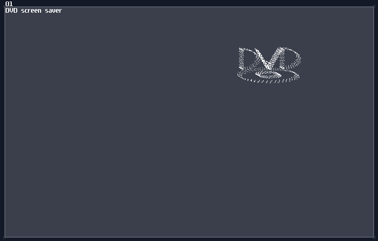
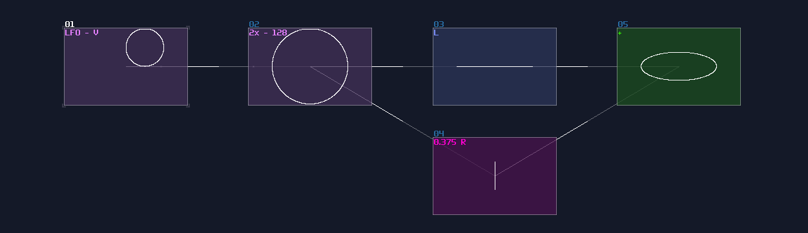
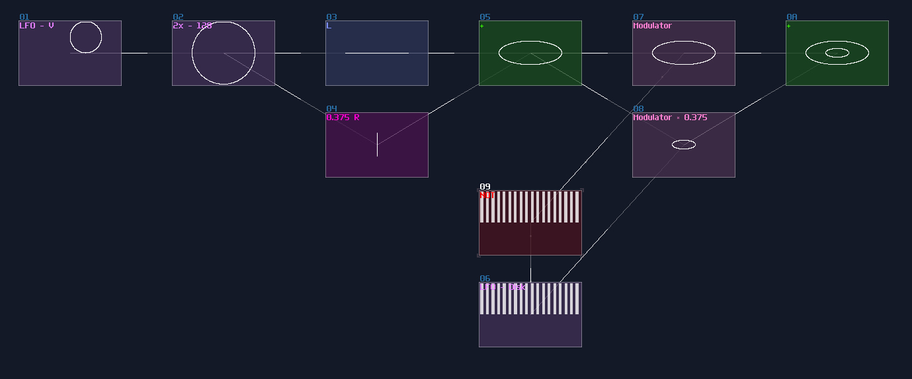
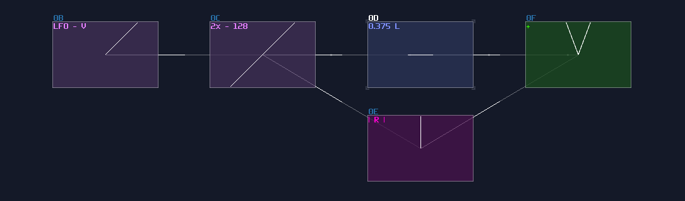
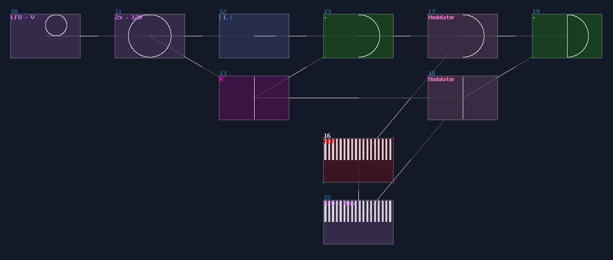
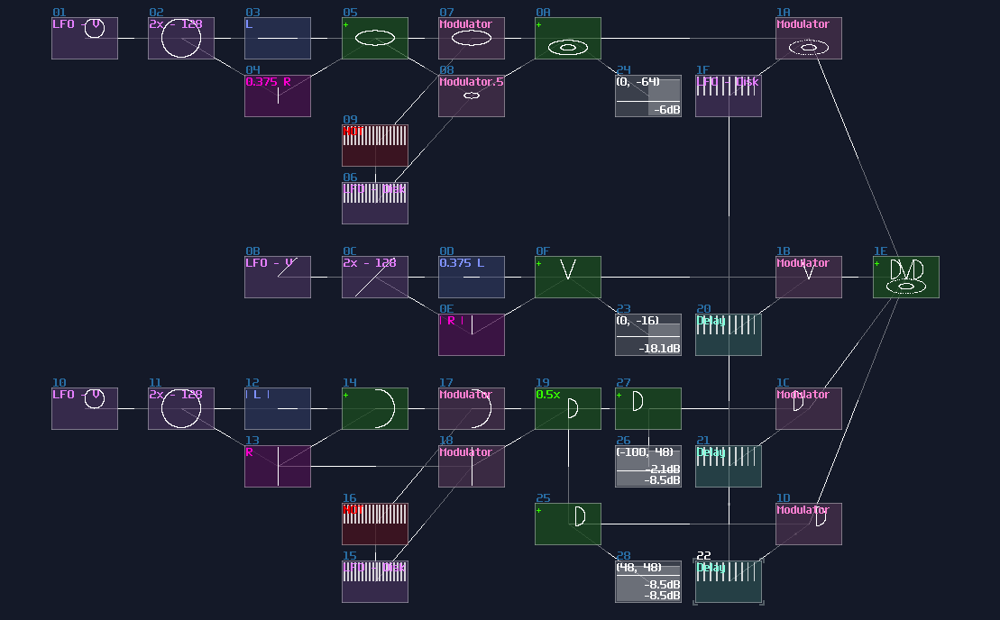
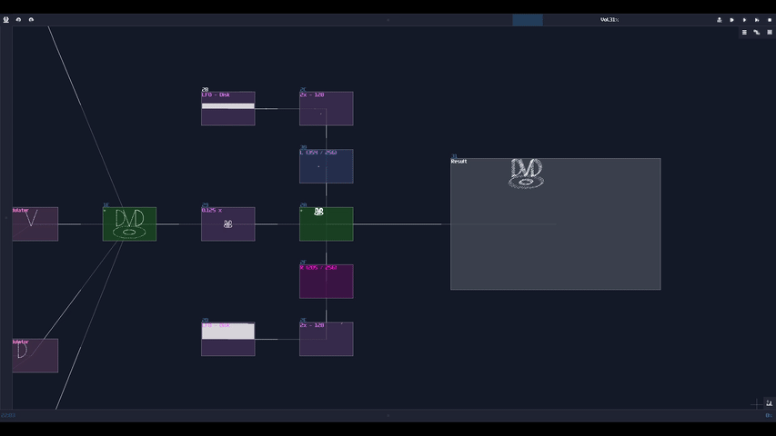

# Example - DVD Screensaver

## Overview
After we have learnt all the tricks for graphic, we are about to use the knowledge to build our first complex project, the DVD Screensaver!

  

\* Demonstration purpose, this is not the exact version in the following tutorial.

## The Segments
DVD logo can be broken down in several elements:

- Two "D"s made of a semi-oval
- "V" made of two diagonal lines
- Two ovals for disk

Let's focus one the easies, the two ovals. This can be done using the same circle LFO, with scaling down the y axis by 0.375 (96 / 256):

Then, apply a square LFO for multiplexing, where one of the oval have the 0.375 of the original oval:

The "V" is also simple; you just need a single Line LFO generator with normalizing to ±128 using an amplifier, and set the y axis with Absolute mode to flip the negative side up. The "V" is a bit wide, so you may decrease the volume of x axis:

For "D", instead of using LFO, you may use the similar absolute trick to flip the left side of the arc to the right. After that, all you need is a line, combining with the arc using multiplexing. The straight line can be made using the Right channel of the circle, representing as the y axis, so you can save yourself a LFO for line:

It is the time for merging everything; as usual, they are all multiplexing. Because all of the character are in the wrong position, you must do translation for all elements so that you can get the logo of the word "DVD" on the disk. Due to the compactness, I made metamodules for generating DC offset independently to the Left and Right channel, and the numbers represent the DC offset of Left and Right channels:

We now have a DVD logo, but... without the iconic bouncing motion, it definitely lacks something; therefore, we can add two more triangular LFO with slow but independent speed, to make it move around; meanwhile, the logo is a bit too large, so we also need to scale it down a little:

Once you have done, wrap it as a metamodule and you are good to go.

## Conclusion

You have now understand how to build a DVD screensaver with the knowledge you have gain from the previous chapter; for the next chapter, let me take that into the next level.

