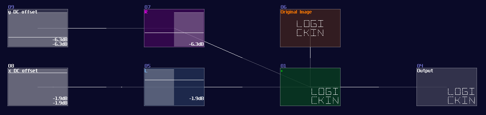
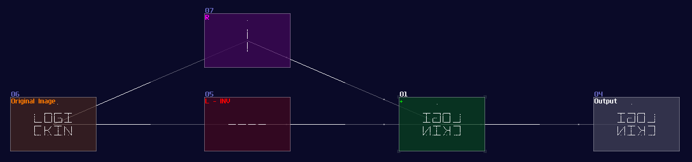
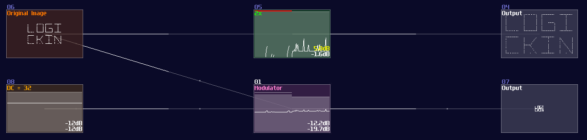
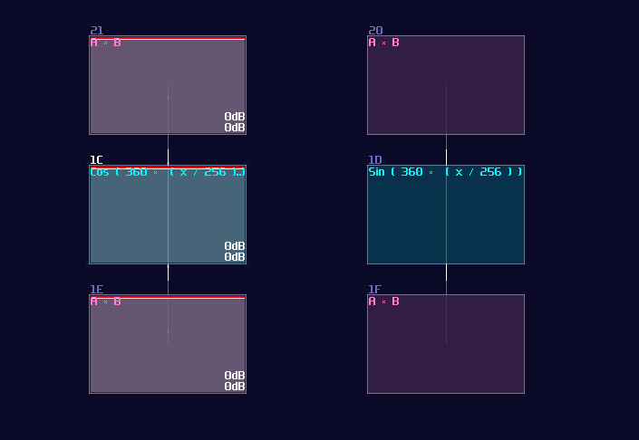
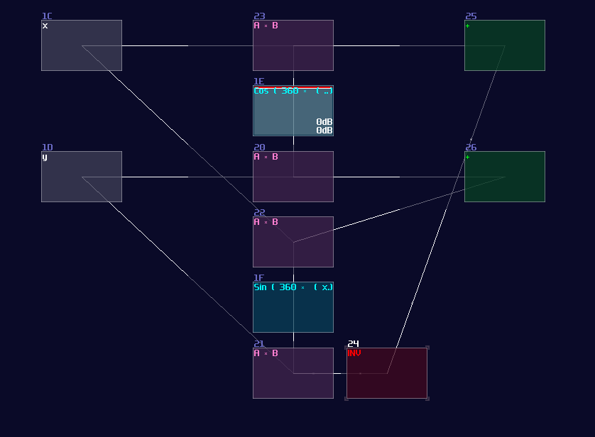
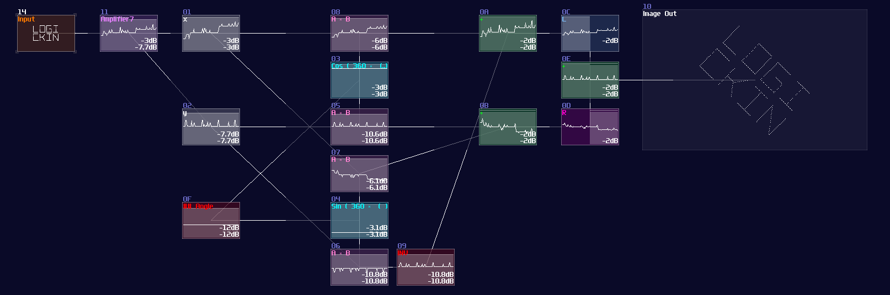

# Geometric Transformations

## Overview
To make your drawing animate, you need to know about the 4 basic geometric transformations, and I am about to tell you that, starting from the most trivial solutions.

## Translation (Moving Things Around)
Moving things are as simple as addition because you only need to add an additional DC offset to your original elements, where the axis is controlled by the respective channels:

## Reflection (Mirroring Things)
Reflection is as simple as translation because instead of adding an offset to the respective channel, you only need to negate of the channels. In this example, I mirrored the text Logickin by inverting the left channel:

## Dilation (Scaling Things)
Not surprisingly, If amplifier is for addition, modulator is used for scaling an image because dilation is basically a multiplication. In fact, increasing and decreasing the gain of any modules can also do the same trick.

## Rotation
"Yay! The solutions above are very simple! It applies to rotation, right?" 

Sadly, this is the tricky part because there is no trivial solution; however, with a bit of math and the understanding of trigonometric concepts, you can relatively easily to get it spin. Let me show you the rotation equation[^rotation]:

\\[
    R = \begin{bmatrix} \cos{θ}&-\sin{θ} \\\ \sin{θ}&\cos{θ} \end{bmatrix} \cdot \begin{bmatrix} x \\\ y \end{bmatrix}
\\]

For people who don't understand matrix, let me convert that into two separated equation so that it is easier for you to follow:

\\[
    x^\prime = x \times \cos{θ} - y \times \sin{θ} \\\\
    y^\prime = x \times \sin{θ} + y \times \cos{θ}
\\]

Where θ is the number of degree of your rotation.

After we have simplified the equation, we can now implement it into SunVox because not only everything is straight forward, but we also have learnt how we do [trigonometric function](../fundamental/numerical_operations_trigonometry.md). To do the multiplication, we can count how many times we have used the sin and cos function, which is four in total; because all of the trigonometric functions share with the same θ as variable, we can further reduce the number the trigonometric modules. As a result, you only need one "sin" module connecting into two modulator for multiplication, likewise for the "cos" modules.

  

Once you have set the multiplication right, you may sort out the remaining part. Since the result of x requires a subtraction, we must invert one of the product of sin θ, and combine with an output of the cos θ, similarly for the other group without the inversion. For the input, input y connects to the modulator that connects with the cos module, and connects to modulator from the sin part that contains an inversion, while input x connects to the remaining modulators.

  

To drive the structure, you need to feed your original image, separated into x and y according to the channels, and feed the angular information into the two trigonometric modules. Because of how DC offset works, degree doesn't exist in SunVox, so you should base on the following equation to get the correct rotation:

\\[ \text{DC offset} = \frac {32} {45} \times θ \text{, Negate the result for clockwise rotation} \\]

For example, if you want to rotate an image clockwise by 45°, you should send -32, according to the equation:

Keep in mind that this structure only works between -180° and 180°. For wider angle, you must warp the DC signal once it have exceeded ±180°. (e.g.: -270 = 90)

## Conclusion
Here we go! We have more an less complete knowledge for graphics in SunVox, so let me show you some examples for the following chapters, to put the theories into practice.

## Example Project:
[Geometric Transformation](../example_projects/graphics/3.5-Geometric_Transformation.sunvox)

### Reference
[^rotation]:[Wolfram MathWorld - Rotation Matrix](https://mathworld.wolfram.com/RotationMatrix.html)

> Fun Fact: This was where I had stuck for the original logbook because it was really hard to update the tutorial since then, and I gave up and re-write everything on the mdbook. Hence, this was my last chapter for the original editions, filling with great amount of errors that is tedious to change.