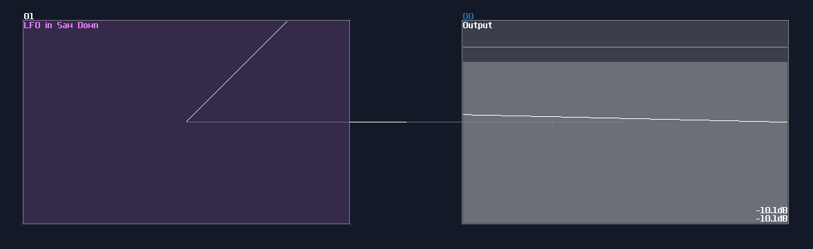
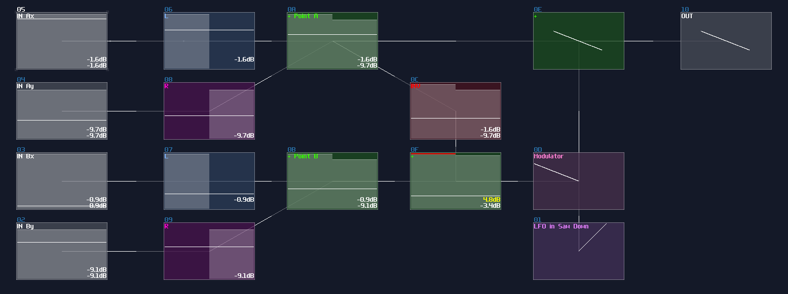
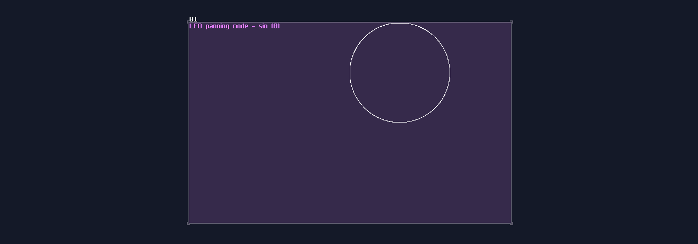
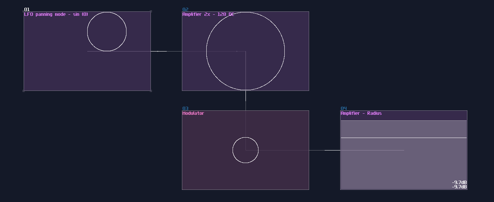

# Lines and Circles

## Overview
After you know how to print a point, let me tell you about how to take a step further to draw a line given two points and a circle.

## Line Over 2 Points
The Line itself is easy because **LFO in generator mode** is the only module you would needed. Desirably, the waveform of the FLO should be either in Saw up, Saw down, or Triangle, so that the LFO can draw a line evenly. There is no strict rule for frequency in the LFO, but to form a image instead of a point moving around, the frequency must be at least 20Hz.

Nevertheless, this line is not useful for drawing since no one would ever drawing anything only from the center with the same slope; thus we need to find a way to define the length of the line and the start and the end point of the line. 

To define start and end point, we need two pairs of DC input, and let the four input as: Ax, Ay, Bx, By

Once you have the four amplifiers, you need to filter the signal by channels, which all x input only allows left channel to go through, and vise versa for the y axis.

To find the distance of the line segment, we subtract Bx with Ax, and By with Ay; for example, if Ax = 25, and Bx = -5, the total distance will be -30 (-5-25). With the correct magnitude, we can multiply it with the aforementioned LFO module, to get the line with a correct length and slope. 

Although the line is now in the correct orientation, the location is wrong, so we must add the offset from point A to plot the final result:

## Circles
Don't fooled by its curvature, circle is a simpler object to render than lines, thanks to a flawed LFO shape: [The Sine - Cosine Mode](https://warmplace.ru/forum/viewtopic.php?p=7127#p7127).

Originally, this was a bug from a LFO, produced an uneven panning effect owing to the wrong phase offset; however, this bug is an excellent feature for drawing circle; hence, we can simply use **sin (0)** panning mode for the LFO like shown:

To draw a circle from its center, based on a given radius, you need scale up the circle by a gain of 2, and bring it down by -128DC unit to the center. Once you have "normalized" the circle, you can manipulate the size using constant DC with a modulator like shown:

## Conclusion
You have now achieved on drawing your first line and circle! For the next chapter, we will expend the concept from circles and line, to make some other shapes.

## Example Project:
[Draw a line given two points](../example_projects/graphics/3.2-Draw_a_line_with_given_two_points.sunvox)