# Three-Phase Dream

## Overview

> This is the extension of the previous chapter and they might contains some trial and error which can be tricky at times. Although I have tried my best to describe what is happened, this chapter is a bit confusing due to its complexity. This chapter might have multiple reworks in future.

> FULL BRIDGE RECTIFIER!!! 
>
> [*Mehdi*](https://www.youtube.com/watch?v=sI5Ftm1-jik)

In the tutorial, I am going to make the iconic three phase dream animation using SunVox, by [Electroboom](https://www.youtube.com/@ElectroBOOM/videos).

## Idea

Let's see this animation:

<iframe width="640" height="480" src="https://www.youtube.com/embed/MgJyJwoMll4?si=-zFI2ksHj0nGs4Hd" title="YouTube video player" frameborder="0" allow="accelerometer; autoplay; clipboard-write; encrypted-media; gyroscope; picture-in-picture; web-share" allowfullscreen></iframe>

Obviously, it is impossible for SunVox to plot the whole image of Mehdi, but we can draw a stick figure, along with his greatest feature, the EYEBROWS!
## Drawing Mehdi, Kind of...

We are going to draw a stick figure like so:

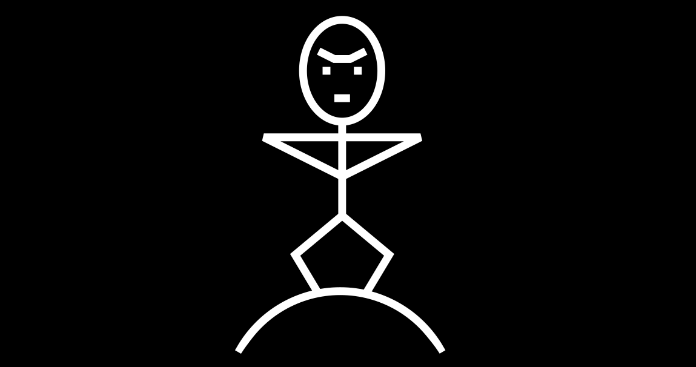

We can start by building the head, which is the easiest part. The head is an oval, so we can use the same trick for the DVD screensaver; for the eyebrows, we can also use the absolute function in amplifier, but with a twist which is the Bipolar DC offset, flattening the middle part of the "V" shape. You can do translation using LFO and you can draw the eyes using the vertical straight line generated by the LFO from the eyebrow, likewise for the mouth which is based on the horizontal line:

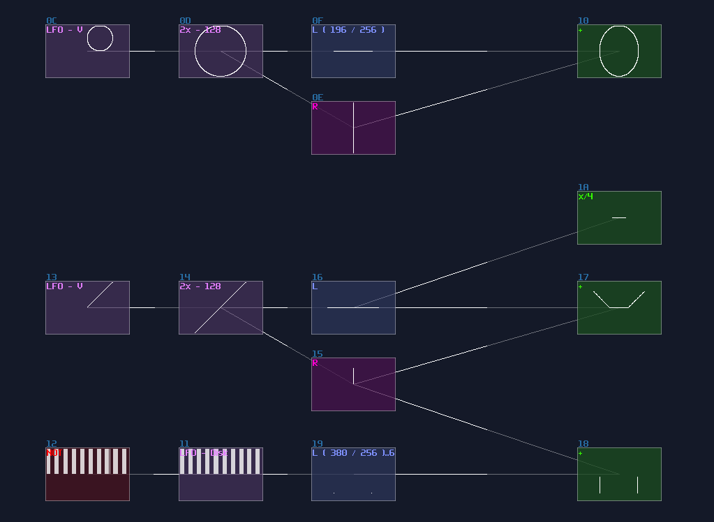

For the torso, we can just use lines from the eyebrow, and the vertical line from the head, with a bit of absolute trick:

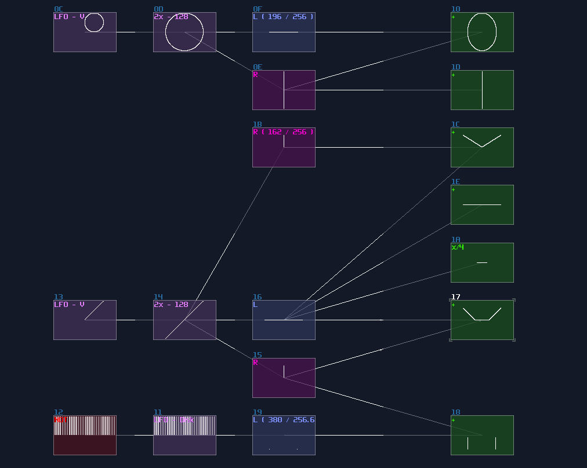

It is multiplexing time! Combine all the shape to form a head and torso like shown, with a bit of translation and scaling:

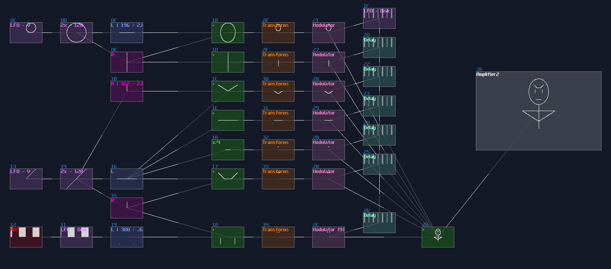

Here comes the hard part. We want Mehdi to move up and down, with his knees expanding and contracting, and we need four lines for that:

1. line for the thigh
2. line for the leg
3. mirror version of them

Thus, we need to draw lines given two points, with multiplexing; there is also an master LFO, clocked at 1Hz, to sync all the movement and the later spinning motion. Unfortunately, this part requires a bit of trial an error, so you may need to mess around with the gain of L or R separation. The way to plot three points are the following:

1. The constant point as foot standing on the ground
2. The knee, that move outward and inward, quarter magnitude of the original master Sine LFO, with opposite phase. It requires a bit of downward motion as well; after halving the LFO sine, you need to apply and additional volume change into 141 / 256 with another amplifier.
3. For the hip, you only need downward motion which comes from the halved master sine LFO. 
4. The halved master sine LFO also controls the torso.
5. Because of having three points, you need multiplexing for the hip and the foot joins to plot two lines at once.
6. Once you have lines for the squatting action, make a copy using another set of multiplexing with mirroring.

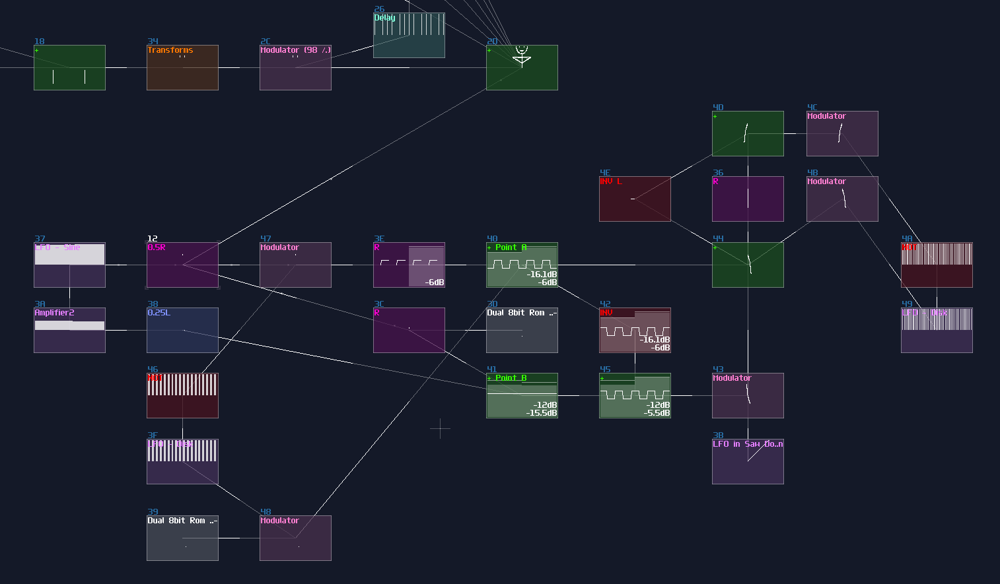

Combine with a 120° arc, we need to do multiplexing again, to form one-third of an image:

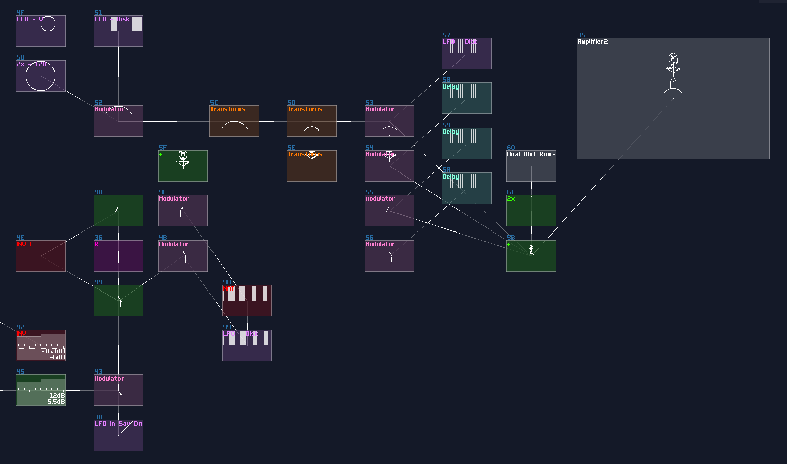


Now, we need to sort out the beam for the crank of the rotor, which is based on the similar concept, drawing a line given two points where the starting point is at the bottom of the triangle, ended with the circular motion, which will be resembled as a crank. The circular motion can be done with a LFO in sin(0) mode, with the same frequency of the master LFO. Multiplexing is also used here, but because Mehdi is more complex than a single line, we may set the the duty cycle more bias toward to Mehdi for a clearer image:

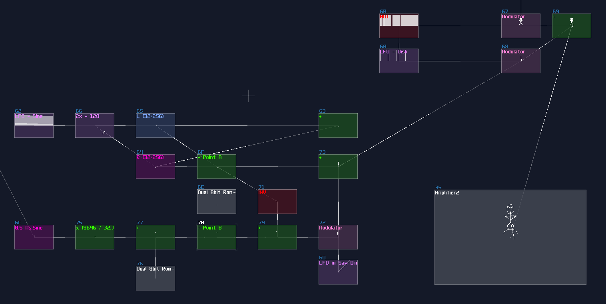

## From One Phase to Three Phases

We need two more Mehdis to complete the cycle. Split the same copies three times ±with 120° (±85DC unit) rotation; in addition, if you want all Mehdis pulling and pushing the same crank of the rotor, we need to delay the two copies by 333ms and 667ms respectively which adds an extra period of 1/3 and 2/3 from the 1000ms master clock. 

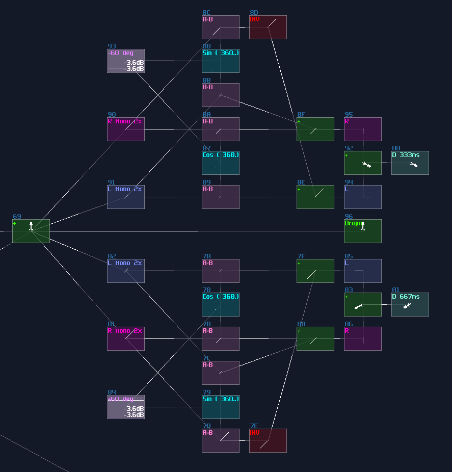

## The Rotor

Mehdis are done, and we are now moving on to the rotor. Remember the little unused "+" module when you were doing the circular motion?

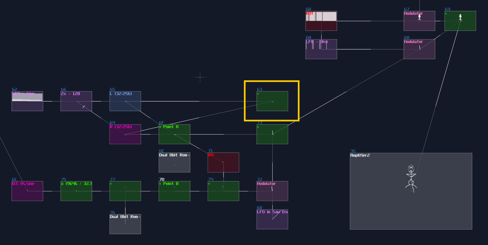

We need that for plotting the crank by drawing a circle. 

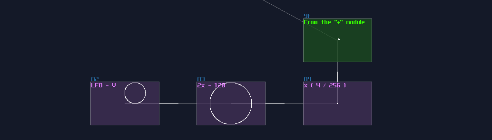

For the rotor, we can do it with a hacky way; using a normalized triangular LFO with a stereo delay, you can print a rectangle due to the phase difference between the Left and Right channel.

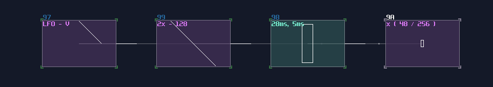

To make it spin, we need rotation, but unlike the previous method that requires sin and cos function, we can squarely use the LFO from the sine generator for the rotation as they are effectively sine and cosine curve so that not only the structure is more simple, but also it is easier to doing synchronization:

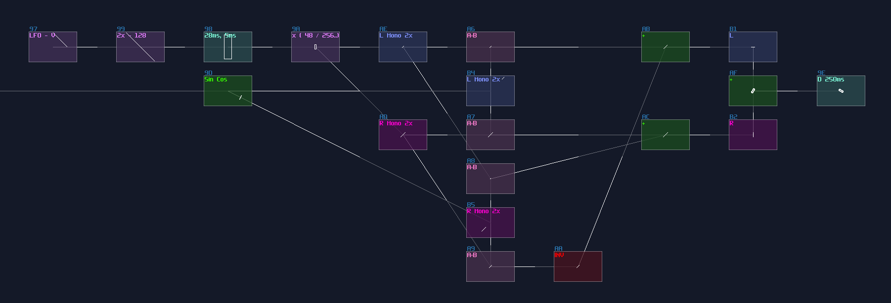

Then we can do multiplexing again to complete the whole rotor:

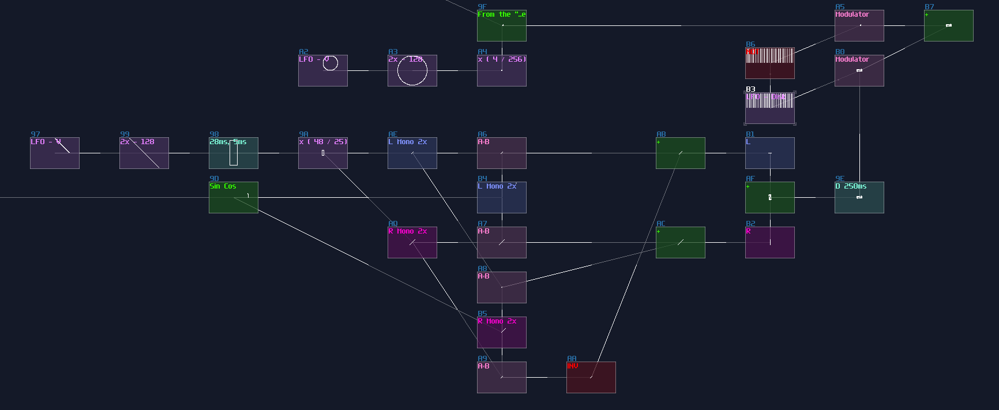

## Putting Altogether and Give It a Spin

We can now combine the Mehdis and the rotor into a complete; since Mehdis are much more complicated than the rotor, we need more time for rendering Mehdis. owing to the weighting, it can be quite complex if you use the LFO - Delays method, so let we use a decoder based multiplexer:

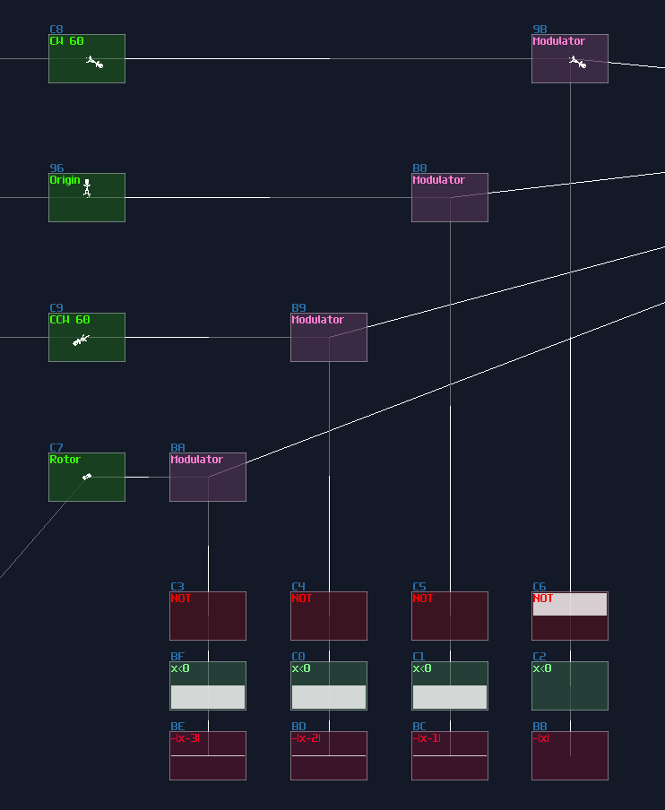


To drive the multiplexer, we need a counter to generate a specific DC magnitude withing a precise time with weighting, so metamodule can be used. Inside the metamodule, you only need an amplifier, with the following pattern:

```
Controls the DC offset of the amp inside the metamodule, with weighting
0: ----0103004000
1: ----0103004080
2: ----0103004100
3: ----0103004000
4: ----0103004080
5: ----0103004100
6: ----0103004000
7: ----0103004080
8: ----0103004100
9: ----0103004000
A: ----0103004080
B: ----0103004100
C: ----0103004480

```

As you can see, the Mehdi has three time more screen time than the rotor, to ensure that the Mehdis will be printed cleanly. After that, we can connect the counter to the multiplexer, with Ctl2Note and Sound2Ctl to switch on the module automatically.

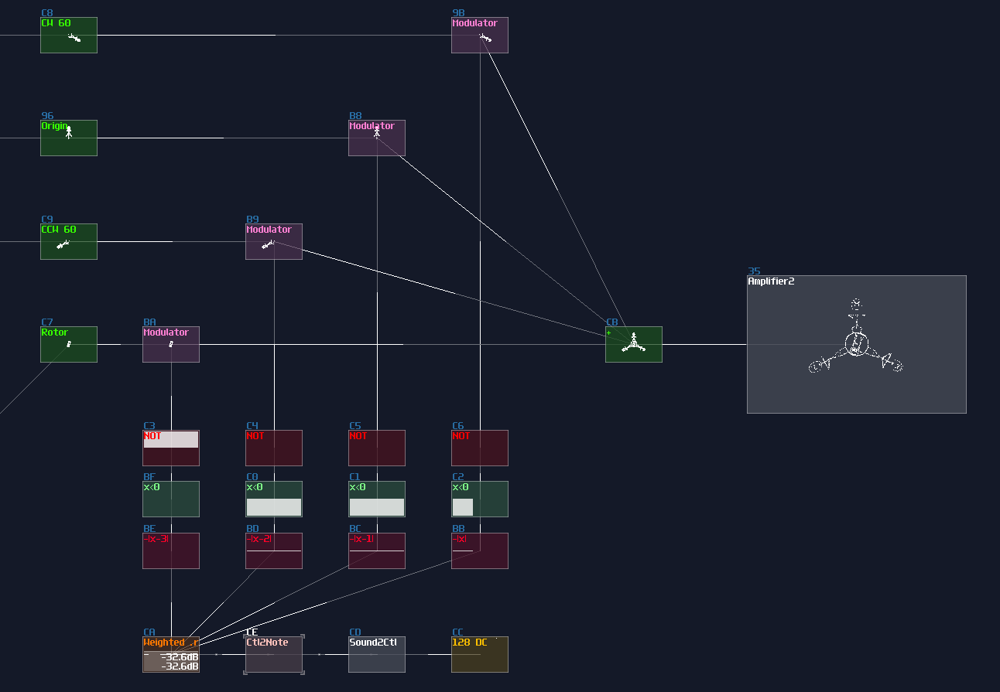

We are really close to the finish line, as we have reached the final step; to give it a gentle spin, you can use the similar trick for the rotor, but a much slower speed:

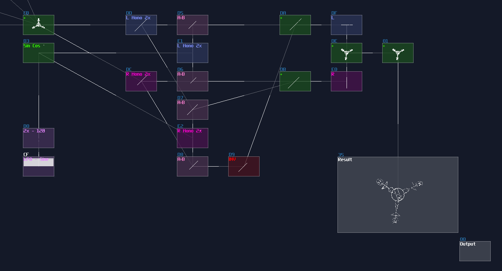


## Result
You have completed the animation! Although it is far from ideal, compared to the original, this is what SunVox can do at best, with single module output.

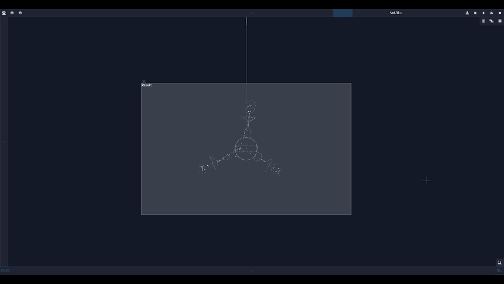

## Conclusion
Alright, we have pushed the limit of the SunVox Oscilloscope to draw the three phase dream animations, applied all the techniques we have learnt. For the next section, let me discuss some thought process on building something complex

## Example Project:
[Multiplexing](../example_projects/graphics/3.7-Medhi_Three_Phase_Dream.sunvox)