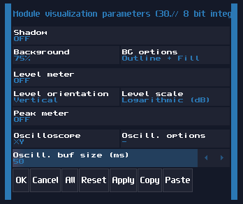
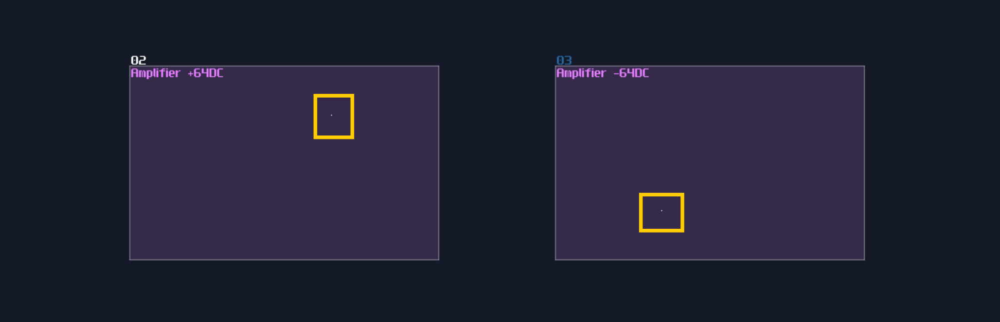
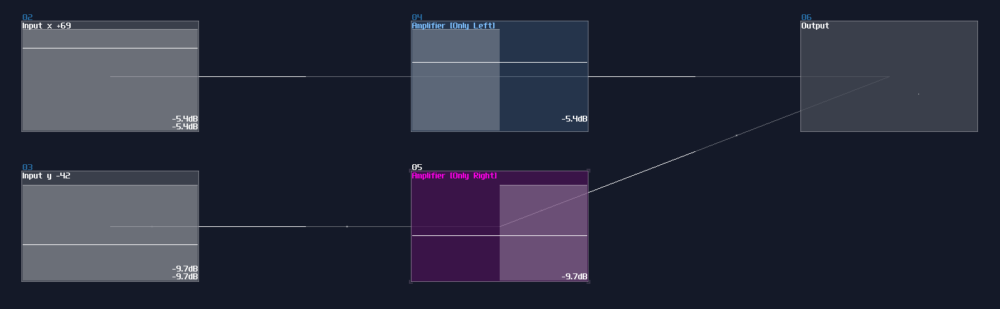
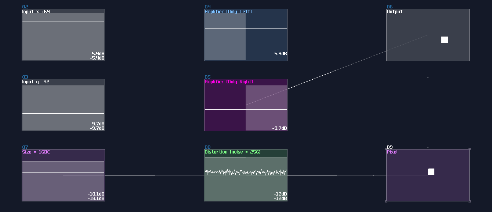
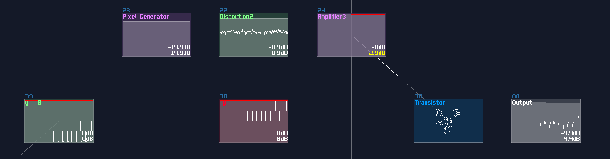

# XY mode, points and pixels

## Overview
Before you can do some cool visual, you must know the basics of how to config a screen for you module, and what is a point which is the smallest unit you can render.

## Configuration
Before the magic happens, you must set your module visualization as the following:

The most important of the setting is the **Oscilloscope mode**, which you must use the **XY** mode to print your image. The XY mode splits the channels into to two directions, where left channel move the X axis (left and right) while the right channel move the Y axis (up and down). The **Oscill.buf size** are also preferred to be the **maximum** so that the image would be the clearest. **Level meter** should be **off**; otherwise, you may see the level bar jumping, affecting the readability of the module.

## A Point and a Pixel
It is simple to get a point from amplifiers by changing the DC offset which to point will move towards to the top right when the controller value is move towards +128, and vise versa when the controller moves toward to -128:

However, the default DC offset can only move the point diagonally, and it is impossible to travel places like top left and bottom right, which is pointless. Thus, to move the point freely, we generally use separate DC offset controls for each channels, filtered by panned amplifiers as shown:

Cool, now we have a freely moving dot, but... it is way too small and it is hard read for many devices. In fact, the dot in the image above is so tiny that it is nearly invisible. For solving this problem, we can enlarge a dot by adding noise into the point, using distortion with noise sized by another constant DC offset from an amplifier. By summing the point location and the noisy square, we now have a larger "pixel" for your display.

Similar concept can be found in the display driver of the Game Of Life Module so that the module can present the 5x5 gird clearly:

## Conclusion
Now you know how to config your module to display things and to render your first pixel, for the upcoming chapters, you will learn about how to achieve vector graphics, from line to spiral and polygons.