# Example 2 - 7 Segment Display Counter

> To provide a cleaner demonstration for individual components, some of the modules might be moved into different locations.

## Overview
After we have built a dice, let's focus on the most common form of display, the 7 segment display. In this example, we are going to build a 2 digit counters that counts up.

## Planning The Project
To build a counter, we expect the following features:

- two counters stepping from 0 to 9
- the counters should know when to step back to 0
- the right digit (the ones) should know when to carry the digit
- contain a display that prints the two digit

After we know the basic components, we can draw a flowchart to see how the logic flows:

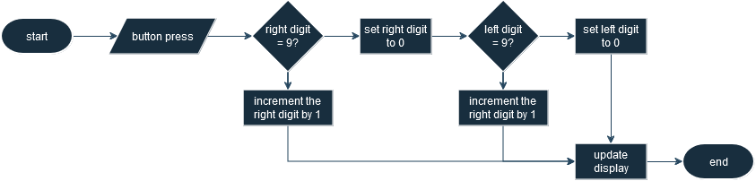

Seems the logic is not complicated because all we need to do is to bump up the counter or carry the right most digits to the left, so let's heading to the implementation.

## The Counters
Obviously, we must have some counting mechanisms to count the number, so we are going to build two falling edge triggered counters which can simplify the carry logic. There are two ways to build a counter, and you may use either approaches:

### T Flip Flops Based
The first approach is to use a series of T flip flops, and you can simply chain 4 flip flops as shown:

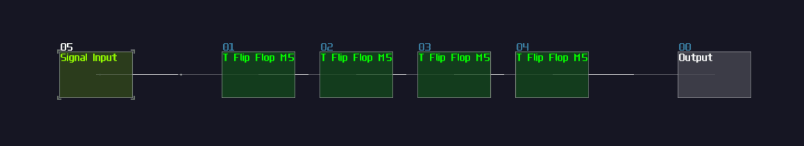

After you have mapped each output of the flip flop to their corresponding DC unit, you already have a base 16 counter:

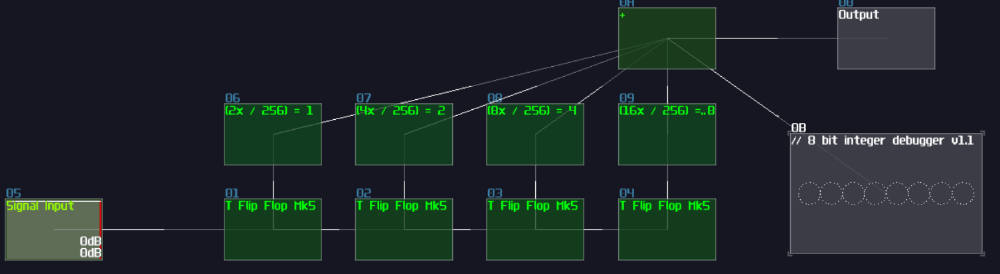

However, since we are doing a decimal counter, not hexadecimal, we need to prematurely reset the counter to zero once it reach 10; thus, we need to build a reset structure when the flip flops hit 10 in binary. using logic gates, feedback, sound2ctl and multictl:

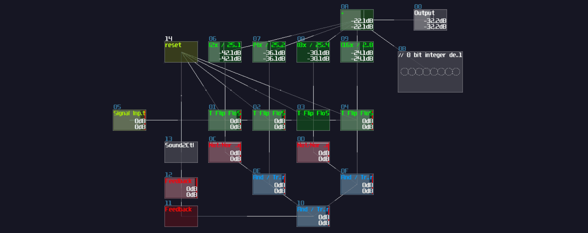

As you can see, when the flip flop chain hit 1010 (from right to left where the right most flip flop is MSB), it triggers the bottom AND gate such that the AND gate sends a reset signal for the T flip flops to do a hard reset, limiting the counter to count from 0 to 9.

### Accumulator Based
T flip flop is intuitive for people who learn about classical computing, and it is easier to manipulate individual bits, but T Flip Flop is not space efficient in terms of file size because it is a metamodule containing the memory circuit and a monostable. If you want to use less number of modules, or you only care about integer operation, you may do an accumulator.

Initially, you need to build an accumulator, consisting a falling edge monostable and a delay based memory with the delay time aligns to the monostable:

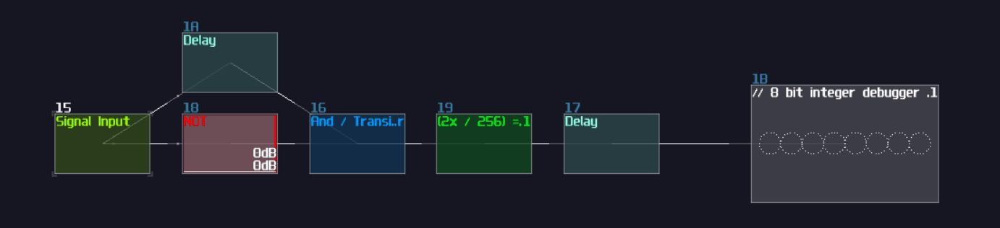

Nevertheless, you can definitely spot a problem that the accumulator goes out of bound. To reset the accumulator, we need to set the feedback of the delay module to 0 when it hit 10. In the following example, we can subtract 10 from the delay using an amplifier in negative absolute mode, triggering the negative detector, and only if the memory cell hits 10, it disables the negative detector and breaks the internal feedback of the memory cell to reset. Since the reset sequence might have display 10 in a short amount of time, we need to overwrite the output with 0 when the accumulator is temporary 10, detected by a NOT gate attached after the negative detector, along with normalizing the output of the NOT gate to 10 for offsetting the output; thus:

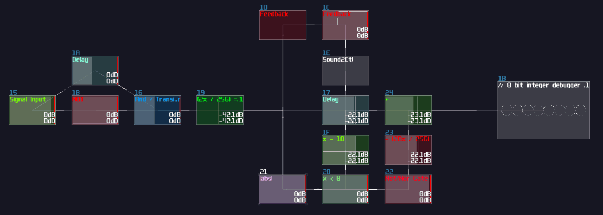

## Carry Logic
Once we have a counter, we can now expend with an additional digit by duplicating the counter your have made previously. For this example, I am going to use the T flip flop based counter for the tens digit, while the accumulator based for the ones; however, this is a **BAD practice** and **it should be discouraged** since you should duplicate the same structure if there are multiple operations that does the same. Implementing the same logic with different variations will make debugging tricky, but because all these screenshot you have seen will be exported as an example project, I have to mix the counter instead:

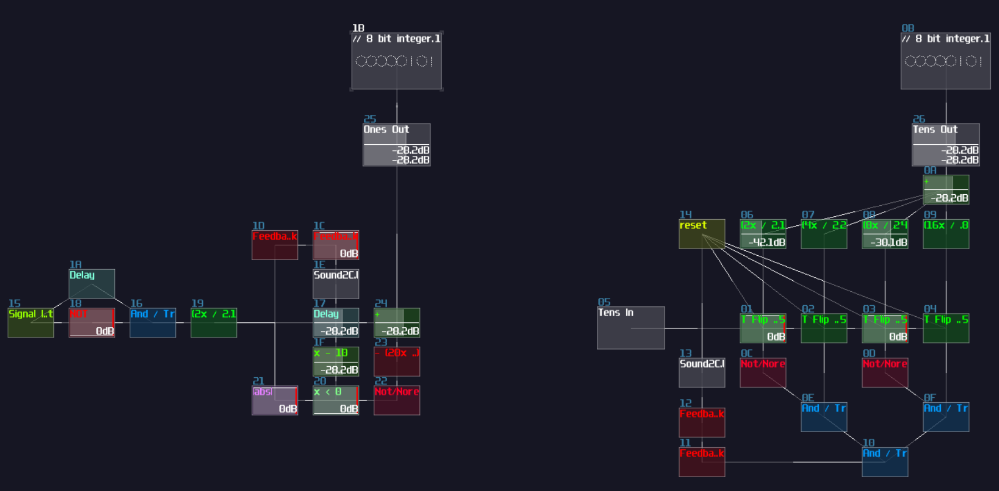

As you can see, I have only placed the two counters side by side, but I have leave a gap and aligning the sum module of the Ones counter (the left counter) with the input of the Tens counter (the right counter) so that we will have a smoother experience on building the carry logic; otherwise, you will need to move the module groups a lot, or you will create a messy project. 

To carry the digit from the Onns counter, all we need to do is to fire a signal only if the memory block from the Ones counter is 9, subtracted with 9 using an amplifier in negative absolute mode and with -9 DC unit. Along with a negative detector and a NOT gate, it will send a signal only if the memory block hits 9, and since our counters are triggered by falling edge, the Tens counter steps only at the moment when the Ones counter no longer be 9, which is at the moment of stepping from 9 to 0:

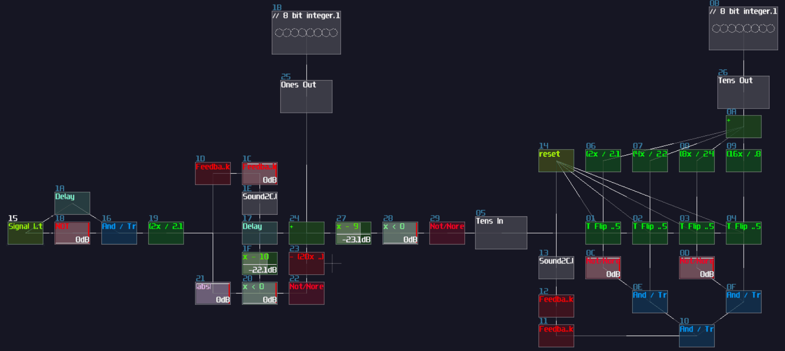

That's about it, this is all of the logic for the counters, and let's build some 7 segment displays.

## 7 Segment Display
7 segment (or any segment) displays are crucial for displaying the results of your calculations or rendering texts, so I will explain this element in details so that you can build your own segment display, but first, let me show you a 7 segment display to see how it works:

<object data="../apps/circuitjs/circuitjs.html?ctz=CQAgjCAMB0l3BWcMBMcUHYMGZIA4UA2ATmIxAUgoqoQFMBaMMAKDAXIcIBZxiUQPPgKrkqkFgBkQXXmH4zihYVHAgAZgEMANgGc61CdNkgUKXgyWnzqiFr0GkRmUJQJll5W+VU7O-YZSLrwoeHiKXmGqVPYBTkFU2Giq2AgiarGOUEFJIEmJAqnpfg6B0kL5grxF0Rr+Wc6YhclNeWm1mWWm3AVU5ontvnWl8dJo4ZXjbcXDcdnSYNwhUcwCoeFDnaPgS6bu4GBr+5v1XYshNqvWvCcj8ztyClfyM1vZ7OTnKq0vqmLvHGmKm4eF8ClE0Ry7V+lV+4lmDShaxskxs8Lezhq3jyLWOqgxSNMUUmUVuc2c3DAykqlOpgwyp22SwmyWZQLJiOkIN6IG57IZd2cQjS4WFhHhJXJOQEIpxFHFtgRXVooVU7glSu2Jm4Vk8vKsHK62qEeu4QnRjPu2typtyFsFQW1cAivOdhviH2CrqoQh68P+jQwMtVrXVioJYx6FBDUbD7vuU1liYV9qlC12OuUV0z4ctzi+Zrkh155oFaYevNy2btZc5Fb9BwEDdTiM9BedrWbIADQT5sr7Kfxed7IOj4TZcaHDq5VLHvNnk5iw+kNRzNINU-Lq4qrNLS+nQO4uRpNf3W-aDZpbs3rcBq+dfK7PaAA" width="100%" height="500vh"></object> 

Obviously, 7 segment displays consists on 7 line segments, forming a 8 like shape, and you can control individual segments to display certain characters; nevertheless, not all characters can be rendered on a 7 segment display, and this is why display with higher number of segments do exist.

To build a 7 segment display, we start by using a LFO playing in saw wave, but because the saw wave plays in both channels, it will create a diagonal line. As we don't need a diagonal segment for our 7 segment display (perhaps for the more complicated one), we can individually extract the Left and Right channel to form a horizontal and vertical line as shown:

This already covers the middle horizontal line and the top left segment. To construct the remaining segments, we need to do translation once again, and since LFO generate a signal ranging from 0 and 128 DC unit, we can just move the segments horizontally or vertically by 128 DC unit. The following mapping is based on a standard 7 segment display which segment A starts at the top, traveling all other segments in clockwise, and end with Segment G which is the middle horizontal line. In the following example, I have used a "Rom" module for translating the shape into different location, and they are basically just DC offset control from amplifier but controlling left and right channals individually. You may find the Rom module in the Memory toolkit (Rom -128-128):

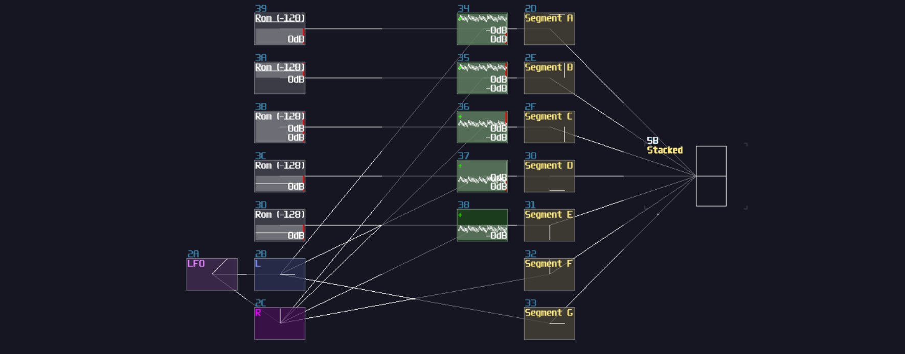

Similar to the dice example we have done before, we now have a stacked image, so we need to append an arrays of modulators acting as transitors for accepting input from the counters, and do multiplexing after the transitors. Once you have done right, every segments will be printed on a single module, while you can control individual segments as shown (signal inputs modules are not required in the final design, just for demonstration only):

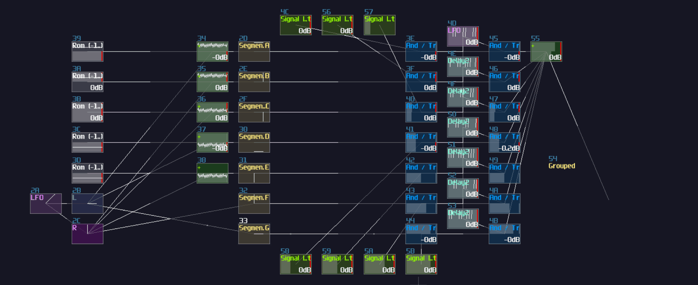

As usual, such structure requires a decoder-encoder pairs to convert integer value into displayable format; after breaking down the integers into individual signal paths, we need to connect the signal path into the corresponding segments to represent a correct character as shown:

| IN                | A | B | C | D | E | F | G |
|-------------------|---|---|---|---|---|---|---|
| 0000000001 (0)    | 1 | 1 | 1 | 1 | 1 | 1 | 0 |
| 0000000010 (1)    | 0 | 1 | 1 | 0 | 0 | 0 | 0 |
| 0000000100 (2)    | 1 | 1 | 0 | 1 | 1 | 0 | 1 |
| 0000001000 (3)    | 1 | 1 | 1 | 1 | 0 | 0 | 1 |
| 0000010000 (4)    | 0 | 1 | 1 | 0 | 0 | 1 | 1 |
| 0000100000 (5)    | 1 | 0 | 1 | 1 | 0 | 1 | 1 |
| 0001000000 (6)    | 1 | 0 | 1 | 1 | 1 | 1 | 1 |
| 0010000000 (7)    | 1 | 1 | 1 | 0 | 0 | 0 | 0 |
| 0100000000 (8)    | 1 | 1 | 1 | 1 | 1 | 1 | 1 |
| 1000000000 (9)    | 1 | 1 | 1 | 1 | 0 | 1 | 1 |

 

Once you have the correct mapping, you should able to print a number by changing the input of the decoder:

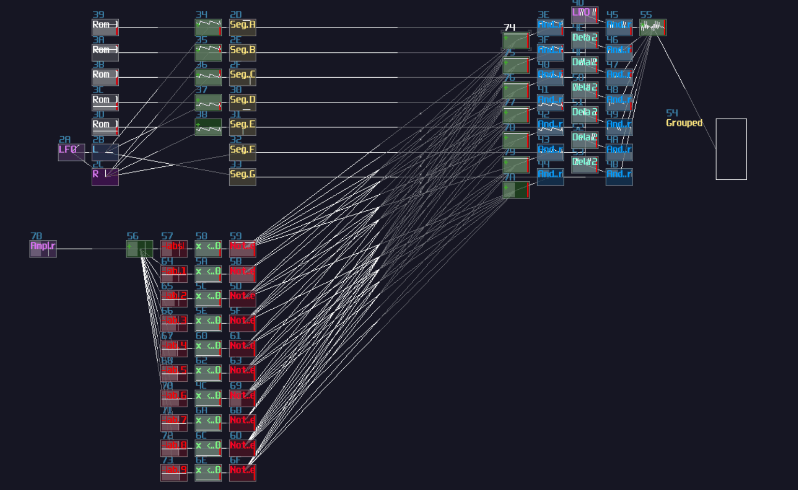

And that's about it, this is how we can build a 7 segment display in SunVox.

## Connects Everything and Display Double Digit
"We have built a 7 segment display, but... there is only one digit. How can we print two digits at the same time?" you might ask. It is not wrong that duplicate the 7 segment display is a solution, but this is hugely inefficient; thus, I normally do another multiplexing to quickly switch the numerical value and the position of the digits:

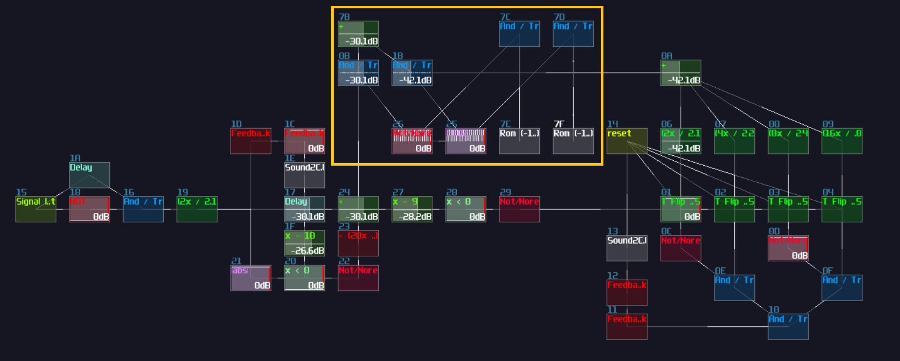

After that, connect the combined value to the input of the decoder, and connect the combined position offset to another add module that connected from the output of the 7 segment display as shown:

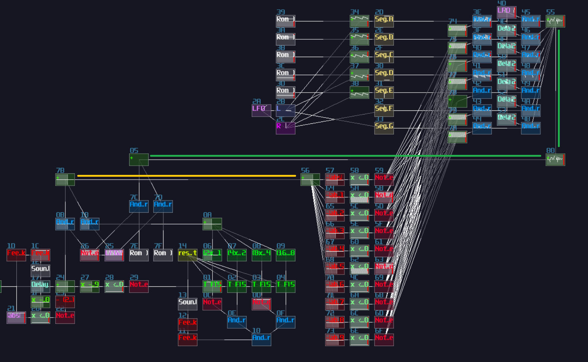;

Combined the position offset and the output of the 7 segment display, send the data to the output, but currently, the two numbers are overlapped to each other, so we need to change the position offset of their individual digits:

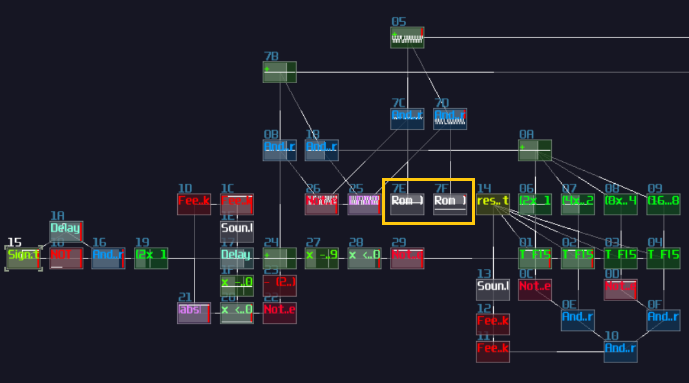;

Once you have solve the overlapping issue, give the final result a porper scale, it is good to go.

## Final Result
This is it! now you have a counter program with a two digits 7 segment display. Send a signal from the signal input, you should able to see the counter incrementing the digits.

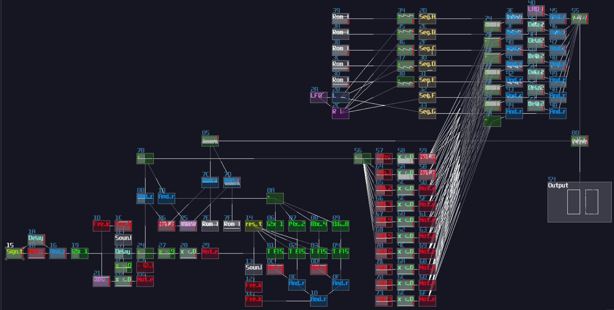

## Conclusion
Wow, that's a lot in this chapter; hopefully, after this tutorial, you will have more understanding how to build a counter circuit and a 7 segment display.

## Example Project:
[7 Segment Display Counter](../example_projects/integration/4.2-7_seg_counter.sunvox)