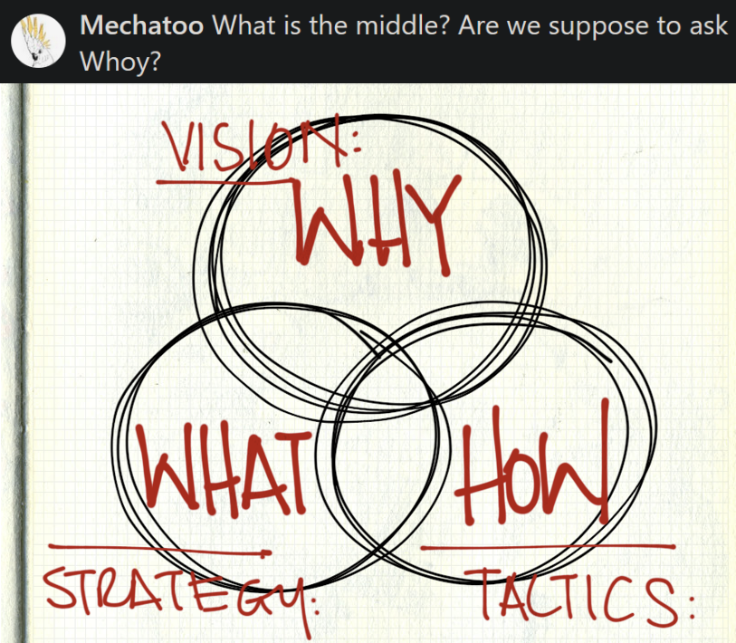
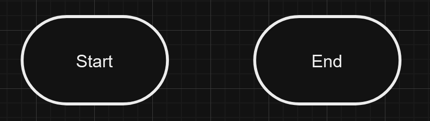
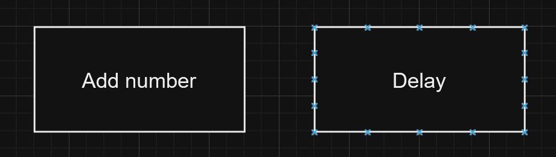
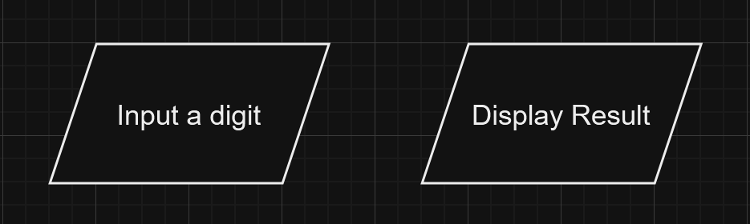
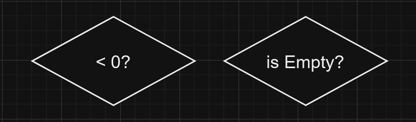
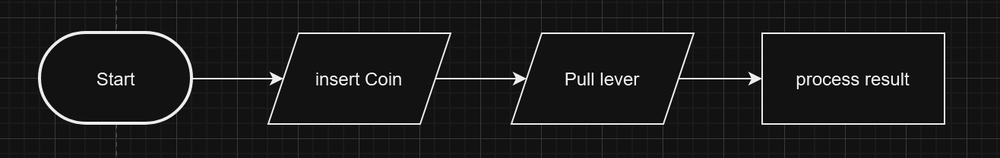

# Flow Chart

## Overview
In this chapter, let me introduce *whoy* to use flowchart for your logic stuff.

>Whoy originally started as a joke for some failed "be successful" illustrations, which questions should go in a sequence rather than a Venn diagram because they are not three subsets, but it turns out can be used for describe "What, Why, How" in superposition. Original Image from [Bouncing Ideas](https://bouncingideas.wordpress.com/2011/11/12/design-engineering-science-their-differences-through-the-lens-of-biomimicry/)

## The main features and components of flowcharts
Flow chart is the most common diagram because they describe how a system process from a process to another, so they are drawn with blocks with arrowed lines pointing one another. Flow charts generally contain a few type of blocks; starting from a capsule shapes, they mean the start or end of the processes:

Followed by regular rectangle, they are represents any form of general process:

Although I didn't use for my chart and used the rectangle instead (which should be wrong), parallelograms are for the I/Os:

Lastly, and most importantly, you need to branch off several conditions, which diamonds are used which it branches into to paths that on satisfied the requirement and vise versa for another:

## Basic Guide to making a flowchart
Making a flowchart is simple, but before making one, you need to have a basic understanding of how your system works. For example, if you want to build a slot machine, you need know that you have to insert a coin and pull a lever before seeing the slots spinning; based on the findings, we can conclude there are three action as shown:

Certainly, there are much more steps for the machine, like the number of coins you must inserted, winning or losing conditions; thus, we need to set conditions for changing the status of the machine. In this example, I want my slot machine requires three coins to operate; otherwise it doesn't play even if the lever have been pulled. After pulling the lever, the machine will give a reward if all the same icons align, otherwise if they don't. Therefore, we would get this:

As you can see, conditions (or any form of actions) can either direct into the next action or return to the previous action that form a feedback loop. Now we have flowchart representation of a slot machine, which it can help us to breaking the whole problem into smaller, simpler problems so that we can solve them modularly.

## Conclusion
Now we have understood how to draw a flowchart to break down several smaller actions; in the next chapter, I will tell you about another similar chart, block diagrams.

## Reference

[^fc_definition]:[smartdraw.com - What is a Flowchart?](https://www.smartdraw.com/flowchart/)