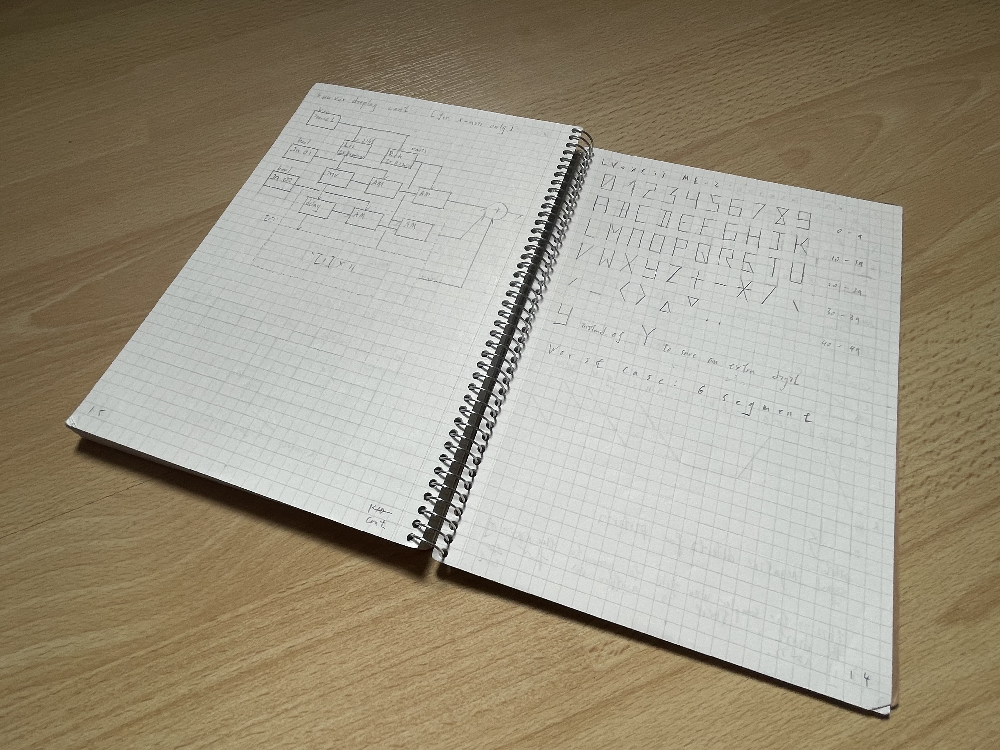
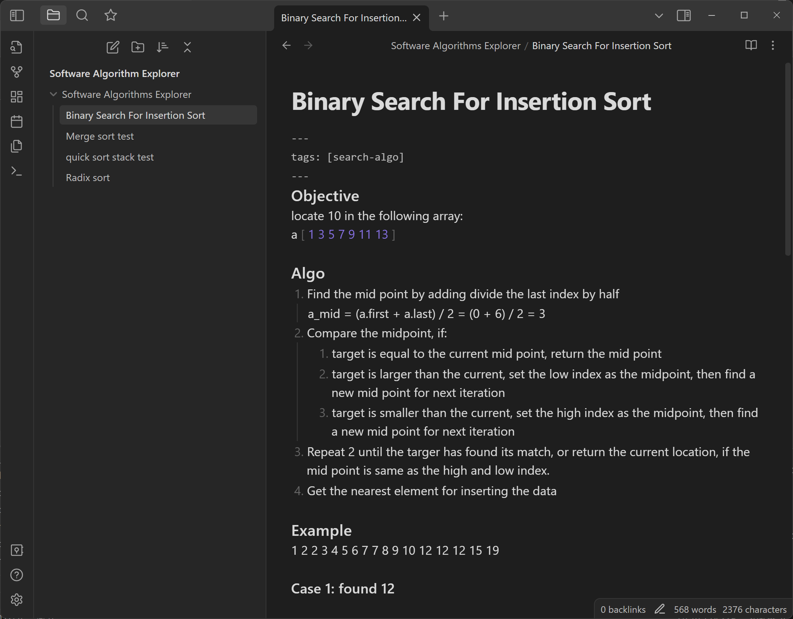
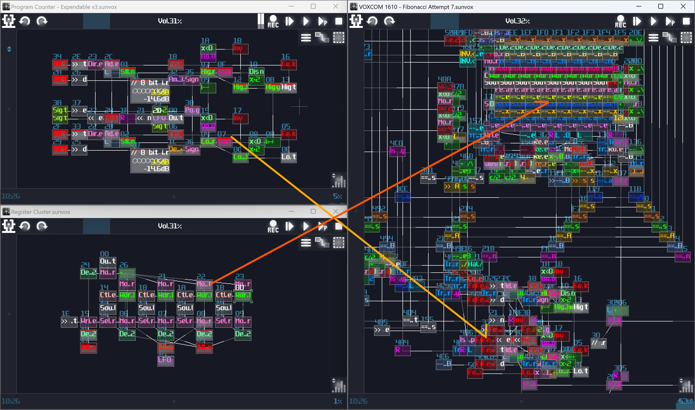

# Planning Ahead

## Overview
I didn't create VOXCOM out of thin air, and it took a lot of planning before putting the first module. I used a couple of tools to record my ideas and design ISA or computer structure. In this chapter, I will point out some of the good tools for drafting your logical circuit.

## Notebooks
Sometimes, the best way to record is actually draw them down on paper because that is the fastest way to note down your diagrams or sketches. I always have some notebook nearby so that I can quickly draw down any idea without losing them due to waiting for loading website for drawing diagrams.

It is better if you have a tablet that features a pen and any note taking app, so that you can take note in there instead, to save paper and to have better time for corrections.

## Text editor
Drawing prototype is fast using Notebooks or tablets, but it is otherwise for creating text based ideas; for that reason, you also need some kind of text editor to writing down your logic behind your contraptions. In fact, a simple notepad may does the job, but it is not intuitive to use due to the lack of functionalities. Thus, we may seek some other alternatives. **Notepad++** is always a great start since it offer mono-space fonts, better text editing features, and caching your unsaved work. If you are someone who feel comfortable with markdown format, **Obsidian** with monospace font is a great choice because you can quickly formatting your idea more clear.

> Fun fact: Just got a laptop with Windows 11 recently, and I found that notepad have gotten some improvements like dark theme, tabs and caching. These great enhancements also makes notepad a good options to jot down your notes as beginners. 

## Diagrams Editor
Beside hand-drawing them, you can also use some tools for create diagrams. There are a few different ways, the easiest way is to use **diagram.net**, so you can draw some common diagrams like flow charts or sequence diagrams without installing anything software. Besides, you can also install **libreoffice**, using their draw tools; however, my favorite tools is still obsidian, which it also offers **Mermaid Charts**, so you can use markdown for your diagrams.

## And obviously, SunVox
Nothing is better than using SunVox itself! When you create your logic structure, you may open a SunVox project and build a subset of the whole project; not only this can reduce the complexity for testing, but also it is easier to undo the mistake and use it in your future projects by copying them. Hence, start small, then put them together to form the complete contraption. For example, I have separated project for registers and program counter, so I can have a separated copies for my future projects:

## Conclusion
These are some of the common tools I used for planning my projects, and I will tell you about how use some of the commonly diagrams to plan your projects, starting from flow chart.