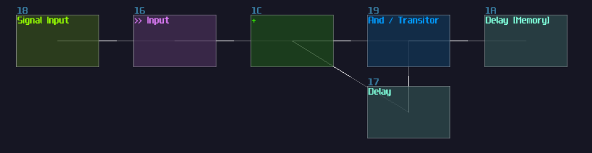

# Example 3 - Plotting N Sides Polygon

## Overview
In this chapter, I am going to focus more on the input and the memory storage by building a polygon plotter which can supports up to 8 sides.

## Planning The Project
Since this project is a bit more complicated and requires more input, a flowchart might not work well enough for this application; thus, let us write some users stories to define the main features:

As a user:
- I want to add new nodes for my shape, so I can have any shapes up to an octagon
- I want the nodes to be movable, so I can have shapes more that just a regular polygon
- I want to edit or remove the most recently added node, so I can undo my previous mistakes

Although this might not be the best way to demonstrate user stories which they are usually used for projects in larger scale, breaking down functionality with different role, the user stories above can still give us some directions and ideas to build that plotter. By looking at the story, we can expected that if we want a plotter, we need to add nodes based on the coordination moved by the users, and edit or remove the last coordination. Based on the following features, we can confirm the following components:

- Controller that moves a cursor
- Controller to edit add and remove the last coordination
- A memory circuit for logging the inserted coordination
- A display can print the cursor and the polygon

## The Controllers

To build a more complex controller, I usually start with a MultiSynth and narrow down to a specific keys for the specific function, and in this example, we need the following actions:

- move cursor up
- move cursor down
- move cursor left
- move cursor right
- toggle edit mode
- add new node 
- remove last node
  
To fulfil all the features, we need 7 inputs, but since MultiSynth only accept keys that belongs to a piano keyboard, we can't use the traditional WASD or the arrow keys, so let's have a look to the keyboard layout to see if any alternative options:

As you can see, A is not considered as a valid MultiSynth input, so the next best thing is either use **2QWE** or **SZXC** for the navigation. Either one is fine because these two sets are interchangeable due to the ability of changing keyboard octaves in SunVox; Thus, I am going to use C, C#, D and E for the navigation which aligns the aforementioned keyboard entry set. Relatively, instead of using JKL as actions keys used in countless games, you may pick **M,.** or **UIO** as alternative, which is B, a higher octave C and D note on the piano keyboard, used for toggling edit mode, add and remove nodes.

After we have defined the input key set, we can move on to add ourselves the first MultiSynth, and this will handle all the possible keyboard entries. With that entry point, we can further attach 7 MultiSynths, corresponding to the 7 inputs we have defined in the previous steps. From the 7 MultiSynth, we need to filter out all the unrelated notes by setting all noteds in the Note-Velocity map in the zero. For example, for the move up operation, I only leave C#5 on, meaning that only C#5 will trigger the operations instead of other keys:

With the correct filtering, you should see the MultiSynth only triggers the operations only if you play the correct pitch:

Here are just a tip of an iceberg because we also need to make the control fool proof and being more convenient, so I am going to define additional features for each controls:

- if the user hold one of the navigation keys, they fire the operation once initially, and after a short pause, it repetitively trigger the same operations, similar to when we hold a key on a typing keyboard.
- the navigation has bounds, and we should stop the cursor from moving further from the viewable range of the Module Oscilloscope.
- the edit button is a toggle button, and if the mode is active, it display a cursor icon on the current coordination of the current node, or at the origin when a new node is added; otherwise, it should prevents any from of input from other buttons.
- the add and remove button should overwrite a cross on top of the cursor for a short amount of time if the add or remove operation fails.

With the additional specifications, we can arrange the order we decided to implement the logics based on their dependencies; clearly, the edit button should be the last because it overrides all functionalities when the edit mode is off, while add and remove operation relies on the navigation; thus, let's work on the navigation system first:

## Cursor Navigation
To produce the behavior of rapid firing action after pausing for an initial input, we may use LFO and ADSR for the timings. For the initial entry, we may use a signal input to generate a constant DC and limit the pulse using a rising edge monostable. For the pause and the rapid fire action, the MultiSynth of navigation operations also trigger an ADSR with relatively long attack, full sustain and no Release so that it takes time to rise to the top and shuts down immediately if the user release the button. Since the peak of ADSR reaches +128 DC unit, we may conditionally send a DC signal only if the ADSR reaches the top, using an amp with -128 DC unit, a negative detector and a NOT gate. With the output of the NOT gate, we may use an LFO to periodically sending a pulse, and combine it with the initial pulse:

After that, since there is only a single input and output, we may wrap the structure into a MetaModule so that it easier to make duplication and easier to maintain the overall project, and don't forget the set the input module aligns to the internal MultiSynth:

From here, we are halfway through; after the triggers, we need to reduce their signal strength down to 1 DC unit, using an amplifier with the volume of 2, and remove one of their channel according to the direction of the operations, followed by a summation. After we have summed all four directions, we reserved a transistor for the edit button so that all the operations are effective only in edit mode:

We may pause here because it would be a bit tricky if we insist to build the complete navigation system, so we have to focus on most of the input's dependencies first, all the memory circuits.

## The Stack
The user want to create 8 coordination at most, and edit and remove the most recent coordination; for that requirement, we may use a stack. 

Stack is as data structure that works in a LIFO (Last in; first out) manner[^stack]. In layman terms, it is like when you stacking up some plates, you always put a new plate on the top of the stack, and when you want to grab yourself a plate from the stack, you always takes the top one.

To built a stack, we may starts from their memory cell first because it also requires to have additional logics, and for now, let's build an accumulator first; keep in mind, since our input event have a certain pulse length, in order to write the data into the block successfully, the delay time of the memory cell must be shorter than the incoming pulse; therefore, let's set the rising edge monostable and the memory cell with 1 ms of delay:

You may wondering why there is an add module sitting between the input and the memory cell. The addition is used for feeding additional signal path for the bound check, as if we let the cursor goes out of bound. we will have no idea the cursor location. To prevent such issue, we must stop the cursor from incrementing if it reaches the border. To do this, we need four conditional check corresponding to the sides, ±128 DC unit for the vertical movement, while ±200 for horizontal. 

[^stack]:[Stack Data Structure](https://www.javatpoint.com/data-structure-stack)