# Example 3 - Plotting N Sides Polygon

> This chapter might contains advance concepts and it might be overwhelmingly long due to the number components; if you feel overwhelmed, you may move on to other chapters first and goes back to this chapter once you are ready.

## Overview
In this chapter, I am going to focus more on the input and the memory storage by building a polygon plotter which can supports up to 8 sides.

## Planning The Project
Since this project is a bit more complicated and requires more input, a flowchart might not work well enough for this application; thus, let us write some users stories to define the main features:

As a user:
- I want to add new nodes for my shape, so I can have any shapes up to an octagon
- I want the nodes to be movable, so I can have shapes more that just a regular polygon
- I want to edit or remove the most recently added node, so I can undo my previous mistakes

Although this might not be the best way to demonstrate user stories which they are usually used for projects in larger scale, breaking down functionality with different role, the user stories above can still give us some directions and ideas to build that plotter. By looking at the story, we can expected that if we want a plotter, we need to add nodes based on the coordination moved by the users, and edit or remove the last coordination. Based on the following features, we can confirm the following components:

- Controller that moves a cursor
- Controller to edit add and remove the last coordination
- A memory circuit for logging the inserted coordination
- A display can print the cursor and the polygon

## The Controllers

To build a more complex controller, I usually start with a MultiSynth and narrow down to a specific keys for the specific function, and in this example, we need the following actions:

- move cursor up
- move cursor down
- move cursor left
- move cursor right
- toggle edit mode
- add new node 
- remove last node
  
To fulfil all the features, we need 7 inputs, but since MultiSynth only accept keys that belongs to a piano keyboard, we can't use the traditional WASD or the arrow keys, so let's have a look to the keyboard layout to see if any alternative options:

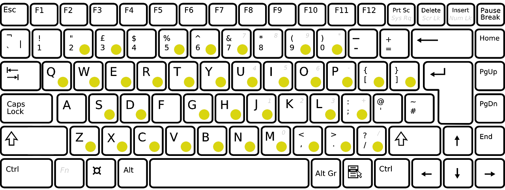

As you can see, A is not considered as a valid MultiSynth input, so the next best thing is either use **2QWE** or **SZXC** for the navigation. Either one is fine because these two sets are interchangeable due to the ability of changing keyboard octaves in SunVox; Thus, I am going to use C, C#, D and E for the navigation which aligns the aforementioned keyboard entry set. Relatively, instead of using JKL as actions keys used in countless games, you may pick **M,.** or **UIO** as alternative, which is B, a higher octave C and D note on the piano keyboard, used for toggling edit mode, add and remove nodes.

After we have defined the input key set, we can move on to add ourselves the first MultiSynth, and this will handle all the possible keyboard entries. With that entry point, we can further attach 7 MultiSynths, corresponding to the 7 inputs we have defined in the previous steps. From the 7 MultiSynth, we need to filter out all the unrelated notes by setting all noteds in the Note-Velocity map in the zero. For example, for the move up operation, I only leave C#5 on, meaning that only C#5 will trigger the operations instead of other keys. Even with the filtering, some modules we used later such as LFO and ADSR can still be triggered, so you have to check the "7E Ignore notes with zero velocity" option for the MultiSynths with the filtering applied:

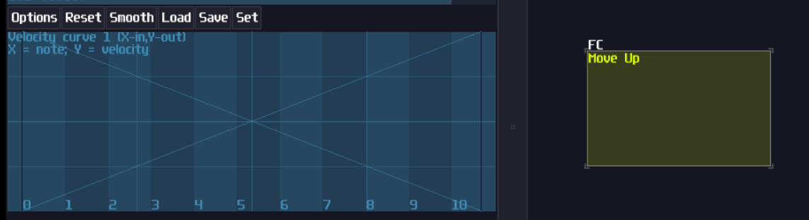

With the correct filtering, you should see the MultiSynth only triggers the operations only if you play the correct pitch:

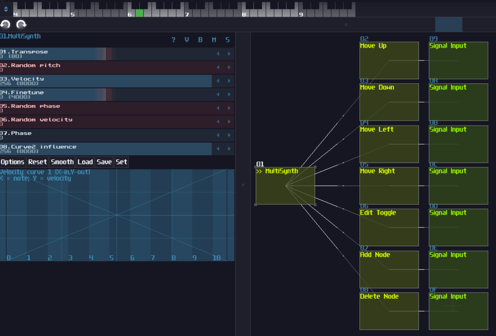

Here are just a tip of an iceberg because we also need to make the control fool proof and being more convenient, so I am going to define additional features for each controls:

- if the user hold one of the navigation keys, they fire the operation once initially, and after a short pause, it repetitively trigger the same operations, similar to when we hold a key on a typing keyboard.
- the navigation has bounds, and we should stop the cursor from moving further from the viewable range of the Module Oscilloscope.
- the edit button is a toggle button, and if the mode is active, it display a cursor icon on the current coordination of the current node, or at the origin when a new node is added; otherwise, it should prevents any from of input from other buttons.
- the add and remove button should overwrite a cross on top of the cursor for a short amount of time if the add or remove operation fails.

With the additional specifications, we can arrange the order we decided to implement the logics based on their dependencies; clearly, the edit button should be the last because it overrides all functionalities when the edit mode is off, while add and remove operation relies on the navigation; thus, let's work on the navigation system first:

## Cursor Navigation
To produce the behavior of rapid firing action after pausing for an initial input, we may use LFO and ADSR for the timings. For the initial entry, we may use a signal input to generate a constant DC and limit the pulse using a rising edge monostable. For the pause and the rapid fire action, the MultiSynth of navigation operations also trigger an ADSR with relatively long attack, full sustain and no Release so that it takes time to rise to the top and shuts down immediately if the user release the button. Since the peak of ADSR reaches +128 DC unit, we may conditionally send a DC signal only if the ADSR reaches the top, using an amp with -128 DC unit, a negative detector and a NOT gate. With the output of the NOT gate, we may use an LFO to periodically sending a pulse, and combine it with the initial pulse:

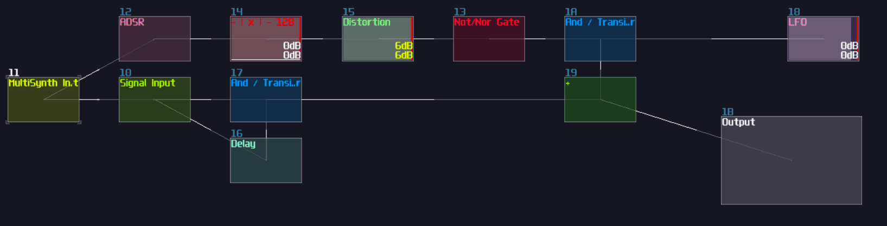

After that, since there is only a single input and output, we may wrap the structure into a MetaModule so that it easier to make duplication and easier to maintain the overall project, and don't forget the set the input module aligns to the internal MultiSynth:

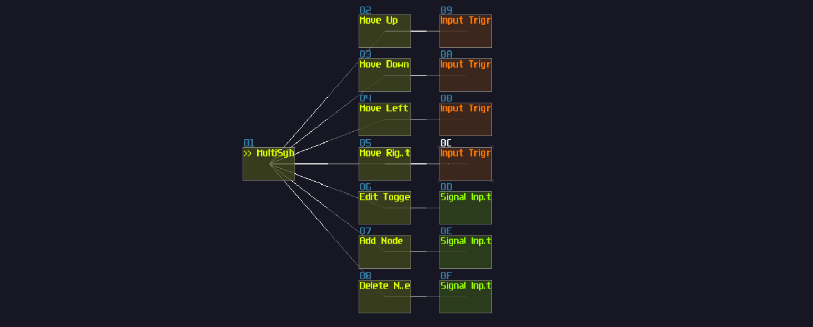

After the triggers, we need to reduce their signal strength down to 1 DC unit, using an amplifier with the volume of 2, and remove one of their channel according to the direction of the operations, followed by a summation. After we have summed all four directions, we reserved a transistor for the edit button so that all the operations are effective only in edit mode:

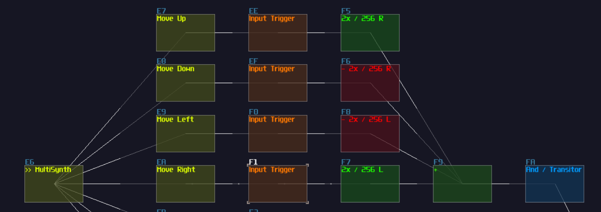

We may pause here because it will be a bit tricky if we insist to build the complete control system without other components, so we have to focus on most of the input's dependencies first, all the memory circuits.

## The Stack
The user want to create 8 coordination at most, and edit and remove the most recent coordination; for that requirement, we may use a stack. 

Stack is as data structure that works in a LIFO (Last in; first out) manner [^stack]. In layman terms, it is like when you stacking up some plates, you always put a new plate on the top of the stack, and when you want to grab yourself a plate from the stack, you always takes the top one.

To built a stack, we may starts from their memory cell first because it also requires to have additional logics, and for now, let's build an accumulator first which is made by a delay memory cell and a rising edge monstable, synced with the identical delay frequency; keep in mind, our input entry also have a finite length of pulse, and we must ensure that the delay time used in the memory is shorter than the incoming pulse duration; otherwise, incomplete and noisy write for the memory will occur; thus, let's set the delay time of the memories in 1 Sample unit. In addition, since the input consist of an 1 DC unit pulse, with the modulator in the rising edge monostable, this will further divide the signal strength by 128 resulting in an inaccurate value. To solve the issue, the pulsing part (the delay side) of the monostable must be feed with a +128 DC unit pulse, and we may use an absolute inverter and a negative detecter with inverted output.

Built the writing operation, now we can handle the clear operation which is straight forward that you only need to take an input and convert that constant DC signal into a midi by triggering the state controller of a ctl2note. Using that midi signal, we can play a MetaModule containing a single line of "stop the module command (xx)" pointing to the output module internally that will send the stop signal externally for the delay memory to clear everything:

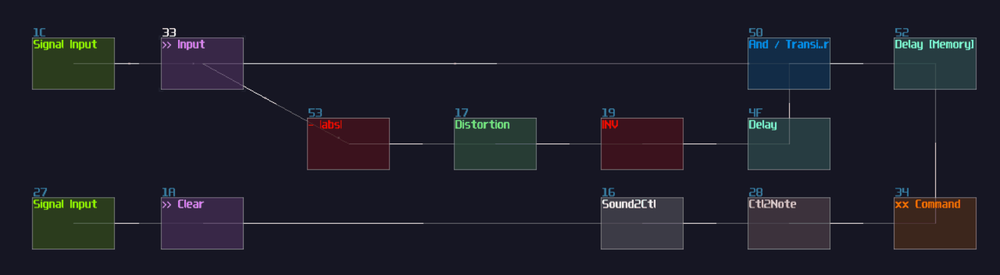

Owing to the specification, we need to support up to 8 nodes to form an octagon, so we need 8 duplications such cells:

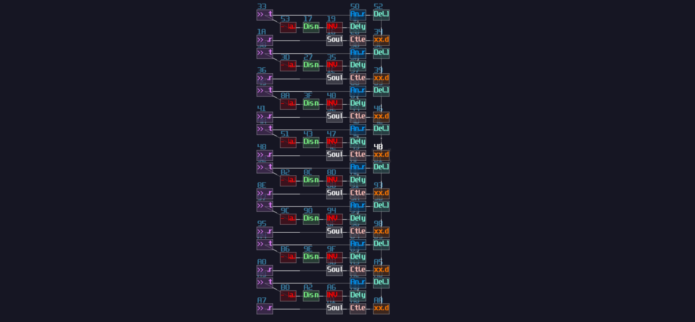

To access the memory cell individually, we need decoders. The decoder has multiple purposes, writing, displaying a cursor, and perform a boundary check for a specific memory cells, so we need three set of transistors, two before the input which they are used for writing and cleaning data, and one set after the output of the memory cells:

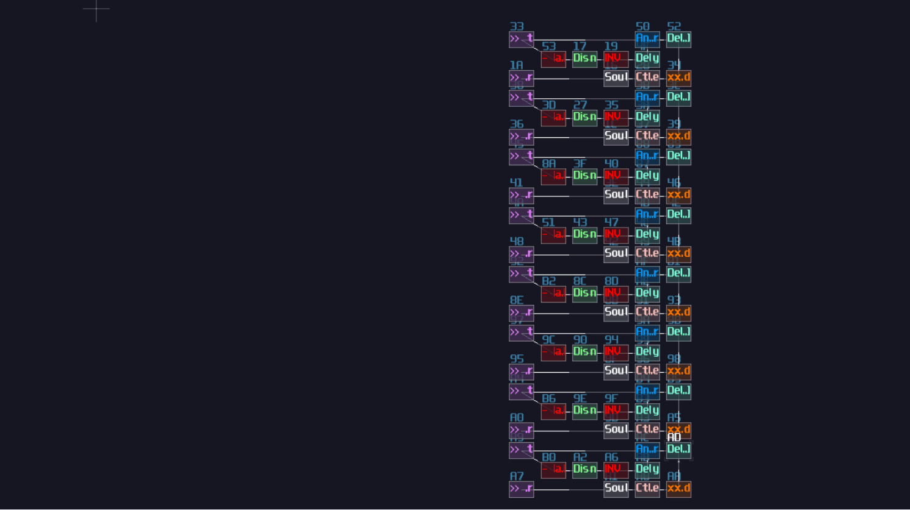

The current structure alone is still not a stack because it misses two important characteristics: push and pop an item. Push operation means to add a new data at the last location of the memory slot, just like how you stack things where you always put your last item onto the top; meanwhile, pop operation is to remove the most recent item you have added into the collection. For our polygon plotter, thing works similarly, press the add button, we add a new node, versa when we press the remove button, but since we don't need to care about what happened to the removed value, or a specify and value during adding a new item, we can squarely set the removed memory cell to zero without returning the popped value; thus, based on our original memory slot, all we need to add a set of counter to keep track on the index

Firstly, we need two entry points for the push and pop operations, both take +128 DC unit as input signal, and split both of the signal paths such that they have an additional paths that regulate to values to +1 and -1 for push and pop respectively.

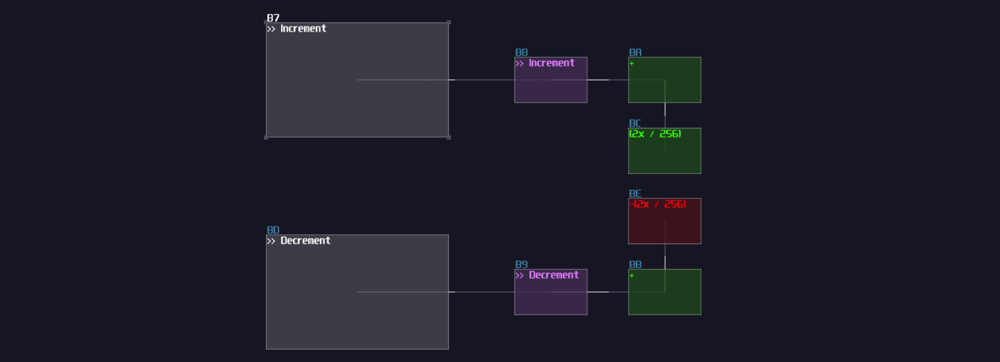

What goes after the entry point is a counter. Right after each of the regulated output, we may reserve a transistor for logics to prevent users adding or removing too many items that lead to an invalid state; after the transistor, we may copy another memory cells as shown:

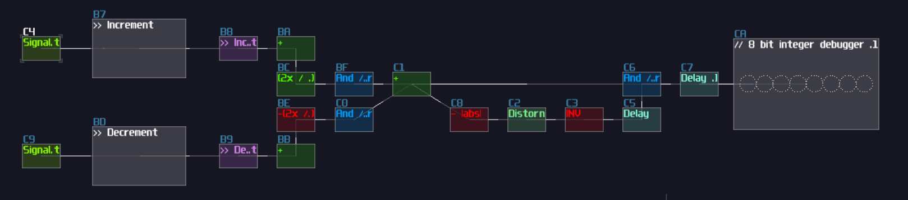

As you can see, each input has a reserved transistor, and we need to build a feedback loop to lock the entry point such that they can prevent index getting out bound, using negative detector with a DC offset:

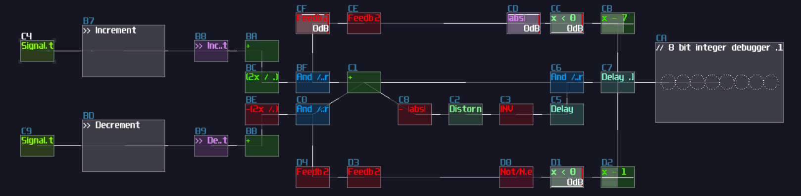

The counter has completed, let's connect the output of the counter to the input of the decoder of the memory clusters:

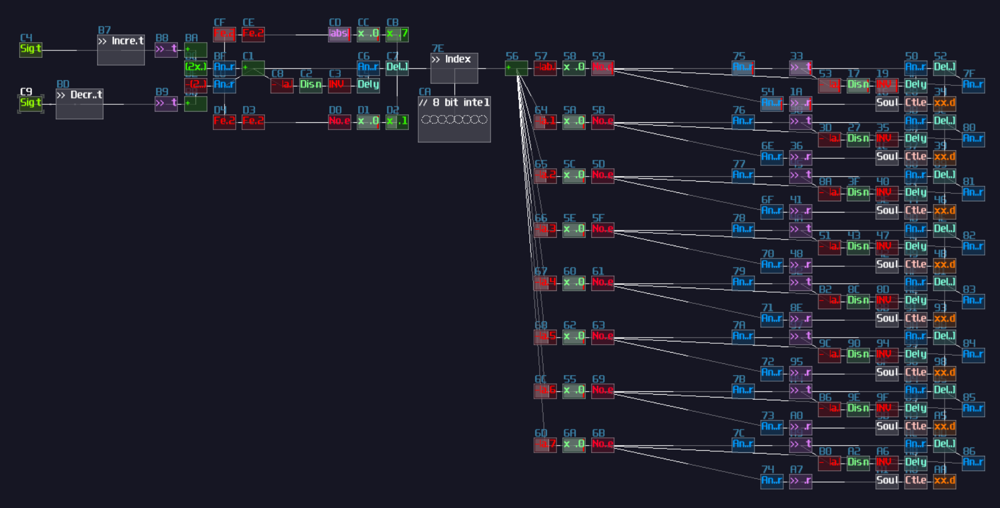

It is really close to the completion of the stack memory, and all we need is to figure how to connect the two inputs to for the stack. Nothing is changed for the input because we only need to increment the index for the next element, but for the output, it will be trickier which you will encounter the first race condition for your contraption. Race condition is a problem that the order and the timing of operations affect the result [^race_condition]. In this example, since counter decrement and data clearing happens at the same time, it might unexpectedly erases the previous memory cell. To prevent the issue, we need to send a regulated pulse such that the clear and decrement happens in the correct sequence without overlaps; thus, we need a monostable and delay to separate two operations. Here is the slower version to demonstrate how the sequence works:

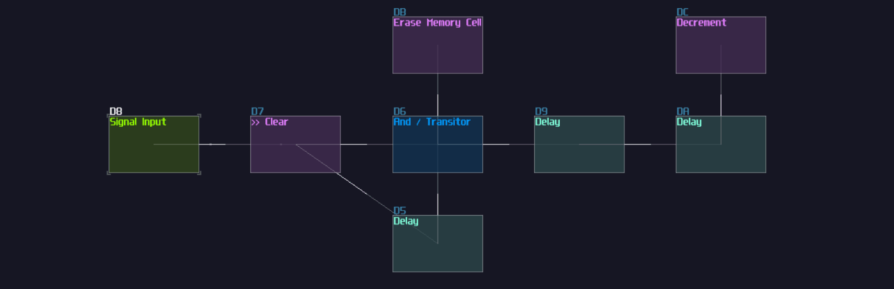

From the illustration above, you can observed that the monostable first generates a pulse to cleaning the memory cell. When it has finished, a delay is introduced to form a separation before the decrement happens. This configuration ensures that clear action must be done cleanly before moving to another memory cell. After set the delay time of the timing circuit to 5 ms, we may connect the decrement signal output to the counter and the clear signal path to the each transistor output of the clear port to the memory cells as shown:

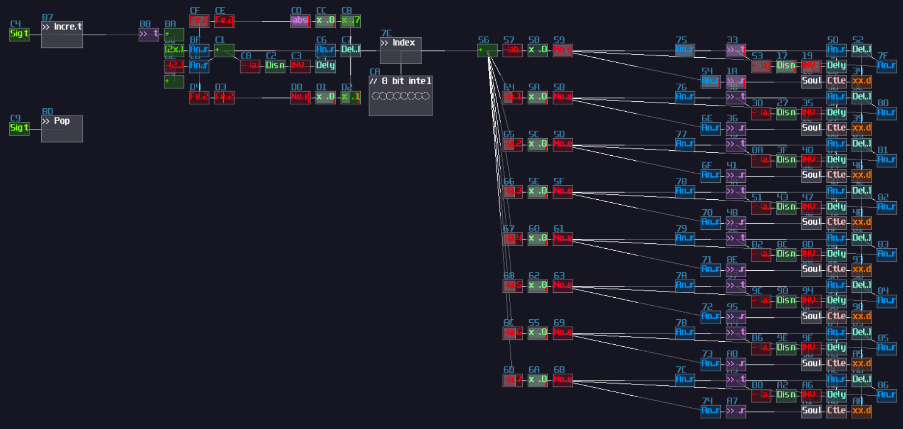

Finally, for the data entry, we need to connect a data path to each of the transistors that connect to the data port of the memory cells so that the controller have a port to send signal to update the memory cells:

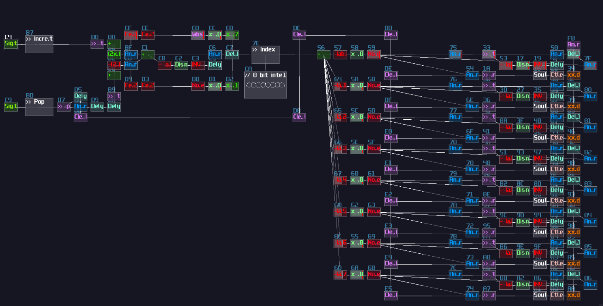

## Complete The Remaining Controls And Connect To The Stack

Since we have completed the stack, it is easier for us to complete the remaining circuits. Back to the controller, because we know that the "Add Node" and "Delete Node" belongs to the Push and Pop operation of the stack, which is time sensitive, we need to find a way to prevent users spamming the controls. To make the control less spammy, we may use an inverted ADSR trigging a negative detector so that even if the user rapidly press the add and remove key, the controller still considers that is a single pulse:

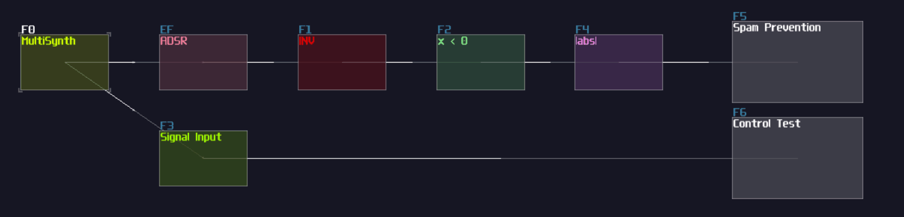

The spam prevention mechanism is applied after the add node and remove node operation, along with a transistor. The transistor are manipulated by the edit toggle button which is a T flip flop, so are the transistor from the navigation system so that they are operational only if the edit mode is on:

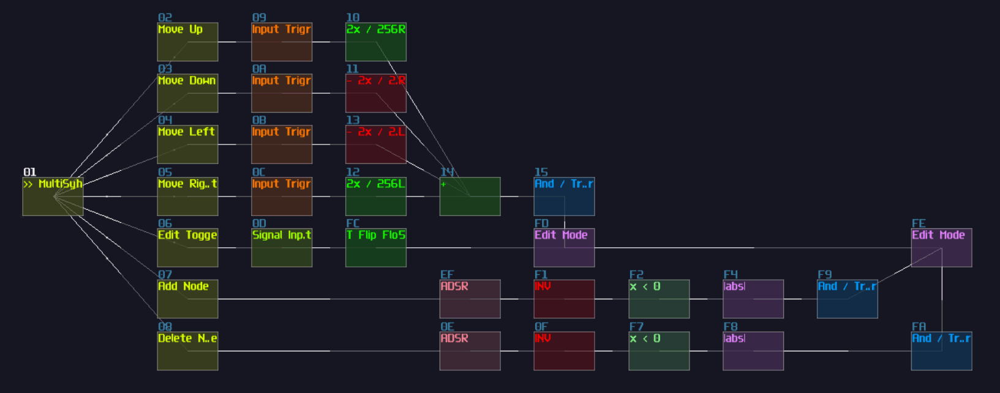

With the controller, connect the transistors based aligning to the functionality of the stack memory: the navigation system links to the data port, the add and remove node connects to the increment and pop respectively:

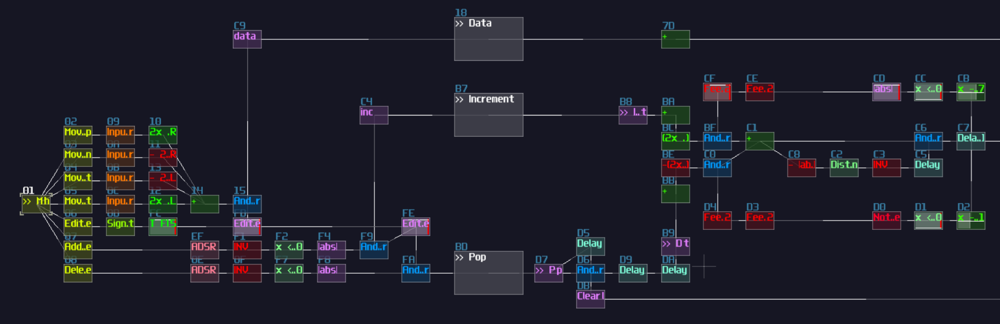

If you have done correctly, after pressing the edit button, you can see the navigation system update the first memory cell, and if you press the add button will update the second memory cell and so on. Pressing the delete button will clear the the most recently added memory cell and the counter moves back to the previous memory cell for editing.

## Boundary Check For The Navigation
For all the control logic, one problem remains. If you hold one of the navigation buttons too long, the cursor location will go outside of the oscilloscope, and it is easy to get lost if both of the coordination are outside the range; thus, to solve the issue, we need to apply a boundary check which is similar to what we have done for the stack, except that it need to explicitly handle both channels.

In this example, let we set the boundary as:
- ±200 for horizontal direction
- ±128 for vertical direction

After that we need to split the memory cell into left and right channel, using an amplifier extracting one of the channel and centralize the signal by setting the stereo width to 0. Because setting stereo width averages the power of both channel while we have nothing to their opposite channel, the volume is reduced by half, so we need to double the gain to properly extract a channel into a mono signal path:

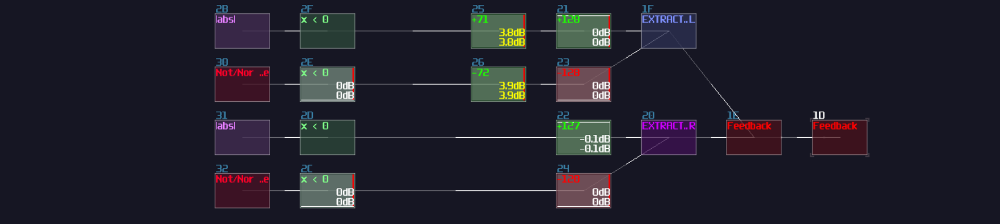

After we have the bound check, we can group all the transistors at the output of the the memory cells and connect the grouped signal to the bound check:

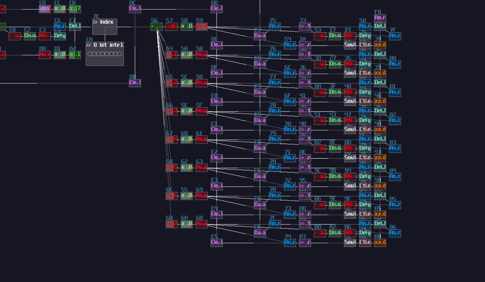

After we have the four indicators, we can insert additional four transistors after input triggers so that when the cursor gets out of bound, it cut the input of the specific direction, and since we want our four input On by default, each additional transistor needs a not gate:

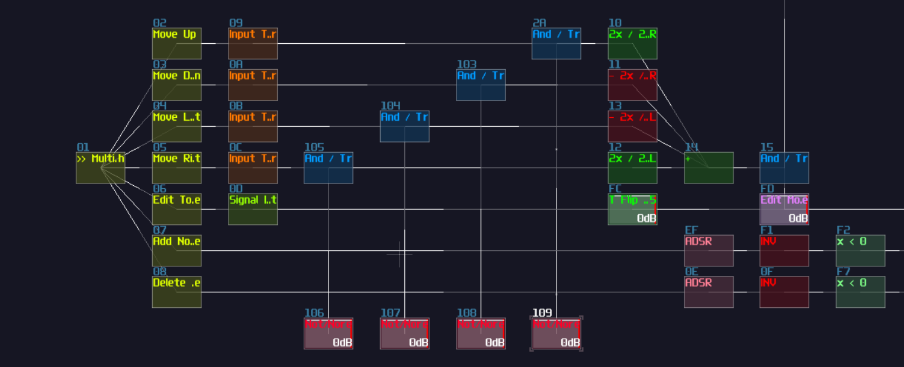

Finally, connect the boundary indicator based on the direction of the control, and we have completed all of the control logic.

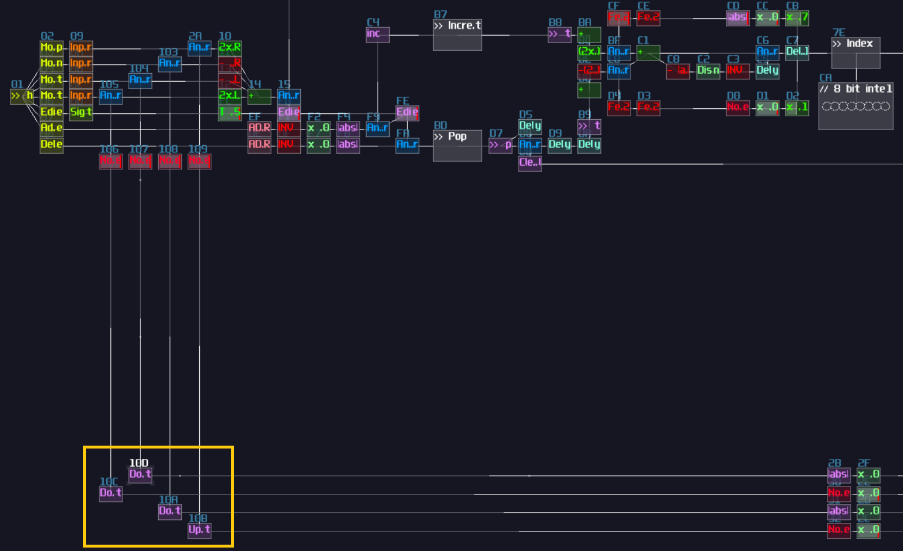

## The graphical Components - Polygon Plotter
We are halfway through the whole project by completing all the control circuit. In the following part, it is all about graphical components.

To plot the polygon, we need to print multiple lines, so we need to print a line given two points which we may build the [structure we have learnt](../graphics/lines_and_circles.md#Line-Over-2-Points) in the graphic section as shown:

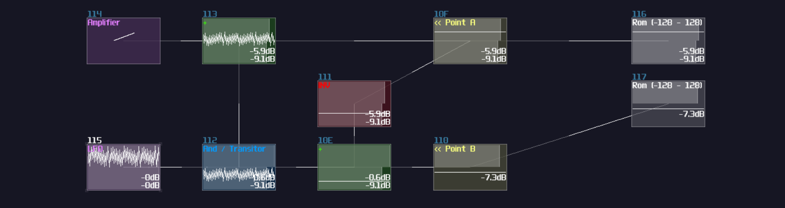

Due to the space concern for the screenshot, I have to mirror the structure so that the final result can fit within a single screen, but in practice, it is better to keep the input and output into the same orientation unless it is a feedback mechanism. After that, it is all multiplexing again, but we have two problems:

- We need to find two points that the first point is the previous point of the second point
- The number of points are dynamic

With this two requirements, we seem to face a problem because with the multiplexing knowledge we have learnt, they all handles fix number of nodes; however, in this example, the node size are dynamic such that the last node are always links to the first node. For example: if there are three nodes, the the third node always forms a pair with the first node, and if we add two more new nodes, the last node has became the fifth node which it will pair with the first node. That means, using LFO and delay doesn't work well since you have to dynamically calculate the length of the delay and the LFO pulse and dynamically block some of the unused delay module to prevent overlapping which is complex and in accurate since is it hard to calculate the delay time based on the duty cycle of the LFO. Nevertheless, there is a more convenient way to do multiplexing dynamically. Thus, let's have a look to a Square LFO with a distortion.

Remember how Negative Detector works? It sends a negative +128 DC unit if the incoming signal is negative. This works because we have set the bit depth to 1 which it has quantized the input into a 1 bit signed integer, which is either -1 and 0:

Likewise, if we increase the bit depth to 3 bits, the distortion will quantize it to a 3 bit integer, ranging from -4 to 3:

With the same principle, we can set the bit depth of the distortion to 8 to quantize the signal into a 8 bit signed integer which aligns to the DC offset steps size of amplifiers. With the quantization, we can feed a LFO signal regulated by a transistor, bound by the another constant DC for the maximum value of the counter:

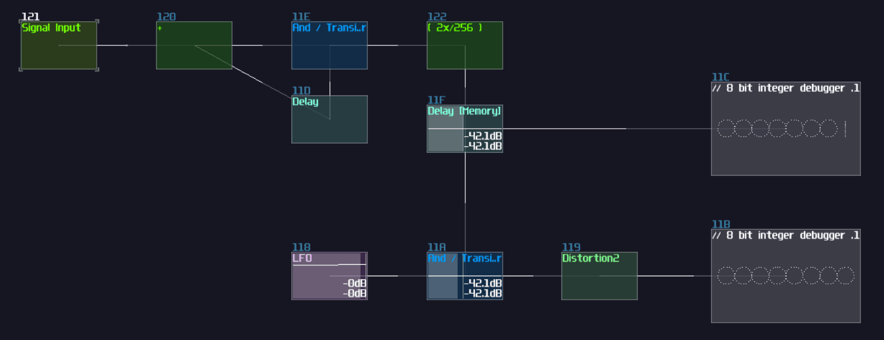

From the illustration above, you can observed when we increment the memory cell by one, the counter counts based on the given upper bound defined the memory cell, but there is one problem remains: How to build the second counter such that the last element always points to the first element regardless the node count. To do this, the easiest way is to split another output with another amplifier with adding 1, so the second counter is always being one higher that the first, but when the second counter reaches the maximum, it forcefully set the output to 0, bound by the index counter so that the counter can be wrap dynamically; thus, you will ended up with the following structure:

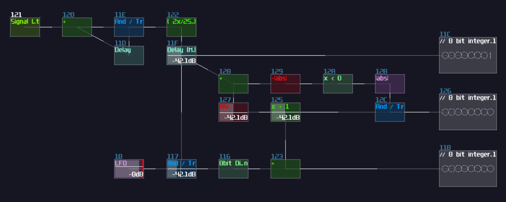

That's about the dynamic counter, and this is huge because instead of dynamically changing the pulse and delay length in real time which can be tedious and inaccurate, two decoders is all we need with this dynamic counter; meanwhile, although the counter vary the frequency of the counting action, since we use that for multiplexing, which it doesn't require a constant time, the problem is negatable; thus, we have successfully transform a problem into a simpler, more intuitive form. 

After all, they are all about decoders, but before that, let's add a pair of transistors for each output of the stack memory cell, and group all the transistor groups into two distinct data buses so that they return two distinct selected points for the line plot:

For the decoders, we need two set of them, and for the sake of connectivity clarity, I build two groups of decoders in an alternating pattern as shown:

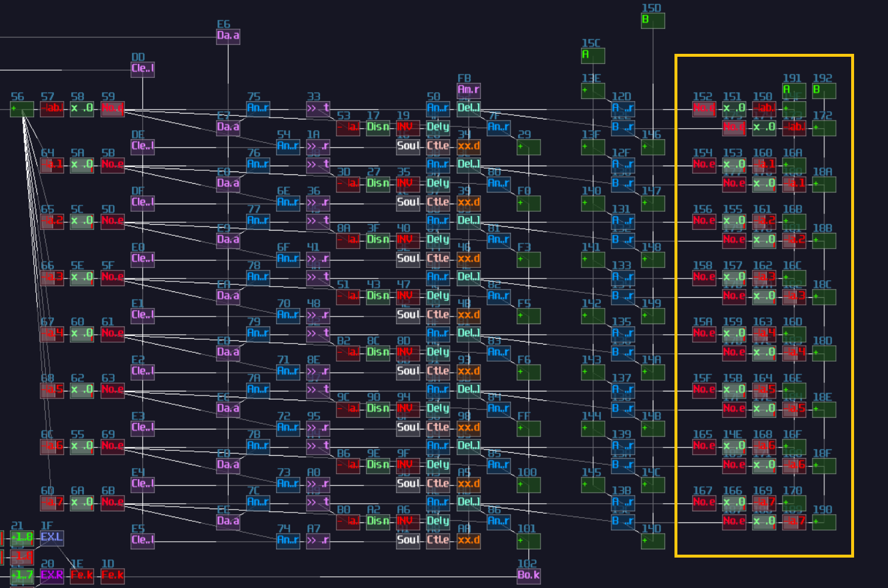

From that, we can now work with the counter, but since the initial condition of the contraption has one node by default, we need to add one to the transistor that set the upper bound of the counter and the bound check for second counter; thus, we will have following (the order of the counter doesn't matter for this case):

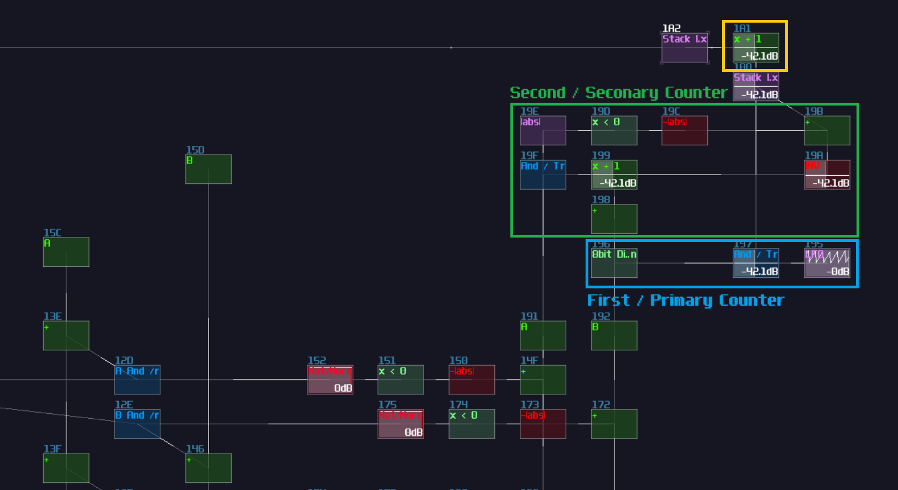

Once the counters are set, remember the two data bus we have created earlier after we have implemented the dynamic counters? We can finally connect the output of the two buses into the line plotter. For someone who are inpatient, if you have already played around with the plotter, it already works!

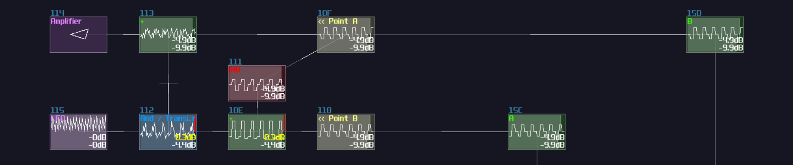

## The Cursor And Validation GUI Elements

Technically, we have completed the core feature of the plotter, but as the requirement has stated, we still need to implement some features that enhance the user experience (UX), building a solution that is more intuitive to use. Therefore, according to the specification, we need to build a GUI for the cursor when the contraption is in edit mode, along with a simple cross if if fails to add a new node.

There are many way to make a cursor icon, but for the simplicity, I am going to make a "Sniper Scope" like element which consists a cross and a circle:

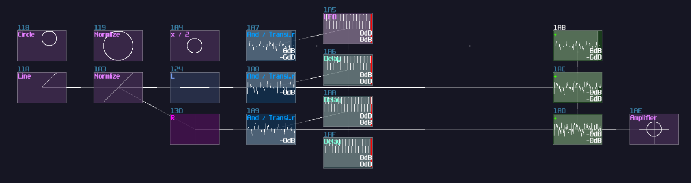

The reserved space are no coincident because we may build a cross based on the existing structure with reflections:

The cursors are a bit too large, taking the whole oscilloscope, so we may use another amplifier to reduce the size. After that, we need to add a logic that can detect any invalid add operations so that the cross will temporarily overwrite the cursor. To handle such case, we need to extract two signal paths where:

1. if user has pressed an add operation in the edit mode
2. if the stack has full

Thus, we may extract an output where users fires an add operation signal from the entry structure, while another output from the max boundary check for the stack like shown, and use an AND gate to see if both condition are true:

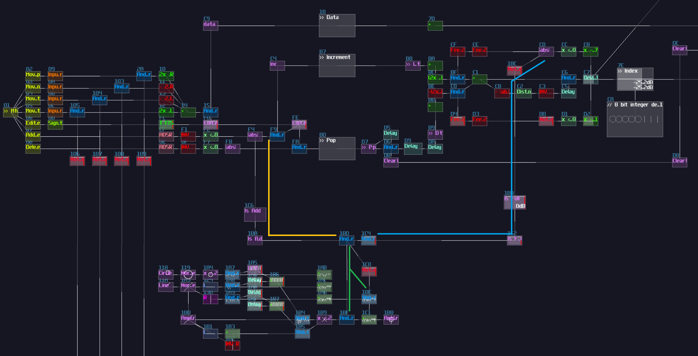

"But why did you put an AND gate that isn't really controlled by anything?", you may wondering. That additional AND gate is to handle an edge case when the stack index reaches the maximum for the first time which it should be a valid case, but with the current set up, the validation throws an "X" even for the valid case. Therefore, we need to do additional checking before mark the user action as invalid. To solve this issue, we need an SR flip flop which the set and reset port are triggered by falling edge monostable from the user input pulse and the max boundary check respectively. To prevent the user input writing the SR flip flop multiple times, we need a feedback loop to cut the signal path if the flip flop has already been written:

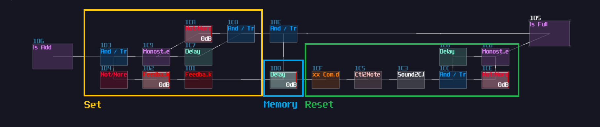

Once you have built the additional check, connect the input to their respective bus, and the memory block connects to the additional, unconnected transistor like shown:

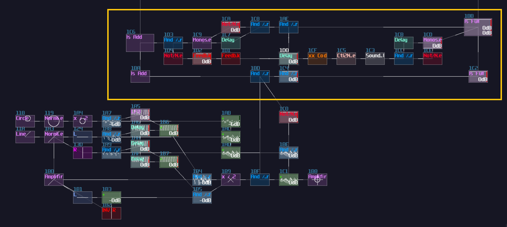

Once you have done right, the cross overwrites the cursor if you attempt to add a new node when the stack is full.

## And Finally, Putting All the Graphical Elements
After we have completed ourselves some cursors, we can finally connect the plotter and the cursor. First of all, extend the edit indicator to the top of the project, so it will be easier to build the last rending mechanism:

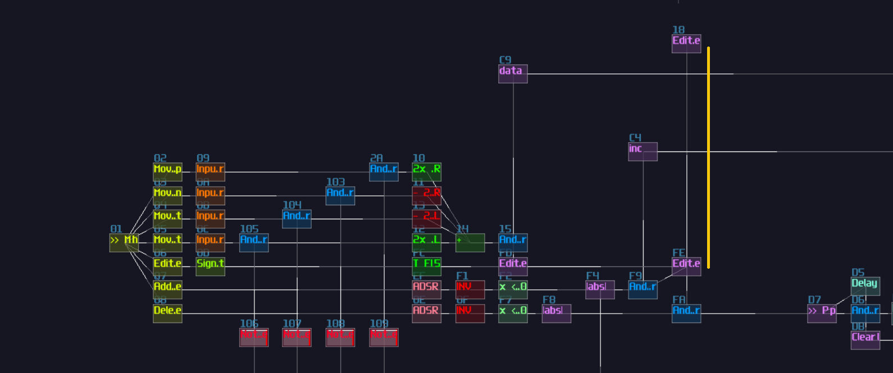

On top of the extension, we need to build our last multiplexer, and this multiplexer is a bit different because it is bias towards to the polygon more than the cursor because the polygon is a more complex shape:

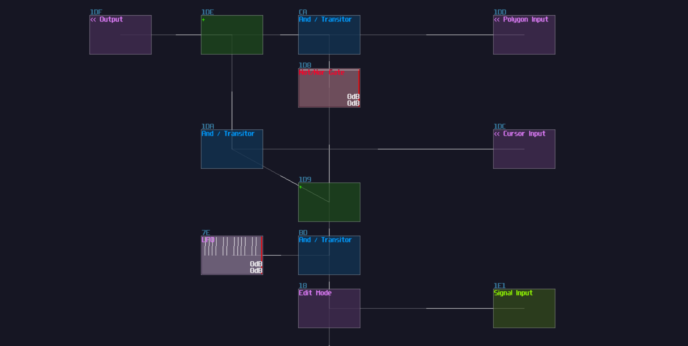

With our final multiplexer, we can now connect our cursor with it. Since the cursor is moved by the location of the currently selected node, we may make use of the data line that tracks the cursor location to move our cursor:

Once you have extended the cursor data line, you can now connect the translated result into the multiplexer, along with the result of the polygon plotter:

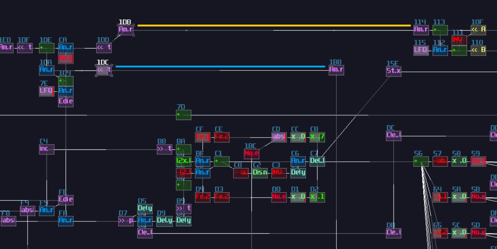

And finally, give it a nice screen next to the controller:

## Final Result

With all the things we have done, we can now enjoy the show. Simply pressing a key that corresponds to B5 to toggle the edit mode, we see a cursor which give us a clearer clue where is the current node and its location. We may move around by pressing C5, C#5, D and E for navigation. If we have settle a node, we may press C6 to add another node, and it will form a line; then a triangle, and so on until we hit octagon. If we further press the add button when the shape is an octagon, the contraption refuses to add a new node with temporary showing a cross to notify the users. To remove a node, all we need to do is to press D6, and it removes the most recently added nodes.

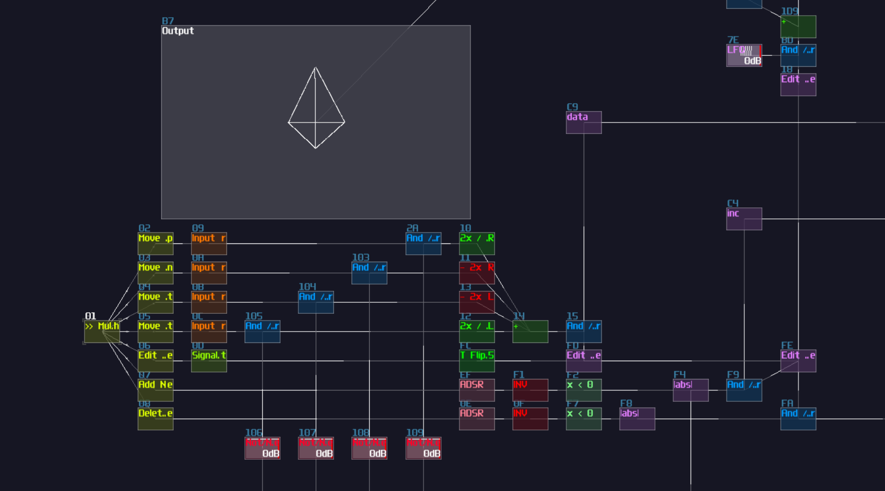

<iframe width="640" height="480" src="https://www.youtube.com/embed/fDfuuWDhJcU" title="YouTube video player" frameborder="0" allow="accelerometer; autoplay; clipboard-write; encrypted-media; gyroscope; picture-in-picture; web-share" allowfullscreen></iframe>

## Conclusion

What a journey!!! This is definitely one of the most complicated projects so far in the logbook; in fact, this will be the most complicated chapter because it involves so much elements we have learnt or not in the previous chapters, and this chapter alone has spent me 3 full days from preparation to writing the document, with countless corrections and reworks for certain parts. 

This is certainly a chapter I will revise in the future for a better clarity, but hope you can still understand how to build an input interface, a basic memory storage and some hacky tricks!

### References
[^stack]: [Stack Data Structure](https://www.javatpoint.com/data-structure-stack)
[^race_condition]: [Race Condition](https://www.baeldung.com/cs/race-conditions)