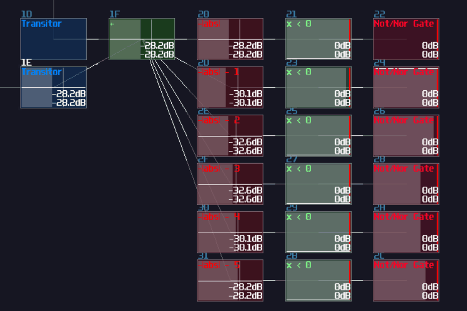

# Example 1 - Unfair Dice

> To provide a cleaner demonstration for individual components, some of the modules might be moved into different locations.

## Overview
In this Chapter, I am going to show you how to use the concept in the previous chapters, to build a simple siz face dice which you can roll with keypress.

## Planning The Project
To build a dice which can accept user input, we need to identify the components:
- A randomizer generates number ranging from 1 - 6
- An input for taking users' entries
- A timer for the dice animation
- A memory block to store a random value once the timer times up
- A display element to show the dice dots

With all those components, you may try to come up with a flow chart, to see how the logic flows:

As you can see, in this project, I would expect a user pressing key, and it triggers a timer with the midi signal which it updates graphics based on the randomizer. The timer counts until it has reached the time limit. Once it times up, it send a write signal to a memory while it records the last state of the randomizer, while changing the display showing the dice value based on the stored value in the memory.

Once you have a clear flow of logic, you may move on to the next phase.

## Input
To prevent user breaking the contraption by rapidly pressing the input, we need a SR latch, after a full volumed, monophonic DC generator. Remember to leave a AM modulator for the resetting the SR latch:

## Timer
The main timer comes after the input, which is a simple rising edge monostable (5 second in this case).

## Randomizer
Even though our dice might be a bit unfair, without a randomizer to randomly pick a number, the dice will be so boring because the state of the dice will be highly predictable. For the ease of building a convincing randomizer, we can use 5 LFOs in random mode, feed with a constant +128 DC offset. After that, we can normalize the output of the LFO such that they can select a value ranging between -128 and 128 DC unit by doubling the gain with subtracting 128 DC unit, and send the signal into individual negative detectors to return a signal only if the normalized LFO generates a negative signal. After negative detection, we take that output and convert it into 1 DC unit by setting amplifier's volume to 2, with absolute mode; by doing that with a summation, we can have a range from 0 to 5 for a decoder that renders the dice graphics. Thus, the randomizer is shown:

## Memory Storage
We need to record the final value after the timer times up, we may use an 8 bit D flip flop we have learnt before to store to dice value as shown (The right most green module):

 

That's it! It is just a single 8 bit D Flip Flop, received the randomizer output as data input and the timer output as Clock signal. Since the D FLip Flop in the toolkit is falling edge triggered, it only assign a value only if the timer goes off. 

## Decoder
We need to build a decoder to bridging our aforementioned logic structure and the upcoming display circuit, converting an integer value into individual signal paths. The decoder is identical to what we have build in the fundamental sections, with additional two modulator before the input of the decoder that are used for selecting signal between the memory and the randomizer:

## Display
Displays are always the trickiest part of any SunVox logical gadgets because of the restrictions of the oscilloscopes, but don't worry, let do that step by step. For now, let's have a look to the classic 6 sides dice face:

If we stack all the faces, you may find that some of the dots are overlapped to one another, and there are only 7 unique dot positions, forming a horizontal H shape. That means, for a dice face, all we need is printing 7 enlarged pixels individually in their corresponding locations by doing translations (I have group the logic into a single module for the cleanliness, and you may find the same module in the graphics toolkit):

At this stage, all 7 pixels are in the correct positions which top and bottom have three evenly spaced pixels, along with the middle pixel; however, the position is a bit off, but we can fix it at the final stage. With the 7 pixels, we need to find a way to print the correct dots based on the decoder output; therefore, we may attach an modulator after each pixels and map the correct pixel with the output of the decoder as shown:

With our stacked image, we can already see that the dice faces are properly shown, but if we want to fit that into a metamodule, we must squeeze all the pixels into a single output module; thus, we need to do multiplexing with a LFO in square wave and a group of delay modules. For the ease of calculation, we may set the duty cycle of the LFO to 228, which the pulse only stays on for roughly 1/8 of the time for each segment, while the delay time of the following segment is the multiple of 8:

Finally, with that merged image, we can further fix the scaling and sizing before sending the graphic to the output module.

## Additional Changes
We have pretty much completed all the basic components of our dice, but we need to connect all the components to make it work because the current dice can't reset itself and switch display between the stored and randomized result, so we must do the following changes:

To reset the input latch, seemingly, we can reset SR latch by setting sending the state of the time since we have reserved a modulator for the reset sequence; unfortunately, since it requires a pair of feedback modules for completing the cycle between the timer and the modulator, introduced a delay. That delay causes the SR latch fails to be triggered since the timer is not fast enough to create a feedback loop for the latch. To solve the issue, we also need our signal input to engage the modulator for switching the latch on:

Lastly, we need to toggle the readout between the D flip flop and the randomizer, so we need a NOT gate receiving the signal from the timer and connect the output of the NOT gate to the modulator after the D flip flop, otherwise for the modulator for the randomizer which directly from the timer. With that configuration, when the timer is on, the choose the randomizer path for rendering the dice, otherwise to the D flip flop:

## Final Result
That's about it! if you press the signal input module, the module triggers SR latch to prevent user spamming the input to break the contraption, while engaging the timer to play a random sequence. Once the timer has timed up, the D flip flop takes a value from the randomizer, and print the result with the corresponding dice face:

As the name suggested, it is not a fair dice because it often stops at 3 and 4. To make a better randomizer, we could calculate the remainder of a larger number, but that will be another story since that is far more complex than the current design.

> Fun fact: I was so lucky to roll a 6 in the screen recording, and this was the first time and the only time I have ever rolled 6 with this dice.

## Conclusion
Alright, you should able to know the thought process of how to build contraption which we first consider the logic flow of the contraption, and to breakdown the contraption into a smaller components serving for different functions. After we have completed all the individual components, we can connect each subgroup to form a bigger structure.

## Example Project:
[Three Phase Dream](../example_projects/integration/4.1-Unfair_Dice.sunvox)