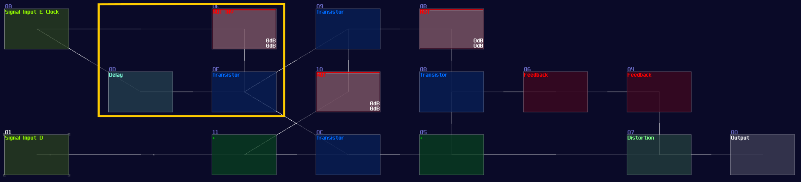

# D Latch and Flip Flop

## Overview
Since JK flip flop is too complicated and fills with racing condition, I usually use the alternatives to get the job done; in this chapter, I will go through how to build a D latch and flip flop so that you can use it for storing handful of data for your modules.

## Concept
If we expend the SR latch with two AND gate and connect a pair of input to each of the AND gate, while one of the input of an AND gate of an input pair has a NOT gate, we can build a D latch:

<object data="../apps/circuitjs/circuitjs.html?ctz=CQAgjCAMB0l3BWcMBMcUHYMGZIA4UA2ATmIxAUgoqoQFMBaMMAKDAWxEIBYruxCIPHBD9BVFFApsOXXhRR4hIhIqmTu0Utp27i0gDIUwk7Hm6ieIMxapUAZgEMANgGc61SCyMJuFsZb+AlIOLu6eLADuynzYkjx8xOJRMcbx8n5KXgAeomrYxJx+nAWCFigWAKIsudxqdUXcZUSiIBUgACIpwnzBPaJxUCkJA+l83FnDGUlytCZD0f0I80tqXuy0fqIiI7x2bVIIMpsWvhYjZ+qHKcum5hRbNgtp1ve3FIR2N-MInw+nf3WhEkqyUeBmqiUkgAJnQnABXZwAFwYzjo0PAISgsFYAHMhBC1MQ1JCQiwAJL-UTBS6kuzQJBHIA" width="100%" height="500vh"></object> 

Unlike SR latch or flip flops, it have a data input (D) and an write enable input (E). Write enable input is used for locking the memory state when the enable input is off, and it is used for changing the state of the memory based on the data input when it is on:

| IN E | IN D | OUT                | OUT Inverted       |
|------|------|--------------------|--------------------|
| 0    | x    | retains prev state | retains prev state |
| 1    | 0    | 0                  | 1                  |
| 1    | 1    | 1                  | 0                  |

D FLip Flop has an identical structure to D latch, except that the enable input will be edge triggered instead of level triggered.

## Building D Latch / Flip Flop from SR Latch

You can simply convert a SR latch into a D latch; instead of connecting the two input into the transistor and the "+" module, an additional pair of AND is added in between the input and the aforementioned destinations. According to the circuit diagram, one of the D input requires a NOT gate for toggling the data:

Likewise, you can convert it into a flip flop by inserting a monostable circuit at the Enable input, as shown:

If you have done right, you will have a D latch / flip flop for storing a single bit.

## More Efficient Approach
"IT IS STILL TOO LARGE! WHO WOULD EVEN USE THIS INEFFICIENT DESIGN TO STORE A SINGLE BIT, WITH 20MS OF DELAY?!"

I can definitely hear people screaming that, but the previous design is just a proof of concept which it has not much value to practical application other than teaching how things works.

To make a better design, we need to play around three modules:

Velocity2Ctl is a powerful module if you pair it with an amplifier, as the Veclocity2Ctl can control the DC offset of the amplifier by sending a pulse of midi signal, and the controller signal retains even the midi is OFF. This leads to a much more compact memory design because it can let us store a byte of data without actively refreshing the memory, while the write and clear sequence are much simpler and much more reliable.

However, you can't squarely use the Velocity2Ctl because it only accepts midi rather then a DC signal; therefore, this is where Sound2Ctl and Ctl2Note come in. Sound2Ctl convert the DC signal into control signal, and we can use the control signal to manipulate the velocity of Ctl2Note so that for every ON state to the Ctl2Note, sending a midi signal containing a velocity magnitude alining to the DC offset of an amplifier which has a 8bit combination.

Thus, we need to form a chain:

Ctl2Note -> Veclocity2Ctl -> Amplifer 

for the core memory part, where the setting of the modules are shown:

 

Ctl2Note:

| Controller    | Values          |
|---------------|-----------------| 
| State         | off             |
| NoteOn        | on pitch change |
| NoteOff       | on min pitch    |

 

Velocity2Ctl:

| Controller     | Values                 |
|----------------|------------------------| 
| On NoteOff     | do nothing             |
| OUT min        | 0                      |
| OUT max        | 32768                  |
| OUT offset     | 0                      |
| OUT controller | 3 (controls DC offset) |

 

While the Amplifier is the default setting. After the core part is complete, we need to find a way to control the memory, so we use two Sound2Ctl to controlling the the velocity and state respectively:

Sound2Ctl from Input D

| Controller     | Values                   |
|----------------|--------------------------| 
| Sample rate    | > 256                    |
| Channels       | mono                     |
| Absolute       | off                      |
| Gain           | 256                      |
| Smooth         | 0                        |
| Mode           | LQ (No interpretation)   |
| OUT min        | 0                        |
| OUT max        | **32768**                |
| OUT controller | **6** (controls velocity)|

 

Sound2Ctl from Input E

| Controller     | Values                 |
|----------------|------------------------| 
| Sample rate    | > 256                  |
| Channels       | mono                   |
| Absolute       | off                    |
| Gain           | 256                    |
| Smooth         | 0                      |
| Mode           | LQ (No interpretation) |
| OUT min        | 0                      |
| OUT max        | **1**                  |
| OUT controller | **7** (controls state) |

 

After you have attached the two Sound2Ctls, along with a Monostable at the Input E, you have completed yourself a D Flip Flop, which the final result should be looked like this:

Keep in mind that the choice of sameple rate is important because your flip flop must be responsible enough for your application, but setting the sample frequency to the maximum is not a wise idea since it might take too much CPU usage once the number of D flip flops scales up. 256 hz is generally a good start because most of the system can't work faster than 50 hz due to the feedback delay.

## Conclusion
We have finally know to to store a byte using D latch and D flip flop, and we can now implement a more efficient design with an aid of midi signal. For the upcoming chapter, we will see how we can use D flip flop to create another type of flip flop.