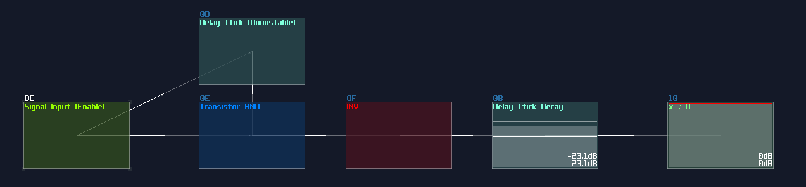

# Delay Based Memory

## Overview
Do you know anything with a delay and a feedback can be memories components? In this tutorial, I will go through some memory ideas using delay, echo and modulators.

## Delay Line Memory
Replaced by solid state ram, **Delay Line Memory** is one of the oldest data storage, developed in 1949 for EDSAC[^edsac]. How it works is that a signal is sent through a medium and the signal is detected by the receiver, while the receiver also connects to back to the medium, forming a feedback loop. Thus, using the timing difference of the pulse, we can access the data in a sequential way[^h_dllm_w]. 

There are type of delay memories:

### Interal Feedback
Delay is the most common way to build a memory, using the feedback function:

| Controller | Values      |
|------------|-------------|
| Dry        | 0           |
| Wet        | 256         |
| Delay L    | ANY         |
| Delay R    | = Delay R   |
| Volume L   | 256         |
| Volume R   | 256         |
| Channels   | ANY         |
| Inverse    | off         |
| Delay unit | ANY         |
| Delay mul  | 1           |
| Feedback   | 32768       |

Echo works similarly to the delay; in fact, this was the only way to build reliable memory storage before Ctl2Note because the older version of SunVox couldn't convert audio signal into midi, nullifying the advantage of MultiSynth and Vel2Ctl.

| Controller                   | Values      |
|------------------------------|-------------|
| Dry                          | 0           |
| Wet                          | 256         |
| Feedback                     | 256         |
| Delay                        | ANY         |
| Right ch offset              | off         |
| Delay unit                   | ANY         |
| Right ch offset (delay/32768)| 16384       |
| Filter                       | off         |
| F.freq                       | ---         |

The delay time and unit can be any duration, as long as your application requirement; it is also optional to use stereo or mono for your memory storage for doubling the storage. To clear the memory, just set the feedback to 0; however, this way might cause long reset time when the delay time is long, but thanks to the new "xx" command, we can clear memory much more efficiently.

To build such memory, metamodule is required, and we need to contain a delay or echo module with the setting mentioned above, with exposing delay time and unit as controllers, setting the playback to ON without repeat. 

Then we set the internal pattern as shown:

```
Line 1: XX--01-------- ------0030----
```

This will clear the feedback state of the module at instant if we play the pattern, and stop the play back immediately. To play the pattern in the metamodule, we can use the same audio to midi trick from T flip flop, sending a midi signal to the metamodule.

### External Feedback
This kind of delay can have extendable delay time because it is not bound by the delay time of a single module, but the whole module chain. Besides delay and echo (only delay, no internal feedback), modulator also can be used if we set the modulation mode into phase absolute mode. 

To build such memory, you just need to use feedback modules with your delay modules of choice. To reset the memory, you can set one of the module volume to 0, or wrap the delay feedback with a Metamodule with sending the "XX" command internally to clear the delay signal. 

Here is a delay line memory with 16 second worth of capacity, using modulator; you may use other delay modules as well, as lang as the the internal feedback is 0:


### Application
Due to the sampling offset, the delay line might not be as clean as velocity based variant, but because of the higher capacity, these kind of memory circuits are normally used for rendering graphics by storing the graphical data, either in exact segment or the location of points:


## Accumulator (aka i++)
Besides audio or continuous signal, you may store a constant DC signal within a precise time. The simplest form of delay based DC storage is an accumulator, which it stores a stackable constant DC signal. 

To build an accumulator, you only need a delay modules (or echo) with a Monostable. The timing of the monostable must be align with the delay time of the delay block; for example, if your delay module have a timing of 1 tick, your monostable circuit must be in 1 tick; otherwise, you may get some unwanted noise due to the imperfect timing. If you have memory cells insides a metamodule, make sure that the tempo is aligned with the master project.


If you trigger the signal input module, it sends an write signal for the memory, writing with the amount of given input which can be a constant or a variable. Resetting the accumulator can be simply done by setting set feedback of the memory cell to 0, using Sound2Ctl.

Accumulators are useful for various application, including my score counter in my pong game:


And the accumulator in my (and fuzion_mixer's) loudness meter:


## Old Style D Flip Flop
Instead of accumulating, you can clear the stored signal before writing the memory, to build a delay based D flip flop. The advantage of this method is that you can store any value with these kind of flip flop, to build memory circuits without the 8bit number limitation:

To overwrite the original data, you must clear the data by removing the offset or set the feedback to zero before adding a new value. To do that cleanly, you may wrap the delay storage inside a Metamodule, using the "XX" command for the delay storage, trigger by the Monostable impulse from the Enable input; the writing sequence is delayed by 2x unit of the Monostable impulse length, to prevent race condition.


Due to the Ctl2Note, this kind of memory is rarely used, but it was common in my older prototypes because this was to only way to build flip flops, so here is my old RAM design, using the same technique.


## Simple Timer
Based on the accumulator, we can build a timer by setting the feedback to any non maximum or minimum value so that the Delay module can slowly (or quickly) fade the stored signal like an capacitor. To make it even more useful, inverter and negative detector can be used for normalizing the output signal:



This was used for overriding with the flashing arrows for a short amount of time for my pong game; since the precision of timing doesn't matter, I squarely used the echo module as timers.


## Conclusion
That's about all of my delay type module based memory, and you have also learnt the application behind these memories. For now, let's take a break because I will tell you about something different for the upcoming section.


### Reference
[^edsac]:[Delay Line Memory used in EDSAC](https://www.computerhistory.org/timeline/1949/#169ebbe2ad45559efbc6eb35720e7a1f)

[^h_dllm_w]:[How delay line memory works](https://www.computerhistory.org/revolution/memory-storage/8/309)