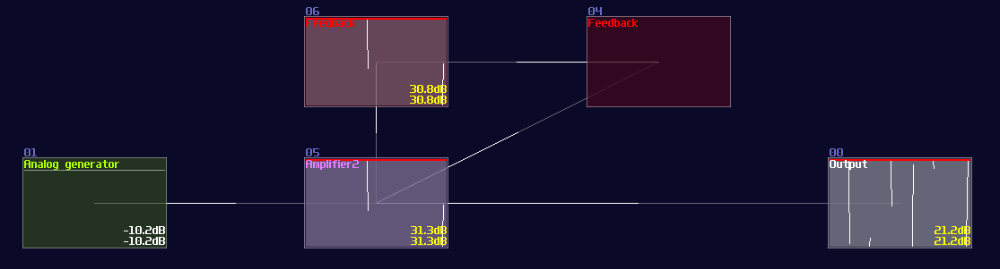
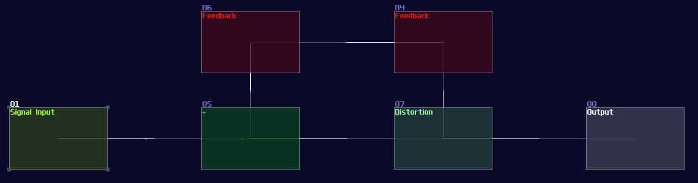
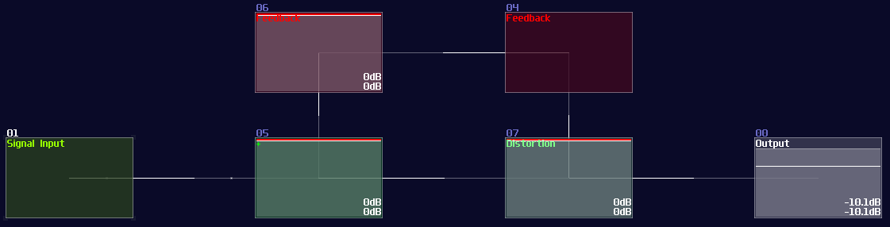
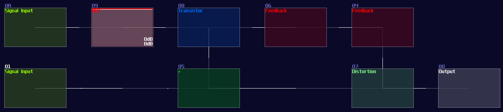
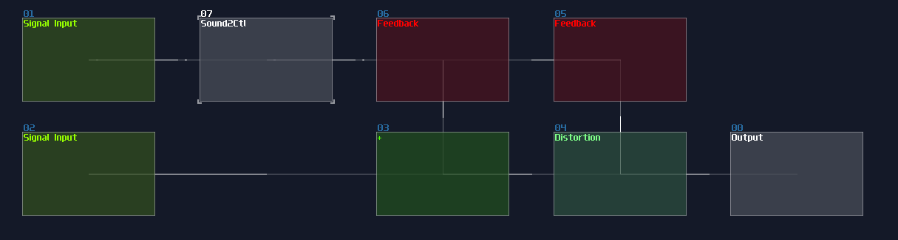
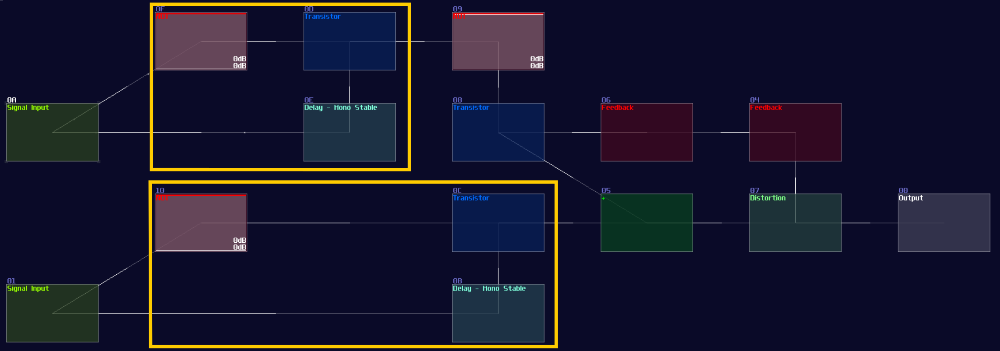

# SR Latch and Flip Flop

## Overview
Let's start from the simplest memory, to see how SunVox store a single datum, using SR Latches and Flip Flops.

## Feedback loops
I guess many of you have faced a problem using feedback where it get infinitely loud, producing unpleasant noise that hurts your ears, and distorting your output signal:

Although an unstable feedback is bad for music production which it produces a lot of unwanted noise and ruins your mix, this is good for Logic processing because the feedback signal retains the input state; however, we need to solve some issues:

- How to get a clean readout?
- How to make it feedback loop more stable?
- How to reset the state of a memory?

Without solving these problems, the memory circuit would be useless since we can't control the state at demand; thus, we need to take a step further.

## SR Latch

The simplest practical memory circuit is a SR latch. It has two inputs which one of them is used for switching the memory to ON state, while another one switch it of. When none of the input has switched, the latch retains the current state. It is invalid to switch on both of the input since it can be any state, depending on the components and environments used for the circuit, causing ambiguity that make this particular state useless for any application.

 

| IN S | IN R | OUT                | OUT Inverted       |
|------|------|--------------------|--------------------|
| 0    | 0    | retains prev state | retains prev state |
| 0    | 1    | 0                  | 1                  |
| 1    | 0    | 1                  | 0                  |
| 1    | 1    | ? (invalid)        | ? (invalid)        |

 

In the real world, SR latch is simple which only a pair of NOR gates (or NAND gates) are required; to form a feedback loop, the output of a NOR gate is connected into the input of another NOR gate, likewise for the other NOR gate. After that, two NOR gate will remain a single input, and this is where the set and reset input located:

<object data="../apps/circuitjs/circuitjs.html?ctz=CQAgjCAMB0l3BWcMBMcUHYMGZIA4UA2ATmIxAUgoqoQFMBaMMAKDAWxEPxABYxCIPHD4CoIFNQRsOXHghR4hIhUqqTaLADJylvFYr4iqVAC4AnAK51qkbboq9eFQwifizVm0jsB3ZVS82JLcesSCfgEUYCE8TmpshJLCtIZ44S5KkgAmdABmAIaWADamDMV02eAeULCsAOZCGaogxK6GJiwAHtFU2MKOxCD9nM4ozgDKdKbdNJIKzggkLuRjzgBKdADO0yz+KaKCB0Eaew4n57wJ-qF8GbcIMVBnB4-JBglAA" width="100%" height="500vh"></object> 

In SunVox, we can create a SR latch by expending from the feedback loop I have shown you before. To make it more stable, we must feed a clean DC signal, so I have used an analog generator based DC source for demonstration.

"Wait... why is there a distortion module appeared out of nowhere? What is the purpose of it?" The distortion has some modification which it has a bit depth of 2 and the volume is doubled. This configuration can prevent the feedback loop going out of bound, as you can see:

Awesome, now we have a way to store a single bit reliably, but we need to clear the state. To do that, we have two options:

The first method is to use a modulator based transistor, connecting from an NOT gate for the reset input and the feedback module, connecting to the amplifier that forms a feedback loop:

This works because the NOT gate retains the Feedback loop, unless the Reset input is ON for shutting off the NOT gate resulting in breaking the loop.

Alternatively, you can use a sound2ctl module to control the volume to one of the feedback modules. To retain the loop, you must set the min controller to max, and vice versa to the max controller to the sound2ctl, to switch OFF the memory by feeding the reset signal:

Either way should work like a SR latch. 

## SR Flip Flop

Instead of trigger the memory with the level of the signal, you can convert it into flip flop by attaching and gates at the inputs with Mono stable circuit to receive clock signal, making it triggering on the edge of the signal. (Falling edge monostable is used for the example):

## Conclusion

You have learnt how to build the simplest memory circuit in SunVox for storing a single state, but we can do better from that, so for the following chapters, I am going to introduce other memories and tricks to make data storage more efficient.

## Example Project:
[SR Latches and SR Flip Flop](../example_projects/memories/2.1-SR%20Latches%20and%20Flip%20Flop.sunvox)