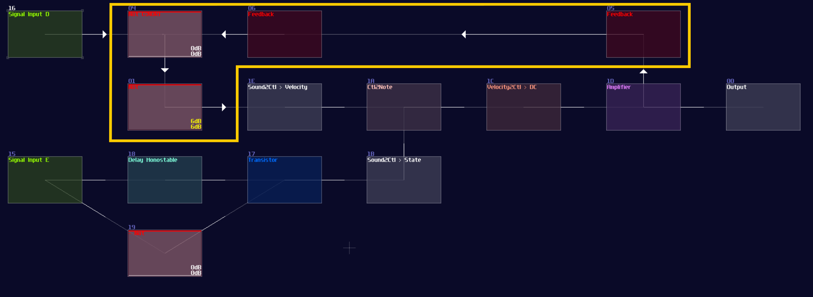
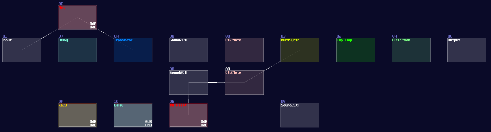

# T Flip Flop

## Overview
In this tutorial, I will show you how to build a T flip flop expanding from a D flip flops:

## Concept
Don't fooled by its simplicity; although T flip flop only have one job and it looks simple on the surface which its job is flicking the output ON and OFF for every clock trigger, it is actually an expansion from a D flip flop.

| IN T | OUT                | OUT Inverted       |
|------|--------------------|--------------------|
| 0    | retains prev state | retains prev state |
| 1    | toggles            | toggles            |

To make the D flip flop "flips" the output signal, a XOR gate is attached before the input D of a A flip flop; using the output of the flip flop, it loops back to the input of the XOR gate. Because of the XOR gate, if the output is True, along with the input T, the XOR gate returns False for the D flip flop, resulting in switching OFF after a clock update, and vice versa if the D flip flop output is False:

<object data="../apps/circuitjs/circuitjs.html?ctz=CQAgjCAMB0l3BWcMBMcUHYMGZIA4UA2ATmIxAUgoqoQFMBaMMAKABkQAWbFLvKznD5UqEAGYBDADYBnOtUgsAHiGyFOfctgx4uxASBQaAKizCFehBIS7qQGBL053eAEzqSArlIAuDKXSu4FAhMJCsAOb2jrYaOhrOGiJmCEjWAnZWNomhKQk8sRSEGUmG1AgsAO4gWYW1nOZQVTXWXI3cTo2K1R1t2QWcnLrdXEMUKLqOkxNN1VPjk8V6NooASqPTuoK0MxC8YEIo0EhHSCLHLEA" width="100%" height="500vh"></object><br>

## T flip flop from D flip flop

As you can see, it is easy to convert a D flip flop into a T flip flop; an additional XOR gate (Chain of two NOT gates) added before Sound2Ctl that controls velocity, where the XOR gate take the output from the flip flop along and an input for triggering the flip flop:




Now you have a T flip flop; however, it is not the best solution, because of the use of feedback module. To break the 50 hz limitation, we need to know a feature in Multisynth. If you set the Trigger mode in the multisynth, the multisynth will only toggles the state of a midi note on key press and ignores the off state. If we attach a generator generating a DC offset after the multisynth, we technically just built a T flip flop; nevertheless, there is a challenging task since there is no way to reset a state of a multisynth unless we press the stop button. [Or do we?](https://www.youtube.com/watch?v=TN25ghkfgQA&feature=youtu.be)


Thanks to the discovery by offthesky[^offthesky]. There is a solution to this problem. Let’s take a quick look to the phase option of the multisynth. We know that phase parameter can change the phase of a waveform or a starting point of a sample, but how about the project inside the metamodule? 

The answer is: you can change the **play head of a project proportional to the phase**. For example, if you want to play at the perfect middle of a project, you can set the phase at 16384. By using this trick with command 30 to stop the play back of a project, you can set the play back conditionally.

To build a re-settable T flip flop, you need to build an internal flip flop with two play back entries using a 4 line pattern: 

```
Line 0 – Enable toggle mode to the input multisynth; 
         set the generator to full volume; 
         plays a note

Line 1 – Stop the project by using command 30;
         stop playing the note

Line 2 – Disable toggle mode to the input multisynth; 
         set the generator to 0 volume; 
         plays a note

Line 3 – Stop the project by using command 30;
         stop playing the note


The Tracker command should looks like this:
0: ----017c000001 ----0201008000 C5--01--------
1: ------0030---- -------------- ==------------
2: ----017c00---- ----020100---- C5--01--------
3: ------0030---- -------------- ==------------

Where Module 01 is a Multisynth, while 02 is a Standard Generator (NOT ananlog).
```

Once the pattern is completed, connect the multisynth to the generator connected to the output.


Once you have the internal structure, save the project as a metamodule, so you can change the play back position.

To control the internal flip flop, you need a multisynth so that to redirect all inputs into a single point. As usual, you need Ctl2Note modules; to prevent race condition over the state control of a single Ctl2Note, you need two of them, handling the T input and the reset control independently. 

Each Ctl2Note modules require a Sound2Ctl to update the state, and they have the identical configuration:

| Controller     | Values                 |
|----------------|------------------------| 
| Sample rate    | > 256                  |
| Channels       | mono                   |
| Absolute       | off                    |
| Gain           | 256                    |
| Smooth         | 0                      |
| Mode           | LQ (No interpretation) |
| OUT min        | 0                      |
| OUT max        | **1**                  |
| OUT controller | **7** (controls state) |

After finished the pair of sound to midi group, you can now work on the input ports. As usual, the T input requires a monostable circuit like the other flip flops, to trigger the flip flop at the edge of the signal. 

For the reset part, since the final module uses controller to reset instead of an audio signal, this part is triggered by level rather then edge of the signal. Thus in this example, an amplifier is used for the switch (see ## Reset), which is just a default amplifier module, with controlling the inverse function. To make the switch function and reset in the right time, a -128DC signal, along with a delay is feed for the switch. The switch connects the reset side of the audio to midi group, and an additional Sound2Ctl to change the phase of the flip flop with the configuration like shown:

| Controller     | Values                 |
|----------------|------------------------| 
| Sample rate    | > 256                  |
| Channels       | mono                   |
| Absolute       | off                    |
| Gain           | 256                    |
| Smooth         | 0                      |
| Mode           | LQ (No interpretation) |
| OUT min        | 0                      |
| OUT max        | **16384**              |
| OUT controller | **7** (controls phase) |

<br>

If everything is right, you can produce the following structure:



How it works is that when you send a pulse into the input T, it plays the first two lines of the internal flip flop, setting the MultiSynth into toggle mode and toggle the multisynth and the nearby generator ON and OFF. When you flick the result switch, it sends another midi signal with playing at the middle of the pattern inside the internal flip flop, temporarily removing the toggle mode and send a silent note to switch the generator OFF.

Owing to the imperfect DC signal from generator, you need a distortion to normalize the signal.


## Conclusion

There you have it, you have learnt about how to convert a D flip flop into a T flip flop, and its more efficient variant. These flip flops alone should be enough for various of application, but I will tell you another type of memory circuits.

## Example Project:
[T Flip Flop](../example_projects/memories/2.4-T_Flip_Flops.sunvox)

### reference

[^offthesky]:[offthesky - Phase controls Metamodule's project play head](https://warmplace.ru/forum/viewtopic.php?p=21653#p21653)


